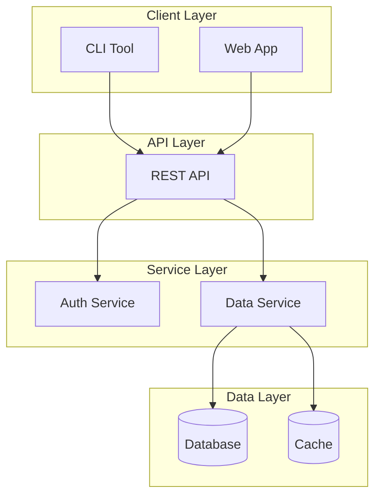
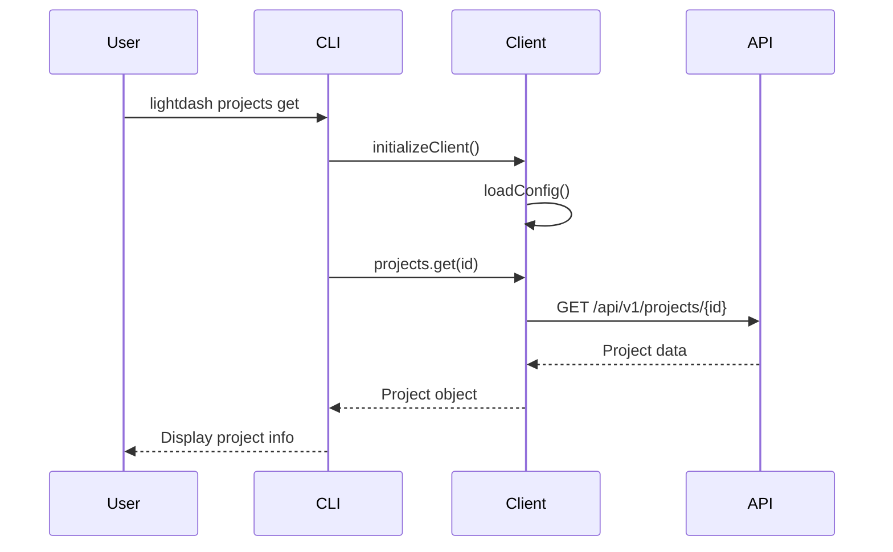
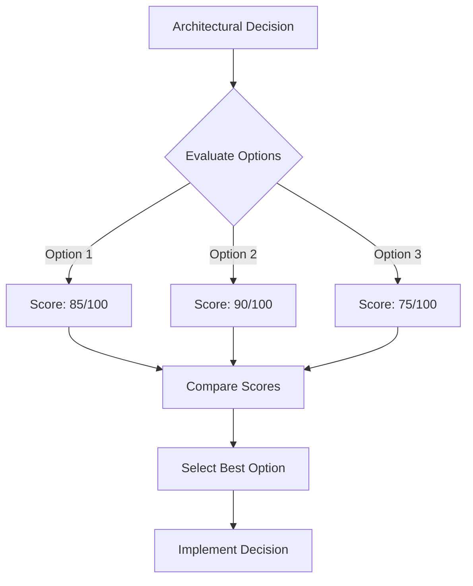
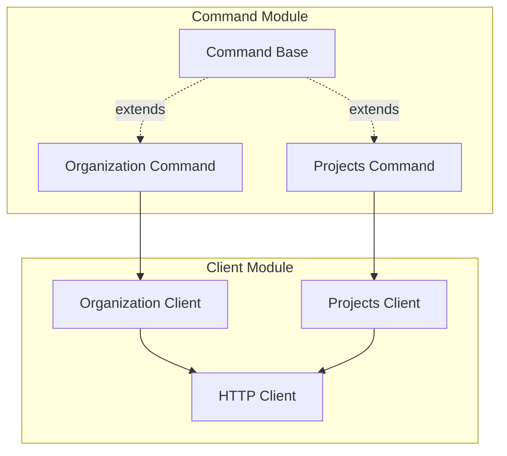
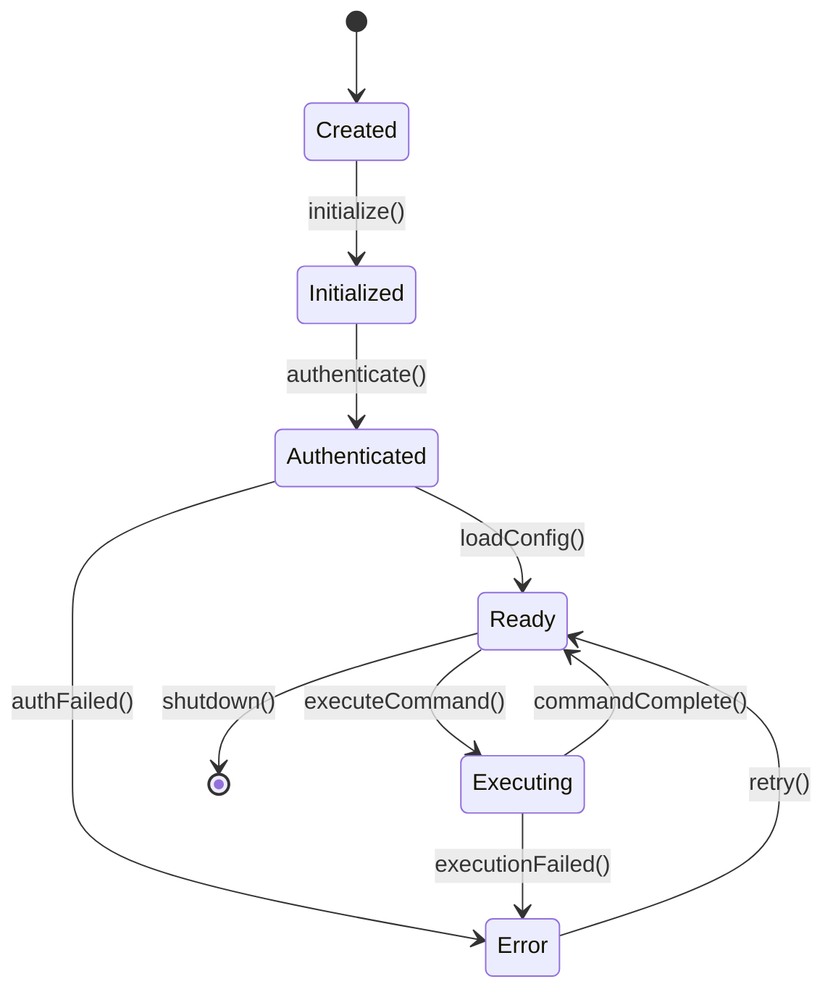
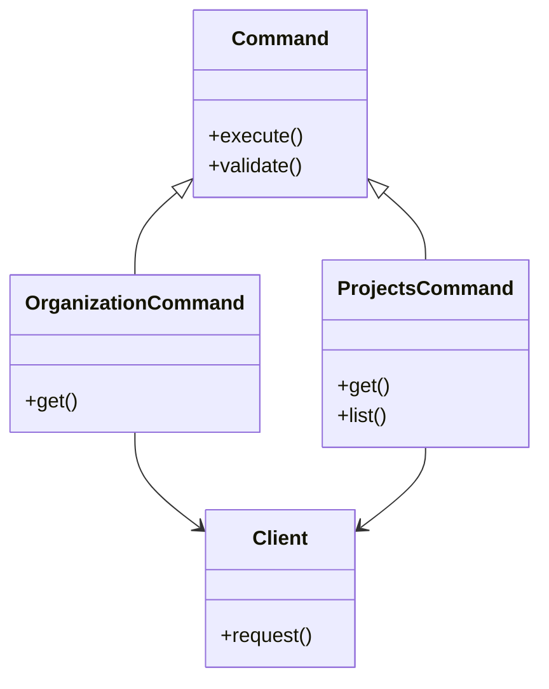
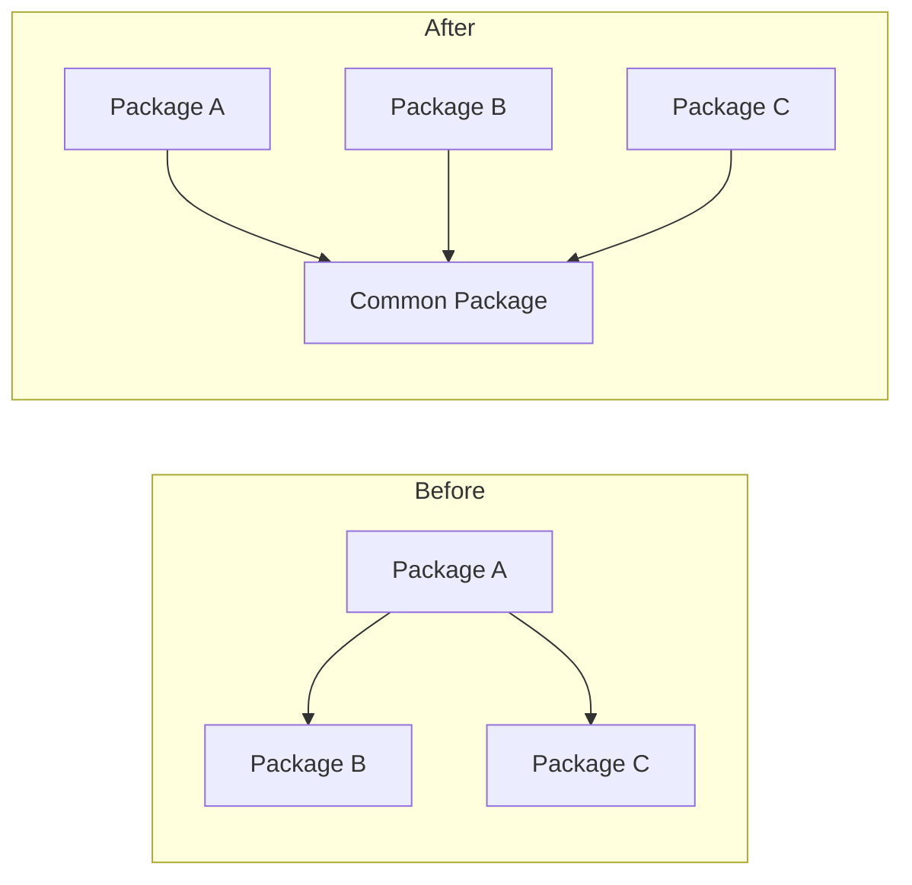
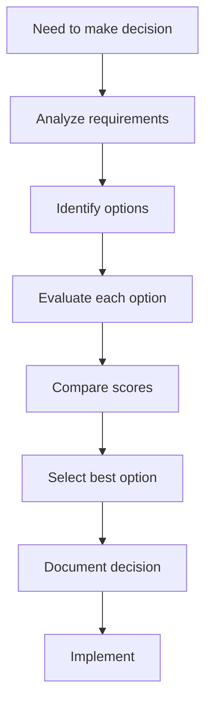
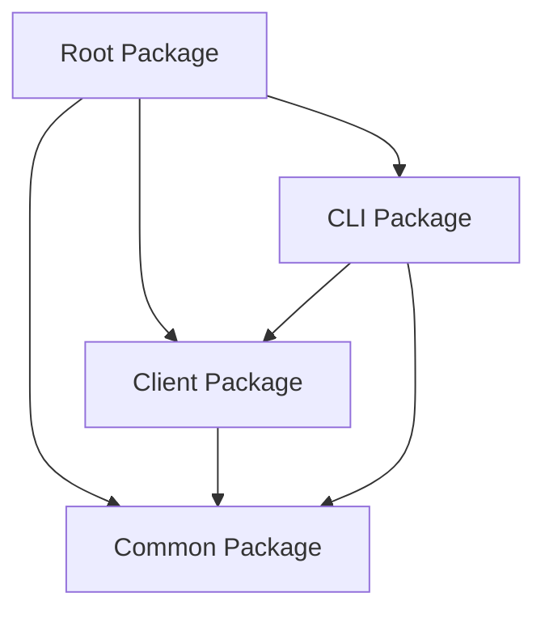

# Mermaid Diagrams for ADRs

This guide provides examples and templates for using Mermaid diagrams in Architecture Decision Records (ADRs). Mermaid diagrams help visualize architectural decisions, system designs, and relationships.

## When to Use Diagrams

- **System Architecture**: Show component relationships and data flow
- **Software Architecture**: Illustrate module organization and dependencies
- **Sequence Diagrams**: Document interaction flows and decision processes
- **Concept Diagrams**: Visualize abstract concepts and relationships
- **State Diagrams**: Show state transitions and workflows
- **Class Diagrams**: Document type relationships and hierarchies

## Diagram Types

### System Architecture Diagram

Use to show high-level system components and their relationships:



### Software Architecture Diagram

Use to show module organization and package dependencies:

```mermaid
graph LR
    subgraph commonPkg [@lightdash-tools/common]
        Types[Types]
        Utils[Utils]
    end

    subgraph clientPkg [@lightdash-tools/client]
        Client[HTTP Client]
    end

    subgraph cliPkg [@lightdash-tools/cli]
        CLI[CLI Commands]
    end

    CLI --> Client
    Client --> Types
    CLI --> Types
    Client --> Utils
```

### Sequence Diagram

Use to document interaction flows, decision processes, or API call sequences:



### Concept Diagram

Use to visualize abstract concepts, relationships, or decision trees:



### Component Diagram

Use to show component relationships and interfaces:



### State Diagram

Use to show state transitions and workflows:



### Class/Type Diagram

Use to document type relationships and hierarchies:



## Best Practices

1. **Placement**: Add diagrams in the "Decision" or "Architecture" section of your ADR
2. **Context**: Always provide a brief description before the diagram explaining what it shows
3. **Simplicity**: Keep diagrams focused - one diagram per concept or relationship
4. **Labels**: Use clear, descriptive labels for nodes and edges
5. **Consistency**: Use consistent naming conventions across diagrams
6. **Version Control**: Mermaid diagrams render in GitHub, GitLab, and many Markdown viewers

## Common Patterns

### Before/After Comparison



### Decision Flow



### Dependency Graph



## Rendering

Mermaid diagrams render automatically in:

- GitHub/GitLab Markdown viewers
- Many IDEs (VS Code with Mermaid extension)
- Documentation sites (MkDocs, Docusaurus, etc.)
- Online editors: [Mermaid Live Editor](https://mermaid.live/)

## References

- [Mermaid Documentation](https://mermaid.js.org/)
- [Mermaid Syntax Guide](https://mermaid.js.org/intro/syntax-reference.html)
- [Mermaid Diagram Types](https://mermaid.js.org/intro/getting-started.html)
