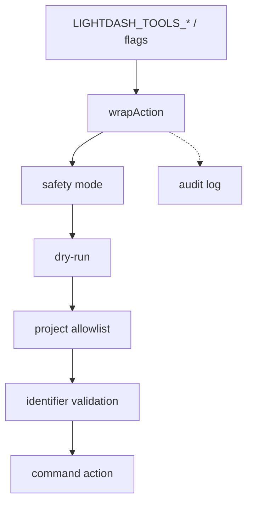

# 5. CLI safety stack

Date: 2026-07-31

## Status

Accepted

## Context

The CLI exposes a broad agent-safe command surface ([ADR-0004](0004-agent-safe-exposure-mcp-cli-vs-client-only.md)). Operators need runtime controls for operation class, project scope, simulation, and audit. Those controls remain on the CLI; MCP uses a different model ([ADR-0008](0008-mcp-request-scope-and-hardening.md)).

## Decision

Every CLI `.action()` runs through `wrapAction` in `packages/cli/src/utils/safety.ts`. Layers:

1. **Hierarchical safety mode** (`LIGHTDASH_TOOLS_SAFETY_MODE` / `--safety-mode`; default `read-only`):
   - `read-only` — `readOnlyHint === true`
   - `write-idempotent` — read-only or non-destructive writes
   - `write-destructive` — all annotated commands
2. **Project allowlist** (`LIGHTDASH_TOOLS_ALLOWED_PROJECTS` / `--projects`) — reject calls whose known project UUID args fall outside the list; empty list allows all. Flag overrides env.
3. **Dry-run** (`LIGHTDASH_TOOLS_DRY_RUN` / `--dry-run`) — write commands describe what would be sent without calling the API.
4. **Input validation** — `validateResourceId` only on known identifier keys (`project`, `projectUuid`, `projectUuids`, `projects`, `slug`), not bare free-form positionals.
5. **Audit log** — `initAuditLog()` at process start; optional `LIGHTDASH_TOOLS_AUDIT_LOG` file (else stderr). Blocked calls use an internal `_lightdashBlocked` marker stripped before output.

## Consequences

- CLI operators get a single composable guardrail story.
- MCP must not be assumed to honor these process knobs; see [ADR-0008](0008-mcp-request-scope-and-hardening.md).
- New CLI commands must use `wrapAction` and correct annotations, or they bypass the stack.
