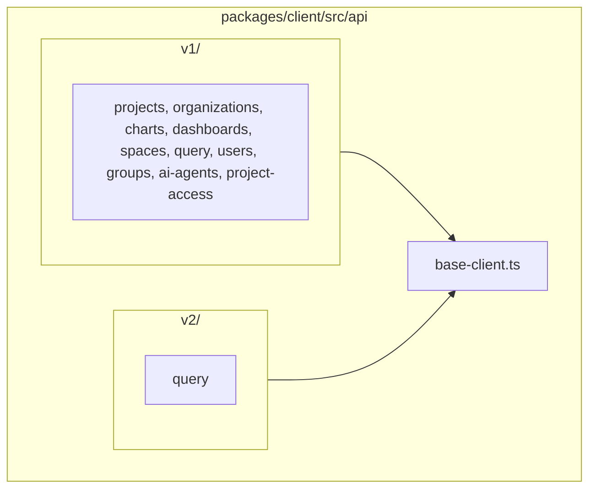

# 7. Client package API folder layout by version

Date: 2026-02-10

## Status

Accepted

## Context

ADR-0003 (API Version Namespaces) introduced runtime version separation: `client.v1.*` and `client.v2.*` with separate HTTP client instances. The source code in `packages/client/src/api/` did not mirror this: v1 client modules lived at the top level of `api/` while only v2 had a dedicated folder (`api/v2/`). This made it unclear which modules belonged to which API version and complicated adding future v2 or v3 modules.

We need a folder layout that clearly distinguishes API versions and aligns with the runtime namespaces.

## Decision

We will organize the client package API source by version:

- **V1 API client modules** (e.g. projects, organizations, charts, dashboards, spaces, query, users, groups, ai-agents, project-access) and their tests **SHALL** live under `packages/client/src/api/v1/`.
- **V2 API client modules** **SHALL** remain (or live) under `packages/client/src/api/v2/`.
- **Shared base** (e.g. `BaseApiClient` in `base-client.ts`) **SHALL** remain in `api/` so both v1 and v2 can import it without cross-version coupling.

### Source layout

The following diagram shows the resulting `api/` folder structure:

- `client.ts` and `index.ts` import v1 clients from `./api/v1/<module>` and v2 from `./api/v2/<module>`.
- Public API (exports, `LightdashClient` surface) is unchanged; this is a non-breaking refactor.

## Consequences

### Positive

- **Clarity**: Folder path explicitly indicates API version (v1 vs v2).
- **Maintainability**: Adding new v2 (or v3) clients has a clear place; no ambiguity with v1 modules.
- **Alignment**: Source layout matches runtime namespaces (`client.v1`, `client.v2`).

### Negative

- **One-time refactor**: Many files move and imports update; low ongoing cost.

## References

- ADR-0003 (API Version Namespaces): runtime namespaces that this layout supports
- GitHub Issue: #14
- OpenSpec: `docs/openspec/changes/client-api-v1-folder-layout/`
