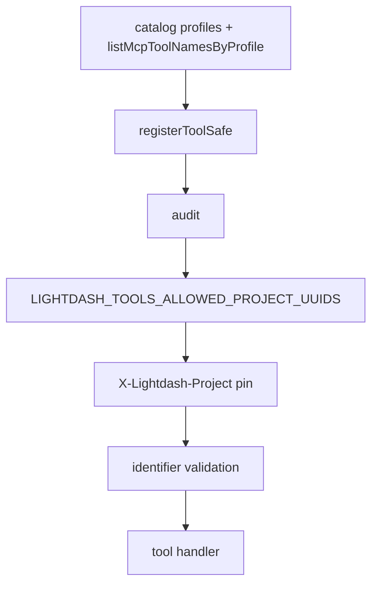

# 8. MCP request scope and hardening

Date: 2026-07-31

## Status

Accepted

Related to [11. MCP tool response sensitivity classes](0011-mcp-tool-response-sensitivity-classes.md)

Amended by [12. MCP content-reader profile saved-content execution boundary](0012-mcp-content-reader-profile-saved-content-execution-boundary.md)

## Context

Process-level `LIGHTDASH_TOOLS_SAFETY_MODE` and dry-run were designed for a broad MCP catalog. Profiles ([ADR-0006](0006-mcp-profiles-shared-registry-fixed-paths.md)) fix the tool set from the operation catalog; they are not a process tool filter. Those CLI knobs became no-ops or overlapped HTTP project pinning, and suggested more protection than they provided. Opaque OAuth tokens cannot be authorized via local JWT scope checks ([ADR-0007](0007-mcp-http-transport-auth-modes-sdk-v2.md)).

Operators still need a **deployment-level ceiling** of which Lightdash projects an MCP process may touch (shared HTTP / Cloud Run), distinct from a per-request pin. That ceiling is the **same** env as the CLI project allowlist: `LIGHTDASH_TOOLS_ALLOWED_PROJECT_UUIDS`.

[MCP Authorization](https://modelcontextprotocol.io/specification/2025-11-25/basic/authorization) does not require a process "allowed tools" env. CLI retains its full safety stack ([ADR-0005](0005-cli-safety-stack.md)).

## Decision

MCP security layers:

1. **Capability** — catalog `profiles` membership via `listMcpToolNamesByProfile` at `registerCapabilities` ([ADR-0006](0006-mcp-profiles-shared-registry-fixed-paths.md)). No MCP env or flag filters which tools register.
2. **Who** — auth mode + Lightdash API RBAC (PAT / shared-key / OAuth broker).
3. **Where (project scope)** — resolved then constrained by an optional shared process ceiling:
   - **HTTP pin (all profiles):** optional `X-Lightdash-Project` → ALS → `governance.pinnedProjectUuid`. Mismatched tool `projectUuid` args are blocked; pinned `list_projects` returns the pinned project only. Pin always wins when set (within the ceiling below).
   - **Tool argument:** when HTTP pin is unset, tools that need a project require explicit `projectUuid`. If still unset → `PROJECT_SCOPE_REQUIRED`. There is **no** process default project env.
   - **Shared project allowlist (CLI + MCP):** optional `LIGHTDASH_TOOLS_ALLOWED_PROJECT_UUIDS` (comma-separated UUIDs). Unset/empty → unrestricted beyond pin/arg + RBAC. Non-empty → **hard allowlist**: HTTP pin and every tool `projectUuid` must be members; `list_projects` intersects API results with the set. Cross-project promote tools also require upstream targets in the set when restricted. The list is a **ceiling only** — not an implicit project default. Invalid UUID entries fail closed at process startup. Removed legacy allowlist env names fail closed if still set.
4. **Hardening** — validate known identifier fields only. Audit every tool call via `initAuditLog()` at process start (NDJSON `channel: "audit"`). On hosted MCP, leave `LIGHTDASH_TOOLS_AUDIT_LOG` unset so audits go to **stderr as pure JSON**; a file path is for CLI/local only.

**Removed from MCP** (no compatibility): process `LIGHTDASH_TOOLS_SAFETY_MODE`, dry-run, CLI-only `--projects`, JWT-based tool scope gating, process default project env, and legacy MCP-only allowlist env names.

`registerToolSafe` order: audit (outer) → allowed projects → project pin → input validation → handler.

## Consequences

- Operator story: choose profile URL; configure auth; optionally set `LIGHTDASH_TOOLS_ALLOWED_PROJECT_UUIDS` and/or pin project on HTTP; pass `projectUuid` when unpinned; rely on Cloud Logging for hosted audit (stderr JSON), or a local file via `LIGHTDASH_TOOLS_AUDIT_LOG` for CLI.
- No false confidence from unused MCP safety-mode / dry-run knobs; one shared allowlist name for CLI and MCP.
- Write profiles still rely on surface guardrails (preview tokens, form elicitation) rather than process safety-mode ([ADR-0019](0019-mcp-stateless-protocol-core-without-redis-ephemeral-store.md)).
