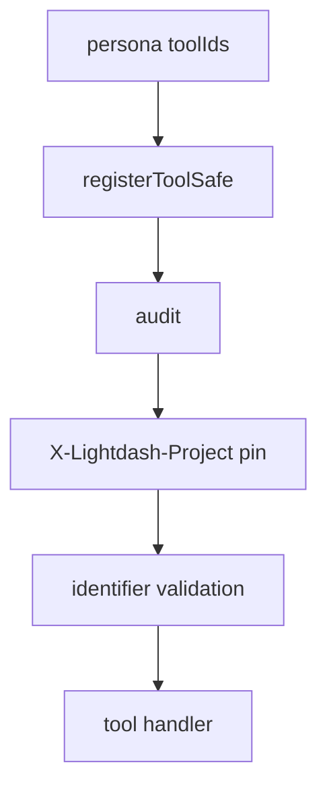

# 8. MCP request scope and hardening

Date: 2026-07-31

## Status

Accepted

## Context

Process-level `LIGHTDASH_TOOLS_SAFETY_MODE`, dry-run, and project allowlist were designed for a broad MCP catalog. Personas ([ADR-0006](0006-mcp-personas-shared-registry-fixed-paths.md)) fix the tool set in code; the shipped `semantic-layer` persona is read-only discovery/compile. Those process knobs became no-ops or overlapped HTTP project pinning, and suggested more protection than they provided. Opaque OAuth tokens cannot be authorized via local JWT scope checks ([ADR-0007](0007-mcp-http-transport-auth-modes-sdk-v2.md)).

[MCP Authorization](https://modelcontextprotocol.io/specification/2025-11-25/basic/authorization) does not require a process "allowed tools" env. CLI retains its full safety stack ([ADR-0005](0005-cli-safety-stack.md)).

## Decision

MCP security layers:

1. **Capability** — persona `toolIds` in code. No MCP env or flag filters which tools register.
2. **Who** — auth mode + Lightdash API RBAC (PAT / shared-key / experimental identity OAuth).
3. **Where (HTTP)** — optional `X-Lightdash-Project` pin (ALS → `governance.pinnedProjectUuid`). Mismatched tool `projectUuid` args are blocked; pinned `list_projects` returns the pinned project only. Stdio has no process project allowlist; reach equals PAT RBAC.
4. **Hardening** — validate known identifier fields only (`project`, `projectUuid`, `projectUuids`, `projects`, `slug`); optional audit via `LIGHTDASH_TOOLS_AUDIT_LOG`. Call `initAuditLog()` at process start.

**Removed from MCP** (no compatibility): `LIGHTDASH_TOOLS_SAFETY_MODE`, `--safety-mode`, `LIGHTDASH_TOOLS_DRY_RUN`, `--dry-run`, `LIGHTDASH_TOOLS_ALLOWED_PROJECTS`, `--projects`, and JWT-based tool scope gating in tool wrappers.

`registerToolSafe` order: audit (outer) → project pin → input validation → handler.

**Deferred:** OAuth introspection for `mcp:read` / `mcp:write` when a write persona ships.

## Consequences

- Operator story: choose persona URL; configure auth; optionally pin project on HTTP; audit if desired.
- No false confidence from unused MCP safety-mode / dry-run / allowlist knobs.
- Write personas need a new gate (likely introspection) before exposing writes over identity-only OAuth.

## References

- [RFC 7662](https://datatracker.ietf.org/doc/html/rfc7662) (introspection — follow-up)
- Implementation: `packages/mcp/src/tools/shared.ts`, `packages/mcp/src/governance/project-pin.ts`
