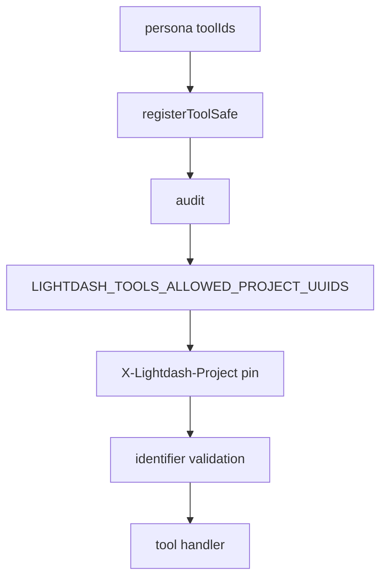

# 8. MCP request scope and hardening

Date: 2026-07-31

## Status

Accepted

Related to [11. MCP tool response sensitivity classes](0011-mcp-tool-response-sensitivity-classes.md)

Amended by [12. MCP content-reader persona saved-content execution boundary](0012-mcp-content-reader-persona-saved-content-execution-boundary.md)

## Context

Process-level `LIGHTDASH_TOOLS_SAFETY_MODE` and dry-run were designed for a broad MCP catalog. Personas ([ADR-0006](0006-mcp-personas-shared-registry-fixed-paths.md)) fix the tool set in code; the shipped `semantic-layer` persona is read-only discovery/compile. Those CLI knobs became no-ops or overlapped HTTP project pinning, and suggested more protection than they provided. Opaque OAuth tokens cannot be authorized via local JWT scope checks ([ADR-0007](0007-mcp-http-transport-auth-modes-sdk-v2.md)).

Operators still need a **deployment-level ceiling** of which Lightdash projects an MCP process may touch (shared HTTP / Cloud Run), distinct from a per-request pin. That ceiling is the **same** env as the CLI project allowlist: `LIGHTDASH_TOOLS_ALLOWED_PROJECT_UUIDS`.

[MCP Authorization](https://modelcontextprotocol.io/specification/2025-11-25/basic/authorization) does not require a process "allowed tools" env. CLI retains its full safety stack ([ADR-0005](0005-cli-safety-stack.md)).

## Decision

MCP security layers:

1. **Capability** — persona `toolIds` in code. No MCP env or flag filters which tools register.
2. **Who** — auth mode + Lightdash API RBAC (PAT / shared-key / experimental identity OAuth).
3. **Where (project scope)** — resolved then constrained by an optional shared process ceiling:
   - **HTTP pin (all personas):** optional `X-Lightdash-Project` → ALS → `governance.pinnedProjectUuid`. Mismatched tool `projectUuid` args are blocked; pinned `list_projects` returns the pinned project only. Pin always wins when set (within the ceiling below).
   - **Tool argument:** when HTTP pin is unset, tools that need a project require explicit `projectUuid`. If still unset → `PROJECT_SCOPE_REQUIRED`. There is **no** process default project env (`LIGHTDASH_TOOLS_PROJECT_UUID` removed).
   - **Shared project allowlist (CLI + MCP):** optional `LIGHTDASH_TOOLS_ALLOWED_PROJECT_UUIDS` (comma-separated UUIDs). Unset/empty → unrestricted beyond pin/arg + RBAC. Non-empty → **hard allowlist**: HTTP pin and every tool `projectUuid` (via `extractProjectUuids`) must be members; `resolveProjectScope` rejects non-members with `PROJECT_NOT_AVAILABLE`; `list_projects` intersects API results with the set. The list is a **ceiling only** — it is not an implicit project default. Invalid UUID entries fail closed at process startup. Removed `LIGHTDASH_TOOLS_ALLOWED_PROJECTS` and `LIGHTDASH_TOOLS_MCP_AVAILABLE_PROJECT_UUIDS` (no aliases) — if still set, startup fails with guidance to use `LIGHTDASH_TOOLS_ALLOWED_PROJECT_UUIDS`.
4. **Hardening** — validate known identifier fields only (`project`, `projectUuid`, `projectUuids`, `projects`, `slug`); optional audit via `LIGHTDASH_TOOLS_AUDIT_LOG`. Call `initAuditLog()` at process start.

**Removed from MCP** (no compatibility): `LIGHTDASH_TOOLS_SAFETY_MODE`, `--safety-mode`, `LIGHTDASH_TOOLS_DRY_RUN`, `--dry-run`, `--projects` (CLI flag only), JWT-based tool scope gating in tool wrappers, process default `LIGHTDASH_TOOLS_PROJECT_UUID`, and `LIGHTDASH_TOOLS_MCP_AVAILABLE_PROJECT_UUIDS`.

`registerToolSafe` order: audit (outer) → allowed projects → project pin → input validation → handler.

**Deferred:** OAuth introspection for `mcp:read` / `mcp:write` when a write persona ships.

## Consequences

- Operator story: choose persona URL; configure auth; optionally set `LIGHTDASH_TOOLS_ALLOWED_PROJECT_UUIDS` and/or pin project on HTTP; pass `projectUuid` when unpinned; audit if desired.
- No false confidence from unused MCP safety-mode / dry-run knobs; one shared allowlist name for CLI and MCP.
- Write personas need a new gate (likely introspection) before exposing writes over identity-only OAuth.

## References

- [RFC 7662](https://datatracker.ietf.org/doc/html/rfc7662) (introspection — follow-up)
- Implementation: `packages/mcp/src/tools/shared.ts`, `packages/mcp/src/governance/project-pin.ts`, `packages/mcp/src/governance/available-projects.ts`
