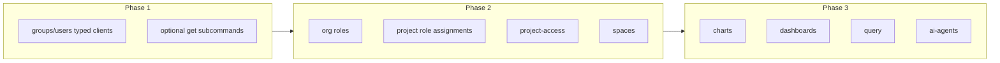

# 10. CLI parity with client package (phased by domain)

Date: 2026-02-10

## Status

Accepted

Implements [5. CLI Architecture Decision](0005-cli-architecture.md)

## Context

The CLI (`packages/cli`) currently uses raw HTTP for `groups list` and `users list` (e.g. `client.getHttpClientV1().get('/org/groups')`). The client package (`packages/client`) already provides `UsersClient` and `GroupsClient` with typed methods and query parameters. ADR-0005 anticipated refactoring to these clients when available. Several client domains have no CLI coverage: v2 organization roles and project role assignments, project-access, spaces, charts, dashboards, query, and ai-agents. Users who need these operations must use `@lightdash-tools/client` in scripts instead of the CLI.

## Decision

We adopt **phased parity by domain**:

1. **Use only typed clients** for any domain the client package covers; remove raw HTTP for groups and users in the CLI.
2. **Add CLI commands in three phases:**
   - **Phase 1**: Align existing commands with typed clients (refactor `groups list` / `users list` to `client.v1.groups.listGroups` / `client.v1.users.listMembers`); add optional subcommands (e.g. `groups get <uuid>`, `users get <uuid>`).
   - **Phase 2**: Add commands for v2 organization roles and project role assignments; add project-access and spaces (list/get, grant/revoke where useful).
   - **Phase 3**: Add commands for charts, dashboards, query (only where CLI input is manageable), and ai-agents (curated subcommands).

## Consequences

### Positive

- **Single pattern**: CLI uses typed clients only; no raw HTTP for covered domains. Easier to maintain and keep in sync with API types.
- **Incremental delivery**: Parity is achieved in phases; each phase delivers user value and can be shipped independently.
- **Alignment**: Matches OpenSpec "extend incrementally" and ADR-0005 future considerations (Groups/Users clients, additional commands).

### Negative

- **Scope decisions**: Phase 3 requires choosing which methods are practical from the CLI (e.g. run-query with large JSON may be limited or file-based).

### Risks

- **Drift**: If new client domains are added without CLI follow-up, parity gaps reappear; mitigated by tracking in OpenSpec and issue #18.

## References

- ADR-0005: CLI Architecture (this ADR implements its "Future Considerations" for Groups/Users clients and additional commands)
- OpenSpec: `docs/openspec/changes/cli-parity-with-client/`
- GitHub: Issue #18 (CLI parity with HTTP client)
