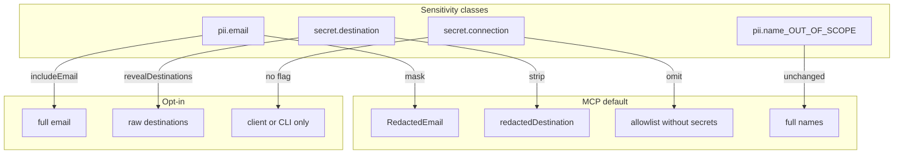

# 11. MCP tool response sensitivity classes

Date: 2026-08-01

## Status

Accepted

Amends [10. MCP organization-audit persona read-only boundary](0010-mcp-organization-audit-persona-read-only-boundary.md)

Relates [4. Agent-safe exposure: MCP/CLI vs client-only](0004-agent-safe-exposure-mcp-cli-vs-client-only.md)

Relates [8. MCP request scope and hardening](0008-mcp-request-scope-and-hardening.md)

## Context

MCP tools return Lightdash API payloads into agent context (chat transcripts, host memory). The MCP specification requires servers to **sanitize tool outputs** ([Tools — Security Considerations](https://modelcontextprotocol.io/specification/2025-11-25/server/tools), 2025-11-25). Protocol-level sensitivity annotations (e.g. draft SEPs) are not shipped; implementors must enforce privacy in handlers.

[ADR-0010](0010-mcp-organization-audit-persona-read-only-boundary.md) already requires scheduler destinations to be redacted by default (`revealDestinations` opt-in). Member/group tools already mask emails (`includeEmail`). Gaps remained: project direct-access emails passed through raw, and semantic-layer `get_project` / pinned `list_projects` could return `warehouseConnection`, `dbtConnection` (including PATs), and `schedulerFailureContactOverride`.

A single global `withSensitive` flag would collapse distinct risk classes and fight existing opt-in names. Display-name redaction was considered and deferred: org-audit workflows need identifiable principals via `firstName`/`lastName`/`userUuid` without always revealing email.

### Alternatives considered

| Alternative                                       | Why rejected                                                                                                                              |
| ------------------------------------------------- | ----------------------------------------------------------------------------------------------------------------------------------------- |
| Global `withSensitive` boolean                    | Collapses email, destinations, and connection secrets; agents over-request; conflicts with `includeEmail` / `revealDestinations`          |
| Central JSON-walk sanitizer in `registerToolSafe` | Brittle on nested shapes; belongs outside ADR-0008 guardrail order (audit → pin → input validation → handler)                             |
| Never reveal emails/destinations on MCP           | Breaks legitimate org-audit destination and email-domain reviews                                                                          |
| Opt-in MCP reveal for connection secrets          | Too high risk for agent transcripts; use `@lightdash-tools/client` / CLI ([ADR-0004](0004-agent-safe-exposure-mcp-cli-vs-client-only.md)) |

## Decision

1. **Sensitivity classes** for MCP tool responses:

| Class                | Default                                                                                | Opt-in                        | Never on MCP            |
| -------------------- | -------------------------------------------------------------------------------------- | ----------------------------- | ----------------------- |
| `pii.email`          | Mask (`a***@domain` via `maybeRedactEmail`)                                            | `includeEmail === true`       | —                       |
| `secret.destination` | Strip raw keys; expose `redactedDestination`                                           | `revealDestinations === true` | —                       |
| `secret.connection`  | Omit (`warehouseConnection`, `dbtConnection`, PATs, `schedulerFailureContactOverride`) | —                             | Always; no reveal flag  |
| `pii.name`           | Full names remain                                                                      | —                             | Out of scope (non-goal) |

2. **No global `withSensitive`.** Class-specific flags only; reveal requires strict `=== true`.
3. **Handler-level allowlists** in tool handlers / `packages/mcp/src/tools/lib/redaction.ts` — not a new `registerToolSafe` middleware layer ([ADR-0008](0008-mcp-request-scope-and-hardening.md)).
4. **Signal redaction** with `warnings` entries using code `REDACTED` (and related audit warning codes) so agents know which flag to pass — or that credentials are unavailable via MCP.
5. **`allowedEmailDomains`** remains for `isExternalDomain` classification on redacted emails/destinations (review signal, not automatic violation).

## Consequences

- Org-audit and semantic-layer tools share one sensitivity policy; new tools must classify fields before returning API payloads.
- Direct project access and member tools share `includeEmail` semantics.
- Semantic-layer project tools return metadata summaries only; warehouse/dbt credentials stay off MCP forever.
- Playbooks and endpoint inventory must document flags; agents must not invent a `withSensitive` argument.
- Future name redaction would require an ADR amendment — it is intentionally not implied by this record.
