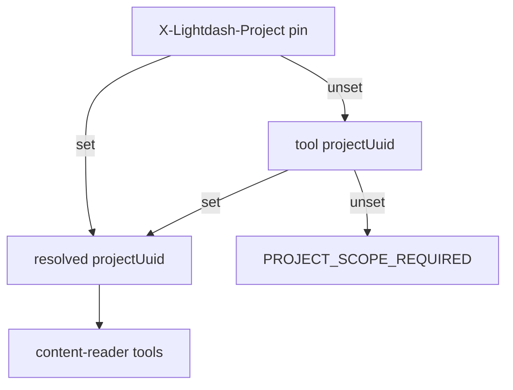

# 12. MCP content-reader persona saved-content execution boundary

Date: 2026-08-01

## Status

Accepted

Amends [8. MCP request scope and hardening](0008-mcp-request-scope-and-hardening.md)

Related to [6. MCP personas, shared registry, fixed paths](0006-mcp-personas-shared-registry-fixed-paths.md)

## Context

Agents and analysts need to read saved Lightdash content (charts, dashboards, spaces) and run **saved** semantic-layer queries to answer questions — without gaining arbitrary warehouse access. The `semantic-layer` persona exposes explore/compile primitives but not saved-content execution. The `organization-audit` persona ([ADR-0010](0010-mcp-organization-audit-persona-read-only-boundary.md)) is metadata-only: no query execution, no row-level data.

A third persona must therefore:

- Stay **project-scoped** (unlike org-wide audit inventory).
- Allow **bounded execution** of saved semantic charts and dashboard tiles only.
- Reject arbitrary metric queries, raw SQL, underlying-data drills, downloads, and mutations.
- Treat SQL-based saved charts as a distinct, higher-risk class disabled by default.

Lightdash v2 query APIs already separate saved-chart execution (`POST …/query/chart`, `POST …/query/dashboard-chart`) from ad-hoc paths (`metric-query`, `sql`, `underlying-data`, downloads). MCP should mirror that boundary in persona capability, not only in tool omission.

Project pinning today is HTTP-only via `X-Lightdash-Project` ([ADR-0008](0008-mcp-request-scope-and-hardening.md)). Clients must pin or pass `projectUuid`; there is no process default project env.

## Decision

1. Ship a **`content-reader`** persona at fixed path `/content-reader/v1/mcp` with MCP server display name **`lightdash-mcp-content`** (shortened for ~60-character client limits; persona id remains `content-reader`). Stdio selects it via explicit subcommand `lightdash-mcp content-reader` ([ADR-0006](0006-mcp-personas-shared-registry-fixed-paths.md) amendment).
2. **Project scope** resolves in strict precedence; tool `projectUuid` **cannot override** HTTP pin:
   1. `X-Lightdash-Project` → `governance.pinnedProjectUuid` (HTTP only)
   2. Tool `projectUuid` argument
   3. If still unset → `PROJECT_SCOPE_REQUIRED` (blocked before handler)
      Optional process ceiling: `LIGHTDASH_TOOLS_ALLOWED_PROJECTS` ([ADR-0008](0008-mcp-request-scope-and-hardening.md)).
3. **Saved-content execution allowed** for semantic (metric-query-backed) saved charts and dashboard tiles via `POST /api/v2/projects/{projectUuid}/query/chart` and `POST …/query/dashboard-chart`, with **values-only** filter and parameter overrides (override literal values only; no ad-hoc field/metric composition).
4. **SQL charts disabled by default.** Saved charts whose query class is SQL (including dashboard SQL tiles) return `CONTENT_NOT_EXECUTABLE` unless an explicit future opt-in is added. OpenAPI also exposes `query/sql-chart` and `query/dashboard-sql-chart`; those remain off the MCP allowlist by default.
5. **Safety dimensions** (persona-level, enforced at registration and handler):
   - `mutability`: `none` | `transient` (async query handles only; no content mutations)
   - `queryCapability`: `none` | `saved_content` (no `metric-query`, `sql`, `field-values`, or `underlying-data`)
   - `resultCapability`: `metadata` | `bounded_aggregate_rows` (paginated async results with row/cell caps; no bulk download)
6. **Excluded from MCP:** `metric-query`, `sql`, `underlying-data`, `download`, `schedule-download`, and all content/org/project mutations (create/update/delete/move).
7. **In-memory query ledger v1:** track async `queryUuid` handles issued in-process (start time, source chart/tile, status) for cancel/results correlation. Ownership and budget keys use the MCP transport `sessionId` from tool `extra` when present; stdio falls back to a process-scoped session id. Not durable across restarts; not a substitute for Lightdash query history.
8. Shared tool implementations live under `packages/mcp/src/tools/`; the persona owns `toolIds`, prompts, playbook, and capability asserts. Endpoint map: [content-reader-endpoint-inventory.md](../content-reader-endpoint-inventory.md).

## Consequences

- Third HTTP path and stdio subcommand; Cursor/Compose configs must document `/content-reader/v1/mcp` alongside semantic-layer and organization-audit.
- [ADR-0008](0008-mcp-request-scope-and-hardening.md) project scope is pin or tool arg only; optional shared `LIGHTDASH_TOOLS_ALLOWED_PROJECTS` ceiling.
- Distinct from [ADR-0010](0010-mcp-organization-audit-persona-read-only-boundary.md): content-reader may return bounded aggregate rows; org-audit remains metadata-only.
- Client gaps (saved chart GET, parameters, async results/cancel) are filled under `@lightdash-tools/client` as tools ship.
- Operators must pin or pass `projectUuid` for stdio/unpinned HTTP; unpinned multi-project crawl is intentionally unsupported.
- SQL chart execution requires a deliberate future ADR/opt-in; default deny avoids silent warehouse access via saved SQL artifacts.

## References

- [content-reader-endpoint-inventory.md](../content-reader-endpoint-inventory.md)
- Implementation (planned): `packages/mcp/src/personas/content-reader/`, `packages/mcp/src/governance/project-pin.ts`
