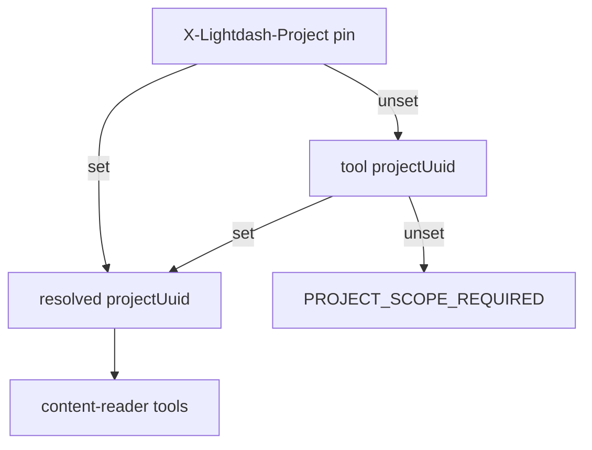

# 12. MCP content-reader profile saved-content execution boundary

Date: 2026-08-01

## Status

Accepted

Amends [8. MCP request scope and hardening](0008-mcp-request-scope-and-hardening.md)

Related to [6. MCP profiles, shared registry, fixed paths](0006-mcp-profiles-shared-registry-fixed-paths.md)

Amended by [19. MCP stateless protocol core without Redis ephemeral store](0019-mcp-stateless-protocol-core-without-redis-ephemeral-store.md)

Related to [20. MCP data-analyst profile ad-hoc metric-query boundary](0020-mcp-data-analyst-profile-ad-hoc-metric-query-boundary.md)

## Context

Agents and analysts need to read saved Lightdash content (charts, dashboards, spaces) and run **saved** semantic-layer queries to answer questions — without gaining arbitrary warehouse access. The `semantic-layer` profile exposes explore/compile primitives but not saved-content execution. The `organization-audit` profile ([ADR-0010](0010-mcp-organization-audit-profile-read-only-boundary.md)) is metadata-only: no query execution, no row-level data.

A third profile must therefore:

- Stay **project-scoped** (unlike org-wide audit inventory).
- Allow **bounded execution** of saved semantic charts and dashboard tiles only.
- Reject arbitrary metric queries, raw SQL, underlying-data drills, downloads, and mutations.
- Treat SQL-based saved charts as a distinct, higher-risk class disabled by default.

Lightdash v2 query APIs already separate saved-chart execution (`POST …/query/chart`, `POST …/query/dashboard-chart`) from ad-hoc paths (`metric-query`, `sql`, `underlying-data`, downloads). MCP should mirror that boundary in profile capability, not only in tool omission.

Project pinning today is HTTP-only via `X-Lightdash-Project` ([ADR-0008](0008-mcp-request-scope-and-hardening.md)). Clients must pin or pass `projectUuid`; there is no process default project env.

## Decision

1. Ship a **`content-reader`** profile at fixed path `/content-reader/v1/mcp` with MCP server display name **`lightdash-mcp-content`** (shortened for ~60-character client limits; profile id remains `content-reader`). Tool membership from catalog `profiles` via `listMcpToolNamesByProfile` ([ADR-0006](0006-mcp-profiles-shared-registry-fixed-paths.md)). Stdio: `lightdash-mcp stdio --profile content-reader`.
2. **Project scope** resolves in strict precedence; tool `projectUuid` **cannot override** HTTP pin:
   1. `X-Lightdash-Project` → `governance.pinnedProjectUuid` (HTTP only)
   2. Tool `projectUuid` argument
   3. If still unset → `PROJECT_SCOPE_REQUIRED` (blocked before handler)
      Optional process ceiling: `LIGHTDASH_TOOLS_ALLOWED_PROJECT_UUIDS` ([ADR-0008](0008-mcp-request-scope-and-hardening.md)).
3. **Saved-content execution allowed** for semantic (metric-query-backed) saved charts and dashboard tiles via `POST /api/v2/projects/{projectUuid}/query/chart` and `POST …/query/dashboard-chart`, with **values-only** filter and parameter overrides (override literal values only; no ad-hoc field/metric composition).
4. **SQL charts disabled by default.** Saved charts whose query class is SQL (including dashboard SQL tiles) return `CONTENT_NOT_EXECUTABLE` unless an explicit future opt-in is added. OpenAPI also exposes `query/sql-chart` and `query/dashboard-sql-chart`; those remain off the MCP surface by default.
5. **Safety dimensions** (profile-level, enforced at registration and handler):
   - `mutability`: `none` | `transient` (async query handles only; no content mutations)
   - `queryCapability`: `none` | `saved_content` (no `metric-query`, `sql`, `field-values`, or `underlying-data`)
   - `resultCapability`: `metadata` | `bounded_aggregate_rows` | `image_snapshot` (paginated async results with row/cell caps; **or** a single saved-chart PNG via headless export — not bulk CSV/row dumps)
6. **Excluded from MCP:** `metric-query`, `sql`, `underlying-data`, CSV/`download`, `schedule-download`, and all content/org/project mutations (create/update/delete/move).
7. **Chart PNG snapshot (narrow carve-out):** `POST /api/v1/saved/{chartUuid}/export` may be exposed as MCP `export_chart_image`. It returns one rendered PNG (MCP `ImageContent`), not tabular bulk export. Requires Lightdash headless browser on the instance. Dashboard image export and query result downloads stay off MCP.
8. **In-memory query ledger (best-effort):** track async `queryUuid` handles issued in-process for cancel/results correlation. `queryUuid` is the client-carried handle ([ADR-0019](0019-mcp-stateless-protocol-core-without-redis-ephemeral-store.md)); ownership is not bound to MCP transport sessions. Not durable across restarts; not a substitute for Lightdash query history. No Redis ephemeral store.
9. Shared tools live under `packages/mcp/src/tools/`; the profile owns path, `serverName`, prompts, and playbooks under `packages/mcp/src/profiles/content-reader/`. Endpoint map: [content-reader inventory](../profiles/content-reader/inventory.md).

## Consequences

- Third HTTP path and stdio subcommand; Cursor/Compose configs must document `/content-reader/v1/mcp` alongside semantic-layer and organization-audit.
- [ADR-0008](0008-mcp-request-scope-and-hardening.md) project scope is pin or tool arg only; optional shared `LIGHTDASH_TOOLS_ALLOWED_PROJECT_UUIDS` ceiling.
- Distinct from [ADR-0010](0010-mcp-organization-audit-profile-read-only-boundary.md): content-reader may return bounded aggregate rows; org-audit remains metadata-only.
- Operators must pin or pass `projectUuid` for stdio/unpinned HTTP; unpinned multi-project crawl is intentionally unsupported.
- SQL chart execution requires a deliberate future ADR/opt-in; default deny avoids silent warehouse access via saved SQL artifacts.
- Ad-hoc Explore execution belongs on `data-analyst` ([ADR-0020](0020-mcp-data-analyst-profile-ad-hoc-metric-query-boundary.md)), not this profile.
