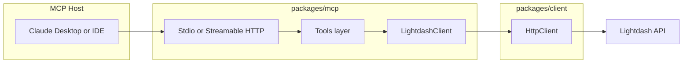

# 13. Implement Lightdash MCP server in packages/mcp using HTTP client (phased transport)

Date: 2026-02-10

## Status

Accepted

## Context

We need to expose Lightdash (projects, charts, dashboards, spaces, users, groups, query, etc.) to AI hosts (Claude Desktop, IDEs) via the Model Context Protocol (MCP) in a secure and well-governed way. The repository already has a typed HTTP client (`@lightdash-tools/client`) with authentication (PAT), rate limiting, retry, and error handling. Building a separate HTTP layer or bypassing the client would duplicate logic and increase security risk. The develop-mcp-server-ts skill and ADR-0011 establish a workflow for building MCP servers in TypeScript; this ADR decides how to implement the actual server in-repo.

## Decision

Implement the MCP server in `packages/mcp` using a phased approach:

1. **Phase 1 (Stdio)**: One MCP server over Stdio transport. `LightdashClient` is instantiated once from environment configuration (`LIGHTDASH_URL`, `LIGHTDASH_API_KEY`). Tools delegate to `client.v1.*` / `client.v2.*`. All Lightdash calls go through `@lightdash-tools/client`; errors (`LightdashApiError`, `RateLimitError`, `NetworkError`) are mapped to MCP text content. Logging uses stderr only (no stdout) so as not to corrupt JSON-RPC.

2. **Phase 2 (Streamable HTTP + optional auth)**: Add Streamable HTTP as a second transport. Same tool implementations; optional middleware validates `Authorization: Bearer` or API key before handling MCP requests. Auth is configurable (e.g. env flag) so local deployments can run without endpoint auth if desired.

No direct HTTP calls to the Lightdash API from the MCP package; all backend access is via `LightdashClient`.

## Consequences

### Positive

- **Single gateway**: All Lightdash MCP access goes through one server and one client; rate limiting and retry are inherited from the client.
- **Security**: PAT lives only in client config (env or explicit); never logged. Phase 2 adds MCP endpoint auth for remote deployments.
- **Maintainability**: Tools are thin wrappers over typed client methods; API changes are reflected in one place.

### Negative

- **Process-wide credentials**: Stdio and initial HTTP deployment use one PAT per process; multi-tenant identity would require a later phase (e.g. OAuth-derived credentials).

### Risks

- **Transport drift**: Two code paths (Stdio vs HTTP) for transport and session handling; mitigated by shared tool registration and client usage.

## References

- GitHub: Issue #26 (parent), sub-issues #27–#30
- OpenSpec: `docs/openspec/changes/mcp-server-lightdash-client/`
- ADR-0011: Add agent skill for developing MCP servers in TypeScript
