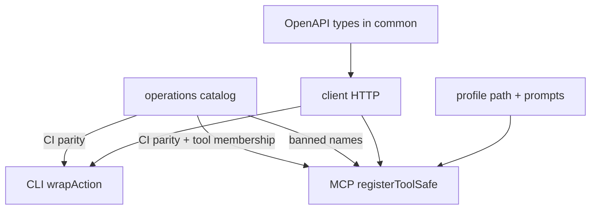

# 13. Operation catalog as sole agent-surface SSOT

Date: 2026-08-01

## Status

Amends [4. Agent-safe exposure: MCP/CLI vs client-only](0004-agent-safe-exposure-mcp-cli-vs-client-only.md)

Relates [2. Monorepo packages](0002-monorepo-packages-client-common-cli-mcp.md)

Relates [6. MCP profiles, shared registry, fixed paths](0006-mcp-profiles-shared-registry-fixed-paths.md)

Relates [11. MCP tool response sensitivity classes](0011-mcp-tool-response-sensitivity-classes.md)

Amended by [21. MCP mount membership via literal profile tables](0021-mcp-mount-membership-via-literal-profile-tables.md) (mount membership storage)

Superceded by [22. MCP profile-owned ToolModules replace operations catalog](0022-mcp-profile-owned-toolmodules-replace-operations-catalog.md)

## Context

Agent exposure metadata lived in three places: `packages/common/src/operations/` (partial), CLI `LEGACY_SCHEMA_REGISTRY`, and MCP `tools/registry.ts` plus hand-maintained profile tool allowlists. Dual maintenance caused drift (CLI schema keys ≠ catalog ids; MCP tool ids ≠ operation `mcp.toolName` for admin surfaces). OpenAPI remains the type SSOT via pinned swagger → `openapi-typescript`; it must not become the agent product catalog (full API exposure is unsafe).

Mount membership for MCP profiles is literal tables in common ([ADR-0021](0021-mcp-mount-membership-via-literal-profile-tables.md)); registration derives tools via `listMcpToolNamesByProfile`.

### Alternatives considered

| Alternative                                     | Why rejected                                               |
| ----------------------------------------------- | ---------------------------------------------------------- |
| Generate MCP/CLI from every OpenAPI path        | Violates agent-safe surface; blows past client name limits |
| Keep legacy schema + catalog hybrid             | Dual registries without an end state                       |
| Replace axios client with openapi-fetch/hey-api | Loses Bottleneck/retries and Lightdash pagination unwrap   |
| Hand-maintained profile `toolIds` allowlists    | Drift vs catalog; superseded by ADR-0006 membership rule   |

## Decision

1. **`packages/common/src/operations/` is the sole product catalog** for which Lightdash HTTP operations appear on MCP and/or CLI, including `agentExposure`, safety impact, sensitivity class, capability profiles, and optional `mcp` / `cli` metadata.
2. **No dual registries or compatibility shims.** CLI legacy schema maps and parallel annotation maps are deleted when catalog coverage lands. Missing catalog entries fail CI.
3. **Descriptor rules (breaking):**
   - `sensitivity` defaults to `none` when omitted; allowed values: `none` | `pii.email` | `secret.destination` | `secret.connection` ([ADR-0011](0011-mcp-tool-response-sensitivity-classes.md)).
   - `agent` ops require **at least one** of `mcp` (non-empty `toolName`) or `cli` (non-empty `commandPath`). MCP-only and CLI-only entries are valid.
   - `mcp.taskSupport.exposed` gates real MCP registration; reserved/`exposed: false` names must not be advertised as live tools by schema introspection.
   - `client-only` ops omit `mcp` / `cli`; use optional `bannedMcpToolName` for the irrecoverable denylist.
   - Serving profiles match MCP mounts (`semantic-layer`, `organization-audit`, `content-reader`, …); see [ADR-0006](0006-mcp-profiles-shared-registry-fixed-paths.md).
4. **Mount membership** is literal profile tables in common (`listMcpToolNamesByProfile`, [ADR-0021](0021-mcp-mount-membership-via-literal-profile-tables.md)) — not hand-maintained MCP allowlists and not `profiles` tags on each op. Handlers stay in MCP; registration/CI require a catalog hit for each listed tool name.
5. **OpenAPI pipeline unchanged** (pin → generate types in `common`). Client stays axios + Bottleneck; coverage gates link catalog `http.path` to client methods.
6. **Runtime policy unchanged:** CLI `wrapAction` ([ADR-0005](0005-cli-safety-stack.md)); MCP `registerToolSafe` ([ADR-0008](0008-mcp-request-scope-and-hardening.md)). Catalog is build/CI policy, not a substitute for those stacks.

## Consequences

- Adding an agent tool/command requires a catalog entry first; CI fails closed on drift.
- Breaking changes to descriptor shape, CLI schema ids, and type export paths are allowed without shims.
- MCP OAuth, fixed profile paths, and package boundaries stay as previously decided ([ADR-0006](0006-mcp-profiles-shared-registry-fixed-paths.md)).
- Handler-level redaction remains required for non-`none` sensitivity; the catalog field documents class, it does not auto-redact.
