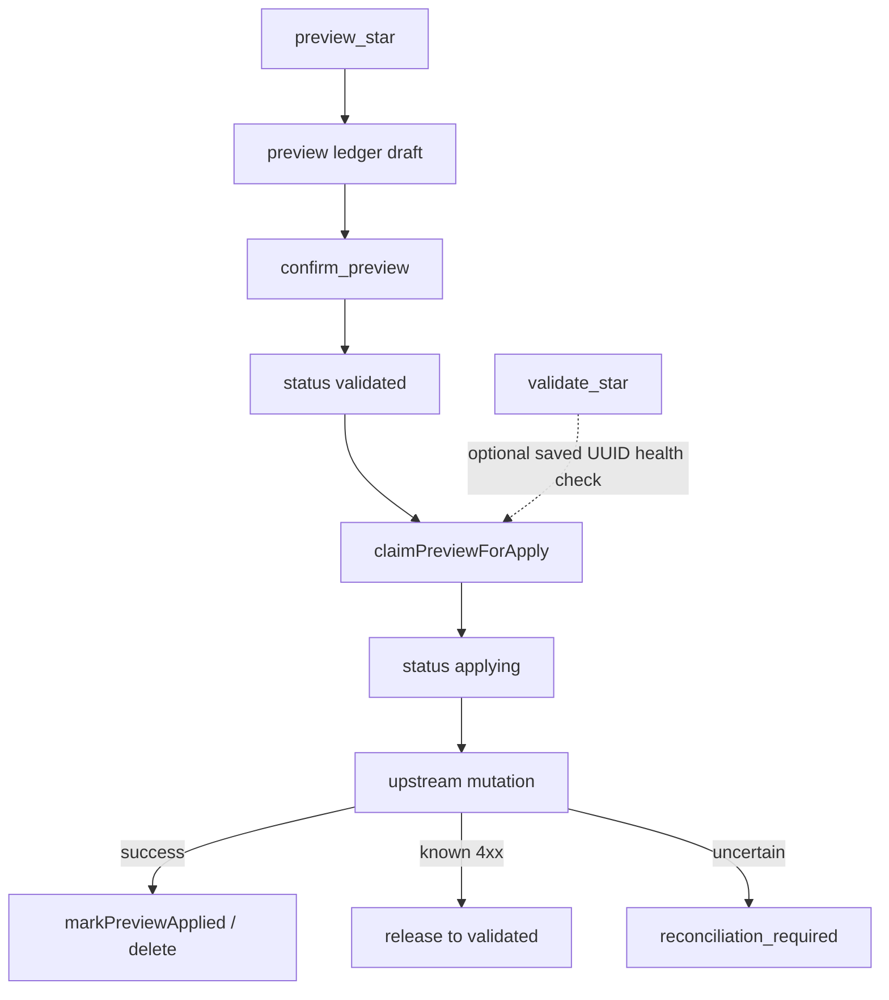

# 14. MCP content-developer persona mutation boundary

Date: 2026-08-01

## Status

Accepted

Amends [6. MCP personas, shared registry, fixed paths](0006-mcp-personas-shared-registry-fixed-paths.md)

Related to [8. MCP request scope and hardening](0008-mcp-request-scope-and-hardening.md), [12. MCP content-reader persona](0012-mcp-content-reader-persona-saved-content-execution-boundary.md), [13. Operation catalog SSOT](0013-operation-catalog-as-sole-agent-surface-ssot.md), [16. Pluggable ephemeral store](0016-mcp-pluggable-ephemeral-store-for-http-preview-sessions-and-oauth.md)

Amended by [17. MCP content-governance dashboard promote elicitation boundary](0017-mcp-content-governance-dashboard-promote-elicitation-boundary.md)

## Context

Agents need to create and improve project-scoped analytical content (charts and dashboards; place into existing spaces) without gaining warehouse SQL execution, org administration, space provisioning, or irrecoverable deletes. The `content-reader` persona ([ADR-0012](0012-mcp-content-reader-persona-saved-content-execution-boundary.md)) explicitly forbids all content mutations. CLI already has chart as-code upsert, but MCP had no authoring surface.

Lightdash APIs are uneven: charts lack a clean UI-shaped create/update pair (as-code upsert exists); dashboards have create / v2 PATCH / `duplicateFrom`; tiles have no per-tile REST routes; preview-of-unsaved-edits has no upstream API; validate and version history endpoints exist but were not wrapped in `@lightdash-tools/client`.

## Decision

1. Ship a **`content-developer`** persona at fixed path `/content-developer/v1/mcp` with MCP server display name **`lightdash-mcp-cdev`** (shortened for ~60-character client limits). Stdio: `lightdash-mcp content-developer`.
2. **Project scope** matches content-reader precedence: `X-Lightdash-Project` → `LIGHTDASH_TOOLS_PROJECT_UUID` → tool `projectUuid` → `PROJECT_SCOPE_REQUIRED`. Tool args cannot override pin/env.
3. **Hybrid authoring:**
   - Charts: as-code upsert (`POST …/code/charts/{slug}`); `duplicate_chart` is MCP composition (read as-code + upsert new slug). Soft SOP: author charts only as dashboard tile prerequisites (dashboard is the [promotion](https://docs.lightdash.com/guides/how-to-promote-content) unit via content-governance).
   - Dashboards: native REST create / v2 PATCH update / create with `duplicateFrom`.
   - Layout: MCP composition over full dashboard tile array via v2 PATCH.
   - Spaces: **read-only** `list_spaces` / `get_space` on MCP; bulk `move_content` into existing spaces. Space create/update are **client-only** (managed out-of-band, e.g. Terraform).
4. **Hard preview gate:** every SAFE_WRITE tool requires a session-owned, validated, unexpired `previewId` from `preview_*`. Every write path (create, update, duplicate, tiles, content-move) marks validated via `confirm_preview` bound to `resourceKind`/`resourceKey`. `validate_*` is an optional health check on a **saved** UUID only (upstream has no unsaved-payload validator) and does not unlock the ledger. Apply path is **claim → mutate → mark applied** (`validated` → `applying` via CAS, then delete on success). Never delete-before-I/O as the sole path: on mutation failure, `releaseOrReconcilePreview` returns to `validated` (known no-write 4xx) or `reconciliation_required` (timeouts/5xx/network). Patch / baseline drift → `PREVIEW_STALE`. Budget/session keys use MCP transport `sessionId` (stdio → `process:…`), same ALS pattern as content-reader query ledger. Persistence is pluggable ([ADR-0016](0016-mcp-pluggable-ephemeral-store-for-http-preview-sessions-and-oauth.md)): default `LIGHTDASH_TOOLS_MCP_STORE=memory`; use `redis` for multi-instance HTTP.
5. **Safety dimensions** (registration + handler):
   - `mutability`: `none` | `preview` | `write-nondestructive`
   - `queryCapability`: `none` (no warehouse execution on this persona)
   - `resultCapability`: `metadata` | `diff`
6. **Annotations:** discovery/preview/validate/compare → `READ_ONLY_*`; chart as-code writes → `WRITE_IDEMPOTENT`; other writes → `WRITE_NONDESTRUCTIVE`. No `WRITE_DESTRUCTIVE` in v1.
7. **Excluded from MCP v1:** arbitrary SQL / metric-query execution, SQL chart authoring, hard/soft delete, rollback, promote, org admin, space create/update. Soft-delete lives on the `content-governance` persona ([ADR-0015](0015-mcp-content-governance-persona-elicitation-required-soft-delete-boundary.md)); dashboard promote also lives there ([ADR-0017](0017-mcp-content-governance-dashboard-promote-elicitation-boundary.md)).
8. Catalog SSOT ([ADR-0013](0013-operation-catalog-as-sole-agent-surface-ssot.md)): profile `content-developer`; shared discovery tools dual-profile with `content-reader` where appropriate. Endpoint map: [content-developer-endpoint-inventory.md](../content-developer-endpoint-inventory.md).

## Consequences

- Fourth HTTP path and stdio subcommand; OAuth PRM is persona-path-aware automatically via `listPersonaPaths()`.
- content-reader remains mutation-free; authoring agents must use content-developer.
- Client gains validate / history / version / dashboard create+update wrappers.
- Agents must call preview → confirm_preview → apply; direct writes are blocked.
- Combined server+tool wire names stay ≤60 characters via short `serverName`.

## References

- [content-developer-endpoint-inventory.md](../content-developer-endpoint-inventory.md)
- Implementation: `packages/mcp/src/personas/content-developer/`, `packages/mcp/src/policy/content-developer.ts`, `packages/mcp/src/policy/preview-ledger.ts`, `packages/common/src/operations/content-developer.ts`
