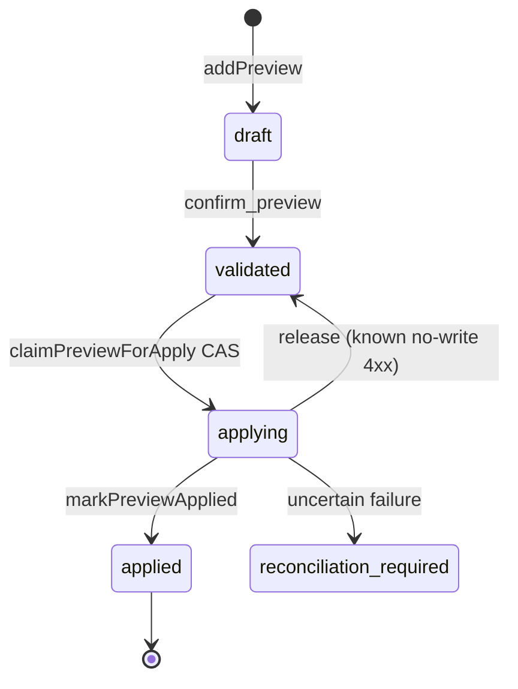

# 16. MCP pluggable ephemeral store for HTTP preview sessions and OAuth

Date: 2026-08-02

## Status

Accepted

## Context

Streamable HTTP MCP holds several kinds of short-lived process state:

1. **Content-developer preview ledger** — session-owned draft → validated → apply tokens ([ADR-0014](0014-mcp-content-developer-persona-mutation-boundary.md)).
2. **Streamable HTTP `SessionStore`** — MCP transport sessions bound to subjects.
3. **OAuth broker pending store** — authorization codes / PKCE handoff between `/oauth/authorize` and `/oauth/token` ([ADR-0007](0007-mcp-http-transport-auth-modes-sdk-v2.md)).

Today these live in process memory. That is correct for stdio and local single-instance HTTP, but multi-replica deployments lose sessions on restart and across instances unless sticky routing is used. ADR-0007 already called out sticky sessions until an external store exists.

### Alternatives considered

| Option                                                | Suitability | Notes                                                          |
| :---------------------------------------------------- | ----------: | :------------------------------------------------------------- |
| Keep memory-only + sticky LB forever                  |          40 | Simple, but blocks horizontal scale and loses state on restart |
| Separate stores per concern with different env knobs  |          55 | More knobs; risk of divergent TTL/ops semantics                |
| One pluggable ephemeral backend (`memory` \| `redis`) |          90 | Shared config; Redis opt-in for scale; memory remains default  |
| Always-on Redis in all environments                   |          35 | Overkill for stdio/tests; fails closed without infra           |

### Trade-offs

- **Feasibility:** Redis is optional; default memory needs no infra.
- **Maintainability:** One `StoreBackend` + factories; backends implement domain stores (preview first; sessions/OAuth follow the same config).
- **Complexity:** CAS / Lua for Redis; in-process mutex for memory. Apply path must not delete-before-I/O.

## Decision

1. **One store abstraction family** for HTTP ephemeral state: preview ledger, Streamable HTTP `SessionStore`, and OAuth broker pending store share the same backend selection and env surface (`createPreviewStore` / `createSessionStore` / `createOAuthBrokerStore`).
2. **`LIGHTDASH_TOOLS_MCP_STORE=memory|redis`**, default **`memory`**.
3. **`LIGHTDASH_TOOLS_MCP_REDIS_URL`** is required only when `STORE=redis` (fail closed at config resolve / first use).
4. **Production MAY use memory** for a single instance. On HTTP + memory, log a warning that multi-instance and process restart lose ephemeral state.
5. **Redis is opt-in** for horizontal scale / restart survival.
6. **Stdio and tests use memory** (default; no Redis required).

### Preview apply state machine (binding for content-developer)

Preview entries use status
`draft → validated → applying → applied | reconciliation_required`
(with release back to `validated` on known no-write failures). Apply **claims** via compare-and-swap (`validated` → `applying`) before upstream mutation, then marks applied or releases/reconciles — never delete-before-I/O as the sole path.

## Consequences

- Operators can run single-instance HTTP on memory with an explicit multi-instance warning, or opt into Redis for shared ephemeral state.
- Content-developer apply becomes crash-safer: a mid-flight failure no longer drops the preview before the mutation outcome is known.
- **OAuth broker pending / codes / DCR clients** fully use the shared backend: Redis mode enables multi-instance authorize → callback → token without sticky routing.
- **SessionStore is hybrid:** live Streamable HTTP `transport`/`server` objects stay process-local (not serializable). Redis mode also persists a serializable session _index_ (auth, lastAccess, personaId) for awareness/TTL; request affinity for in-flight transports still needs sticky sessions or a single instance — a Redis index hit without a local transport is treated as session not found.
- Redis availability becomes a production dependency when `STORE=redis`; misconfiguration fails closed.

## References

- [ADR-0007](0007-mcp-http-transport-auth-modes-sdk-v2.md) — HTTP transport / OAuth broker
- [ADR-0014](0014-mcp-content-developer-persona-mutation-boundary.md) — content-developer preview gate
- Implementation: `packages/mcp/src/store/`, `packages/mcp/src/policy/preview-ledger.ts`, `packages/mcp/src/transports/session-store.ts`, `packages/mcp/src/auth/oauth-broker/pending-store.ts`
