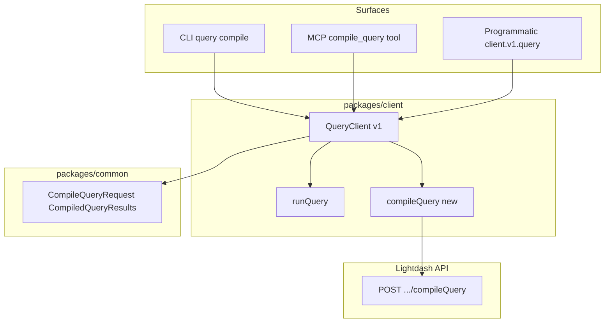

# 21. Support Lightdash compile-query API across client, CLI, and MCP

Date: 2026-02-11

## Status

Accepted

## Context

The Lightdash API provides a `compileQuery` endpoint (`POST /api/v1/projects/{projectUuid}/explores/{exploreId}/compileQuery`) that compiles a metric query to SQL without executing it. This is useful for validation, SQL inspection, and tooling workflows. However, this endpoint was not exposed in our three main surfaces:

- **HTTP Client** (`@lightdash-tools/client`): Only `runQuery` was available; no `compileQuery` method
- **CLI** (`@lightdash-tools/cli`): No query-related commands existed
- **MCP Tools** (`@lightdash-tools/mcp`): No query compilation tool for AI agents

Users and automations needed to either use raw HTTP calls or were unable to compile queries programmatically, via CLI, or through MCP.

## Decision

Implement compile-query support across all three surfaces using a consistent pattern:

1. **Common Types** (`packages/common`): Add `CompileQueryRequest` (derived from OpenAPI `MetricQuery` + optional `pivotConfiguration` and `parameters`) and `CompiledQueryResults` (from `ApiCompiledQueryResults`) to the `Queries` namespace and flat exports.

2. **HTTP Client** (`packages/client`): Add `compileQuery(projectUuid, exploreId, body)` method to `QueryClient` (v1), following the same pattern as `runQuery`.

3. **CLI** (`packages/cli`): Create a new `query` command group with a `compile` subcommand that accepts `projectUuid` and `exploreId` as arguments, reads the metric query JSON from stdin or `--file`, and outputs the compiled result as JSON.

4. **MCP Tools** (`packages/mcp`): Add a `compile_query` tool that accepts `projectUuid`, `exploreId`, and `metricQuery` (as a JSON object), calls `client.v1.query.compileQuery`, and returns the compiled result.

## Consequences

### Positive

- **Consistent API access**: Users can compile queries programmatically, via CLI, or through MCP tools using the same underlying client and types.
- **Type safety**: All three surfaces use shared types from `@lightdash-tools/common`, ensuring consistency and catching errors at compile time.
- **Maintainability**: Single source of truth for request/response types; API changes are reflected in one place (OpenAPI → common → client/CLI/MCP).
- **User value**: Enables validation workflows, SQL inspection, and AI agent tooling without requiring raw HTTP calls.

### Negative

- **CLI input complexity**: Large metric query JSON payloads may be unwieldy from the command line; mitigated by file-based input (`--file`) and stdin piping support.

### Risks

- **OpenAPI drift**: Request/response types are derived from generated OpenAPI types. If the upstream spec changes, types must be regenerated and adjusted. Mitigated by using type aliases that reference the generated schemas directly.
