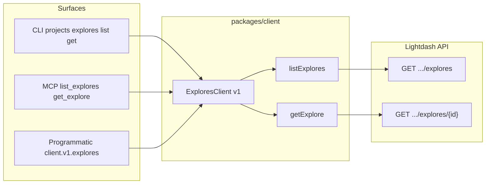

# 22. Support Lightdash explores API across client, CLI, and MCP

Date: 2026-02-11

## Status

Accepted

## Context

The Lightdash API exposes explores endpoints (list and get) under `GET /api/v1/projects/{projectUuid}/explores` and `GET /api/v1/projects/{projectUuid}/explores/{exploreId}`. These endpoints exist in the OpenAPI spec and are used by the Lightdash UI, but they were not exposed in our three main surfaces:

- **HTTP Client** (`@lightdash-tools/client`): No ExploresClient; query operations use exploreId but there is no way to list or fetch explore metadata.
- **CLI** (`@lightdash-tools/cli`): No explores commands; users cannot list or inspect explores from the command line.
- **MCP Tools** (`@lightdash-tools/mcp`): No explores tools; AI agents cannot discover or inspect explores.

Users and automations need to use raw HTTP or cannot list/get explores programmatically, via CLI, or through MCP.

## Decision

Implement explores API support across all three surfaces using a consistent pattern:

1. **HTTP Client** (`packages/client`): Add `ExploresClient` (v1) with `listExplores(projectUuid)` and `getExplore(projectUuid, exploreId)`. Use existing OpenAPI types (`ApiExploresResults`, `ApiExploreResults`) from `@lightdash-tools/common` or generated schemas. Expose as `client.v1.explores` and optional deprecated top-level `client.explores`.

2. **CLI** (`packages/cli`): Add explores under the projects command: `projects explores list <projectUuid>` and `projects explores get <projectUuid> <exploreId>`. Output JSON. Follow the same pattern as spaces and charts.

3. **MCP Tools** (`packages/mcp`): Add `list_explores` (input: projectUuid) and `get_explore` (inputs: projectUuid, exploreId). Call `client.v1.explores` and return JSON in MCP content.

Future work (out of scope for this ADR): set explores (PUT), download CSV from explore, get explore file (git integration).

## Consequences

### Positive

- **Consistent API access**: Users can list and get explores programmatically, via CLI, or through MCP tools using the same underlying client.
- **Type safety**: All surfaces use types derived from the OpenAPI spec (ApiExploresResults, ApiExploreResults).
- **Single source of truth**: API contract comes from generated OpenAPI types; client, CLI, and MCP stay aligned.
- **User value**: Enables discovery of explores for scripting, CLI workflows, and AI agent tooling.

### Negative

- None significant; additive only.

### Risks

- **OpenAPI drift**: If the upstream spec changes, types must be regenerated. Mitigated by using type aliases to generated schemas.

## References

- GitHub Issue: [#52](https://github.com/yu-iskw/lightdash-tools/issues/52) <!-- markdown-link-check-disable-line -->
- OpenSpec: `docs/openspec/changes/explores-api-client-cli-mcp/`
