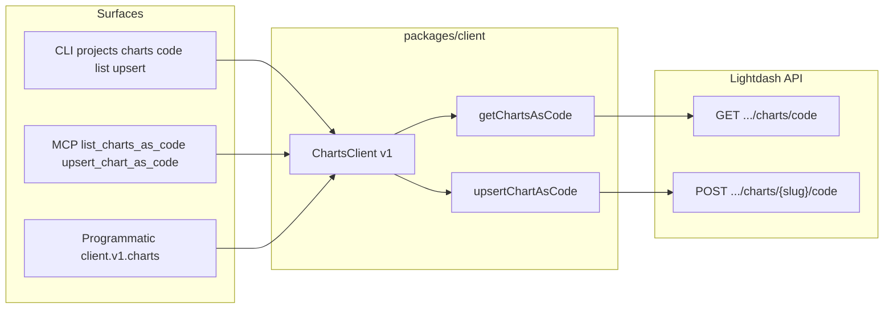

# 23. Support Lightdash charts-as-code API across client, CLI, and MCP

Date: 2026-02-11

## Status

Accepted

## Context

The Lightdash API exposes charts-as-code endpoints: `GET /api/v1/projects/{projectUuid}/charts/code` (list/get charts in code representation) and `POST /api/v1/projects/{projectUuid}/charts/{slug}/code` (upsert a chart from code). These endpoints exist in the OpenAPI spec and back the "dashboards as code" / "charts as code" workflow in Lightdash docs, but they were not exposed in our three main surfaces:

- **HTTP Client** (`@lightdash-tools/client`): `ChartsClient` (v1) currently only has `listCharts(projectUuid)` returning project charts list (`SpaceQuery[]`); no get-as-code or upsert-as-code.
- **CLI** (`@lightdash-tools/cli`): No charts-as-code commands; users cannot list or upsert chart code from the command line.
- **MCP Tools** (`@lightdash-tools/mcp`): No charts-as-code tools; AI agents cannot get or upsert chart definitions as code.

Users and automations need raw HTTP or cannot use charts-as-code programmatically, via CLI, or through MCP.

## Decision

Implement charts-as-code API support across all three surfaces using a consistent pattern:

1. **HTTP Client** (`packages/client`): Extend `ChartsClient` (v1) with:
   - `getChartsAsCode(projectUuid, options?)`: GET `/projects/{projectUuid}/charts/code` with optional query params `ids`, `offset`, `languageMap`; return typed response (`ApiChartAsCodeListResponse` or equivalent from OpenAPI).
   - `upsertChartAsCode(projectUuid, slug, body)`: POST `/projects/{projectUuid}/charts/{slug}/code` with JSON body; return typed response (`ApiChartAsCodeUpsertResponse`). Use types from `@lightdash-tools/common` (generated openapi-types).

2. **CLI** (`packages/cli`): Under the existing `projects charts` command, add a `code` subcommand group with:
   - `list <projectUuid>`: call `client.v1.charts.getChartsAsCode(projectUuid)`; optional flags for `--ids`, `--offset`, `--language-map`; output JSON.
   - `upsert <projectUuid> <slug>`: read body from `--file <path>` or stdin; call `client.v1.charts.upsertChartAsCode(projectUuid, slug, parsedBody)`; output JSON.

3. **MCP Tools** (`packages/mcp`): Add `list_charts_as_code` (input: projectUuid, optional ids) and `upsert_chart_as_code` (inputs: projectUuid, slug, chart payload). Call `client.v1.charts` and return JSON in MCP content.

## Consequences

### Positive

- **Consistent API access**: Users can list and upsert charts as code programmatically, via CLI, or through MCP tools using the same underlying client.
- **Type safety**: All surfaces use types derived from the OpenAPI spec (ApiChartAsCodeListResponse, ChartAsCode, upsert request/response).
- **Single source of truth**: API contract from generated OpenAPI types; client, CLI, and MCP stay aligned.
- **User value**: Enables download/edit/upload workflows and AI-assisted chart development (e.g. with Cursor + MCP as in Lightdash docs).

### Negative

- None significant; additive only.

### Risks

- **OpenAPI drift**: If the upstream spec changes, types must be regenerated. Mitigated by using type aliases to generated schemas.

## References

- GitHub Issue: [#53](https://github.com/yu-iskw/lightdash-tools/issues/53) <!-- markdown-link-check-disable-line -->
- OpenSpec: `docs/openspec/changes/charts-as-code-api-client-cli-mcp/`
