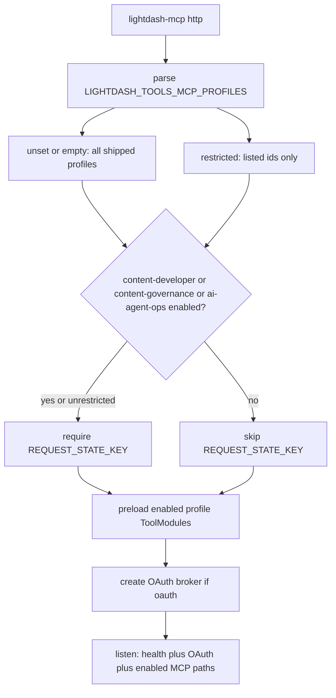

# 24. MCP HTTP profile mount allowlist via env

Date: 2026-08-10

## Status

Accepted

Amends [6. MCP profiles, shared registry, fixed paths](0006-mcp-profiles-shared-registry-fixed-paths.md)

Related to [8. MCP request scope and hardening](0008-mcp-request-scope-and-hardening.md), [9. Cross-cutting conventions](0009-cross-cutting-conventions.md)

Updated 2026-09-10: ToolModule graphs load only for enabled mounts (light id/path catalog stays complete).

## Context

[ADR-0006](0006-mcp-profiles-shared-registry-fixed-paths.md) ships one MCP package with seven fixed HTTP paths. `lightdash-mcp http` mounted every path; clients chose a URL. That is still the right default, but a hosted process (Cloud Run, Compose) that only intends to serve reader or authoring personas still exposed guessable write/governance/analyst URLs to any valid OAuth bearer.

Stdio already selects exactly one profile via `stdio --profile <id>`. An env default for stdio was rejected (0.13.0): MCP stdio authorization uses process credentials, not HTTP OAuth, and Cursor/Claude `args` already pass `--profile`.

Free-form `LIGHTDASH_TOOLS_MCP_PATH` remains rejected. A process **tool** filter remains forbidden ([ADR-0008](0008-mcp-request-scope-and-hardening.md)). Operators still need a **mount** ceiling — which profile URLs exist — analogous to `LIGHTDASH_TOOLS_ALLOWED_PROJECT_UUIDS` for projects.

### Alternatives considered

- **`http --profiles` CLI flag:** explicit, but Cloud Run is env-centric; operators would fork container `CMD` per environment.
- **Edge/proxy path filter:** no product change, but easy to miss RFC 9728 PRM well-known routes; signing key would still be required.
- **One Cloud Run service per profile:** strongest isolation, high ops cost for small teams.
- **Stdio profile env:** recreates a footgun already removed; does not shrink hosted HTTP.

### Trade-offs

Unset/empty = all mounts (backward compatible) can surprise an operator who forgets the var. Fail-closed unknown ids and empty CSV segments limit that risk. Path-specific PRM for a disabled profile 404s so discovery does not advertise a dead resource.

## Decision

1. **HTTP-only allowlist** via `LIGHTDASH_TOOLS_MCP_PROFILES` (comma-separated known `ProfileId`s). Unset or empty → mount every shipped path (ADR-0006 default). Non-empty → only listed ids; unknown ids or empty segments fail at startup. No free-form paths. No aliases.
2. **Stdio unchanged:** `lightdash-mcp stdio --profile <id>` only. This env is ignored on stdio.
3. **Filter at the HTTP layer**, with a split catalog. The lightweight id↔path catalog stays complete for CLI help, allowlist parsing, and PRM path resolution without loading ToolModules. **ToolModule graphs load only for enabled mounts** (HTTP: `LIGHTDASH_TOOLS_MCP_PROFILES`; stdio: the selected `--profile`). Disabled MCP paths and their path-specific PRM still return the same 404 as unknown paths.
4. **Root PRM** (`/.well-known/oauth-protected-resource`) uses `config.mcpPath`. When the allowlist omits `semantic-layer`, `mcpPath` is the first enabled id in `PROFILE_IDS` order so root metadata does not name a 404 resource.
5. **`LIGHTDASH_TOOLS_MCP_REQUEST_STATE_KEY`** is required only when `content-developer` or `content-governance` is enabled (or when unrestricted).
6. This is **not** a tool-registration filter. Capability inside an enabled profile remains that profile’s `tools` array ([ADR-0008](0008-mcp-request-scope-and-hardening.md) / [ADR-0022](0022-mcp-profile-owned-toolmodules-replace-operations-catalog.md)).

## Consequences

- Operators can run a read-only or authoring Cloud Run revision without serving governance/analyst mounts or requiring a signing key.
- Restricted `LIGHTDASH_TOOLS_MCP_PROFILES` also **skips importing** disabled profile ToolModules, shortening Cloud Run cold start (see [cloud-run.md](../operators/cloud-run.md)).
- Clients still connect by profile URL; a mis-aimed URL against a restricted process 404s instead of exposing another persona.
- `http --help` continues to list all shipped profiles (offline inventory). Runtime enablement is env.
- Adding a profile is still a new folder + fixed path; include the new id in the allowlist when restricted; add the path to the light catalog module.
