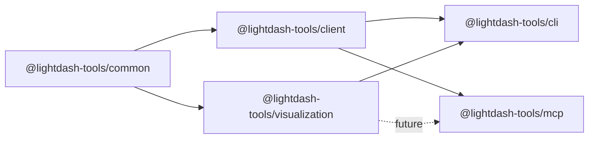

# 26. Add visualization package for LVS multi-target compilers

Date: 2026-08-11

## Status

Accepted

Amends [2. Monorepo packages: client, common, CLI, MCP](0002-monorepo-packages-client-common-cli-mcp.md)

## Context

[ADR-0002](0002-monorepo-packages-client-common-cli-mcp.md) fixed the monorepo at four packages: `common`, `client`, `cli`, and `mcp`. Agents and operators now need a **target-independent** way to express governed visualizations (KPI / ranking stories) and compile them to:

- deterministic SVG;
- self-contained standalone HTML;
- Lightdash Custom Charts (`chartConfig.type: 'custom'` + Vega-Lite `spec`).

Putting that domain model inside `@lightdash-tools/mcp` would couple rendering to protocol code and exclude non-MCP users. Putting it inside `cli` would prevent MCP from reusing the same compilers later. `common` must stay free of rendering runtimes and must not grow a visualization grammar.

The visualization platform RFC (`docs/rfc-visualization-platform.md`) therefore requires a fifth package with a hard dependency firewall.

## Decision

1. Add workspace package **`@lightdash-tools/visualization`** at `packages/visualization`.
2. It owns the Lightdash Visualization Specification (LVS), template registry, capability negotiation, and pure compilers/renderers for MVP targets (`svg`, `standalone-html`, `lightdash-custom-chart`).
3. **Dependency firewall:**
   - MAY depend on `@lightdash-tools/common` and pure libraries (e.g. `zod`).
   - MUST NOT depend on `@lightdash-tools/client` or `@lightdash-tools/mcp`.
   - MUST NOT perform network I/O or hold credentials.
4. Adapters own I/O:
   - `@lightdash-tools/cli` may depend on `visualization` for offline `viz` commands.
   - `@lightdash-tools/mcp` may depend on `visualization` in a later phase for interactive tools/Apps; MCP Apps and content-developer persistence tools are **out of scope for this ADR**.
5. Custom Chart **compilation** is pure. Persistence remains behind the content-developer preview gate ([ADR-0014](0014-mcp-content-developer-profile-mutation-boundary.md)). This ADR does not amend content-developer `queryCapability: none` and does not add warehouse execution to that profile.
6. Interactive query composition (when added later) must reuse the data-analyst bounded metric-query boundary ([ADR-0020](0020-mcp-data-analyst-profile-ad-hoc-metric-query-boundary.md)); it must not invent drill-down / underlying-data surfaces on MCP until a dedicated ADR.

### Architecture

## Consequences

- ADR-0002’s four-package inventory is extended; validate-names / knip / verify gates must recognize `packages/visualization`.
- Visualization logic is independently testable with fixture datasets (no live Lightdash).
- Risk: a growing LVS becomes a competing chart language — mitigated by keeping LVS high-level, limiting MVP to two templates, and delegating conventional charts to Vega-Lite only on the Custom Chart target.
- Risk: Custom Chart upsert still needs caller-supplied `name` / `slug` / `spaceSlug` / `version`; the package emits `chartConfig` + aligned `metricQuery` only.
