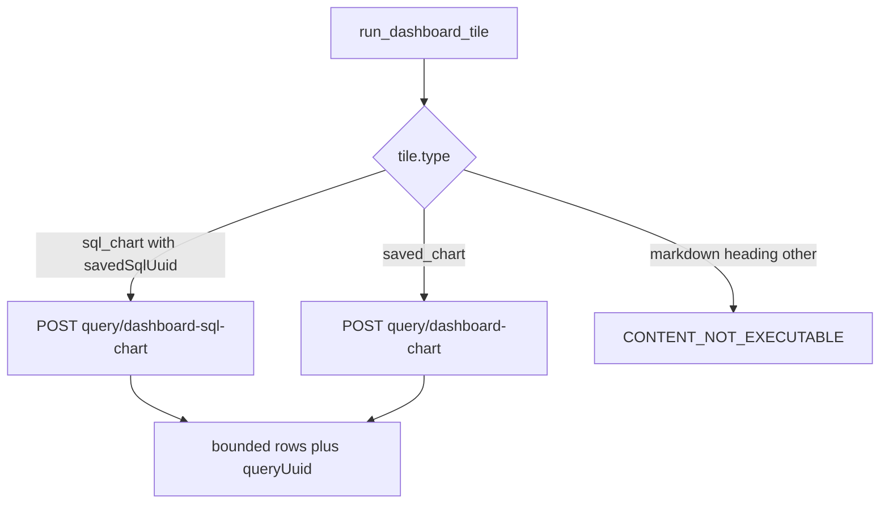
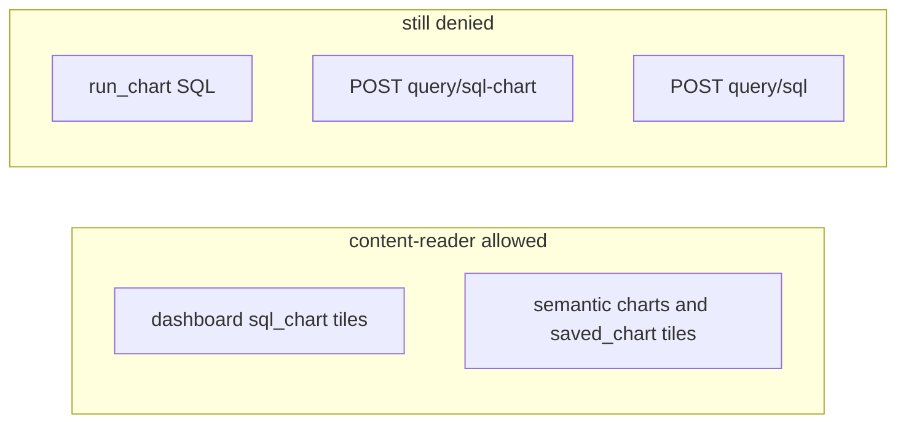

# 28. MCP content-reader executes saved dashboard SQL tiles

Date: 2026-08-20

## Status

Accepted

Amends [12. MCP content-reader profile saved-content execution boundary](0012-mcp-content-reader-profile-saved-content-execution-boundary.md)

Related to [20. MCP data-analyst profile ad-hoc metric-query boundary](0020-mcp-data-analyst-profile-ad-hoc-metric-query-boundary.md)

## Context

[ADR-0012](0012-mcp-content-reader-profile-saved-content-execution-boundary.md) lets `content-reader` run **saved** semantic charts and dashboard tiles, and treats SQL-backed saved charts as a higher-risk class disabled by default. Decision 4 returned `CONTENT_NOT_EXECUTABLE` for saved SQL charts **and** dashboard SQL tiles, and left OpenAPI `query/sql-chart` and `query/dashboard-sql-chart` off the MCP surface pending a later opt-in.

That default-deny is the wrong grain for Interactive Viewer–style dashboard Q&A. Many published dashboards mix semantic tiles with SQL runner tiles (`type: sql_chart`, `properties.savedSqlUuid`). Agents on `content-reader` can already load those dashboards, but cannot read the numbers those tiles were authored to show. Recreating the SQL on `data-analyst` is not available (that profile excludes raw SQL). Converting every SQL tile to a semantic chart is an authoring project, not a read path.

The remaining risk is real: saved SQL can return grain-level rows and expensive scans, unlike semantic aggregates. Dashboard placement is still an editorial gate — a human put that saved SQL on a board — and is not the same as letting an agent compose `POST …/query/sql`.

Lightdash already separates those APIs:

- Saved dashboard SQL: `POST …/query/dashboard-sql-chart` (inherited dashboard filters; identify the chart by `savedSqlUuid` or `slug`).
- Standalone saved SQL chart: `POST …/query/sql-chart`.
- Ad-hoc SQL: `POST …/query/sql`.

Date zoom is a `dateZoom` field on `query/dashboard-chart`, but **not** on `query/dashboard-sql-chart`. SQL charts that opt in use the reserved parameter `${ld.parameters.date_zoom}` from viewer context. Mapping tool `dateZoom` onto `parameters.date_zoom` is unverified against the execute schema.

### Alternatives considered

- **Enable all saved SQL charts** (`run_chart` + dashboard tiles): weaker gate; unpublished/sandbox SQL becomes executable by UUID.
- **Operator env opt-in, default deny**: preserves ADR-0012 wording, but leaves the default profile blind on mixed dashboards.
- **New profile or `data-analyst`**: dashboard Q&A already belongs on `content-reader`; `data-analyst` is ad-hoc explore metric-query ([ADR-0020](0020-mcp-data-analyst-profile-ad-hoc-metric-query-boundary.md)).
- **No execution** (migrate tiles / chart PNG): does not return numbers from SQL-heavy boards.

### Trade-offs

Dashboard SQL tiles gain Interactive Viewer parity at the cost of bounded **possibly row-level** results. Existing row/cell/concurrency budgets still apply. SQL text stays hidden. Standalone SQL charts and ad-hoc SQL stay off MCP.

## Decision

1. **Dashboard `sql_chart` tiles are saved content.** `run_dashboard_tile` may execute `tile.type === 'sql_chart'` via `POST /api/v2/projects/{projectUuid}/query/dashboard-sql-chart` (`v2.query.runDashboardSqlChartQuery`). Safety remains `queryCapability: saved_content` (not `raw_sql`).
2. **Standalone SQL charts stay default-deny.** `run_chart` still returns `CONTENT_NOT_EXECUTABLE` for `source=sql` / `chartType=sql`. `POST …/query/sql-chart` stays off the MCP allowlist.
3. **Ad-hoc SQL stays excluded.** `POST …/query/sql`, underlying-data, and bulk download remain off MCP. Agents must not author SQL.
4. **SQL text stays hidden.** `get_chart` / `explain_content` must not return the SQL body.
5. **Identity and filters.** Execution requires `properties.savedSqlUuid` on the tile. Values-only dashboard filter and parameter overrides still apply. `dashboardFilters` and `dashboardSorts` are always sent (required by upstream). Query `context` is `dashboardView`, not `mcp.run_sql` / `sqlRunner`.
6. **Date zoom on SQL tiles is ignored in v1.** Tool `dateZoom` is not a field on `dashboard-sql-chart`; warn and use the dashboard default. Do not invent a reserved-parameter mapping.
7. **Honesty about result grain.** SQL tile rows may be grain-level. Envelope a `SQL_RESULT_MAY_BE_ROW_LEVEL` warning. Do not claim semantic aggregate semantics. Existing bounded normalize / row caps still apply.
8. **Capability split.** `canExecuteDashboardSqlTiles: true`; `canExecuteSqlCharts: false`. `get_dashboard` marks `sql_chart` tiles `executable` when `savedSqlUuid` is present (same `executable` flag as semantic `saved_chart` tiles).
9. Inventory: [content-reader inventory](../profiles/content-reader/inventory.md). This ADR replaces ADR-0012 decision 4 **only** for dashboard SQL tiles; the rest of ADR-0012 remains binding.

## Consequences

- Mixed semantic + SQL dashboards become answerable on `content-reader` without attaching `data-analyst` or exposing ad-hoc SQL.
- Agents must use `run_dashboard_tile` (not `run_chart`) for SQL KPIs; playbooks and `readerCapabilities` must advertise that split or agents will keep skipping tiles.
- Warehouse cost and PII exposure for SQL tiles follow whatever the saved query already does; budgets truncate rows, they do not rewrite SQL.
- Date zoom simulation on SQL tiles is incomplete until upstream documents a `dateZoom` (or equivalent) field on `dashboard-sql-chart`.
- Enabling standalone `run_chart` SQL or `POST …/query/sql` still requires a further ADR.
