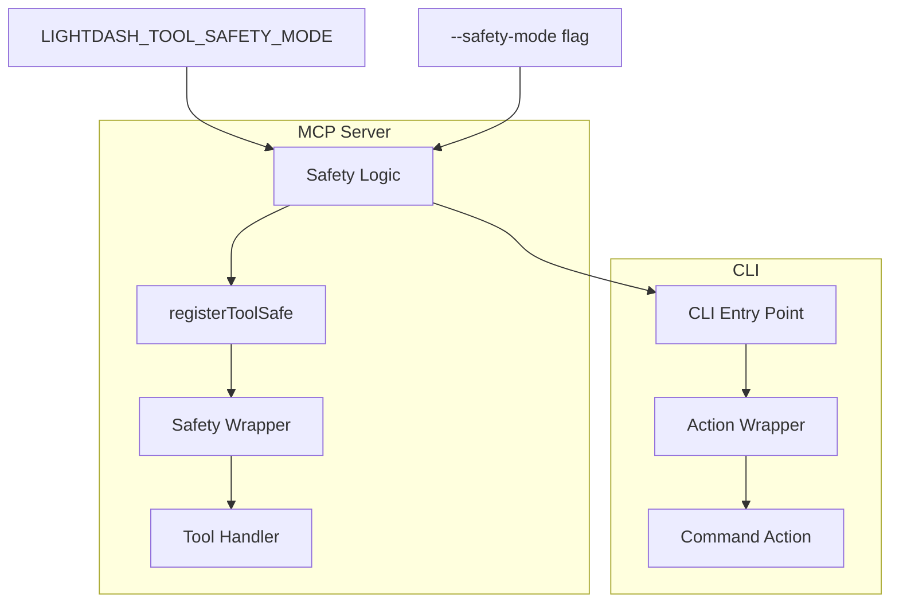

# 29. Hierarchical safety modes for MCP and CLI

Date: 2026-02-13

## Status

Proposed

## Context

AI agents and autonomous tools are increasingly used to interact with Lightdash via our MCP server and CLI. Some operations are inherently dangerous (e.g., deleting users, removing projects), and accidental execution can lead to data loss or service disruption. We need a way to restrict the operations available to these tools based on the environment or user preference.

We already have `ToolAnnotations` in the MCP server (based on the MCP specification), but we lack:

1. A hierarchical safety model.
2. Enforcement of these annotations in both MCP and CLI.
3. A unified configuration mechanism.

## Decision

We will implement a hierarchical safety model across both the MCP server and the CLI.

### Safety Modes Hierarchy

1. **`read-only`**: Only allows operations explicitly marked as read-only.
   - `annotations.readOnlyHint === true`
2. **`write-idempotent`**: Allows `read-only` operations and non-destructive, idempotent writes.
   - `annotations.readOnlyHint === true` OR (`annotations.readOnlyHint === false` AND `annotations.destructiveHint === false`)
3. **`write-destructive`**: Allows all operations, including destructive ones.
   - All tools/commands.

### Configuration

- Environment Variable: `LIGHTDASH_TOOL_SAFETY_MODE` (values: `read-only`, `write-idempotent`, `write-destructive`).
- CLI Flag: `--safety-mode` (same values).
- MCP CLI Flag: `--safety-mode` (same values; specifically for filtering registered tools).
- Default: `write-destructive` (for backward compatibility).

### Enforcement

- **MCP Server**:
  - **Dynamic Enforcement**: The `registerToolSafe` function will be updated to wrap tool handlers in a safety check. If a tool is called that is forbidden in the current mode, the server will return an error message to the agent. Tool descriptions will also be updated to indicate if a tool is disabled.
  - **Static Filtering**: The `--safety-mode` option allows the server to filter which tools are registered at start-up. Tools not allowed in the selected mode will not be bound (registered) to the MCP server, hiding them completely from the AI agent.
- **CLI**: A global `--safety-mode` option will be added. Commands will be annotated with `ToolAnnotations`. A middleware/wrapper will check the safety mode before executing a command's action.

### Architecture

## Consequences

- All CLI commands must be audited and annotated with the appropriate safety hints.
- AI agents will receive clear feedback when they attempt a forbidden operation.
- Improved safety and trust for users allowing AI agents to operate on their Lightdash instance.
