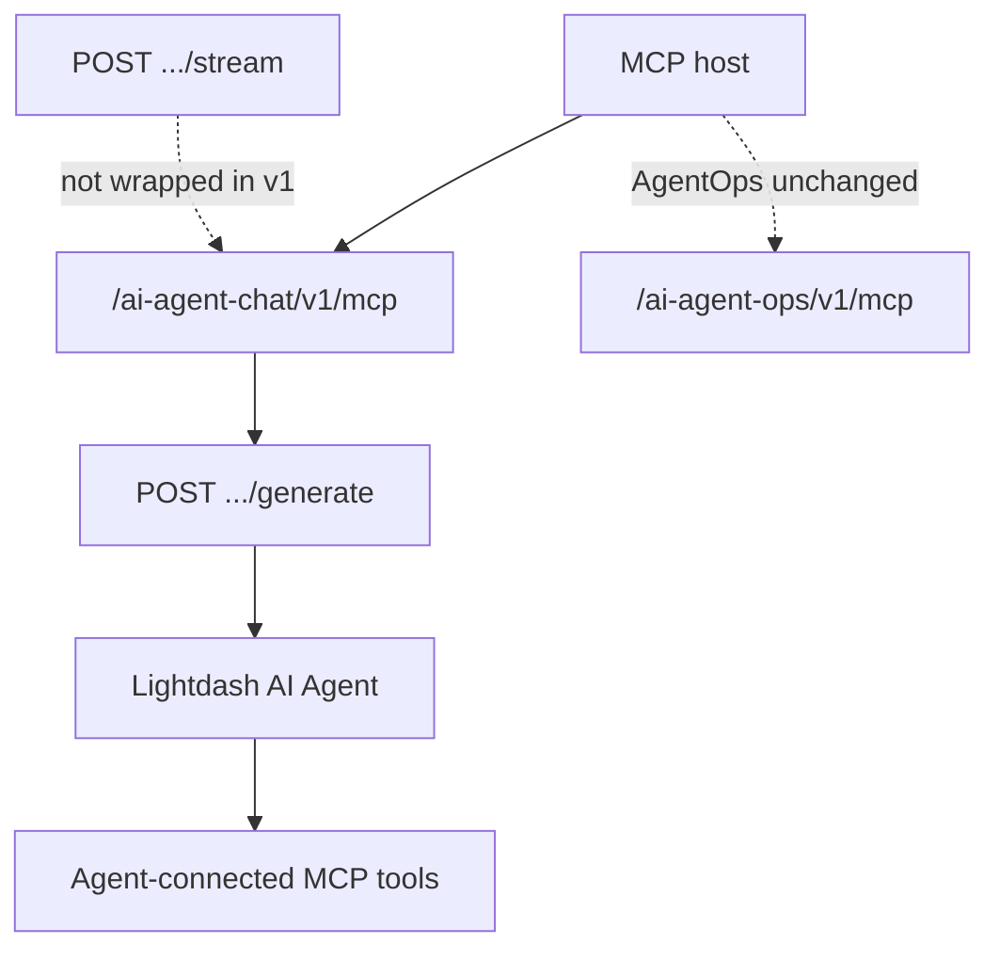

# 29. MCP ai-agent-chat profile conversation boundary

Date: 2026-08-20

## Status

Accepted

Amends [6. MCP profiles, shared registry, fixed paths](0006-mcp-profiles-shared-registry-fixed-paths.md)

Related to [18. MCP ai-agent-ops profile thin API boundary](0018-mcp-ai-agent-ops-profile-thin-api-boundary.md)

**Amended by [30. MCP ai-agent-chat first turn requires prompt on create](0030-mcp-ai-agent-chat-first-turn-requires-prompt-on-create.md)** — decision 4 empty `{}` create is replaced by required `prompt` on create.

## Context

Agents need to **use** managed Lightdash AI Agents as the current user: discover an accessible agent, resolve a default when the caller has one, create or resume a conversation, submit a prompt, and receive the generated answer — **without** AgentOps, evaluations, SQL-mode controls, or content authoring.

Existing profiles leave a gap:

- `ai-agent-ops` ([ADR-0018](0018-mcp-ai-agent-ops-profile-thin-api-boundary.md)) inspects agents, readiness, and evaluation suites/runs. It explicitly deferred thread generate/continue on MCP.
- `content-reader`, `data-analyst`, `semantic-layer`, and `content-developer` are analytics or authoring surfaces, not the managed AI-agent runtime.

Extending `ai-agent-ops` with generate would collapse the consumer vs operator boundary ADR-0018 preserved. Hosts already attached to `/ai-agent-ops/v1/mcp` would gain conversation generation they did not opt into.

`@lightdash-tools/client` already wraps `createAgentThread`, `createAgentThreadMessage`, `generateAgentThreadResponse`, and `getUserAgentPreferences`. Current Lightdash still exposes both `POST …/generate` and `POST …/stream`. The stream body accepts `enableSqlMode`, `autoApproveSql`, and `toolHints`. v1 uses non-streaming generate so those flags never appear on the MCP schema.

## Decision

1. Ship a separate **`ai-agent-chat`** profile at fixed path `/ai-agent-chat/v1/mcp` with MCP server display name **`lightdash-mcp-aichat`**. Stdio: `lightdash-mcp stdio --profile ai-agent-chat`.
2. **v1 surface:** `list_project_agents`, `get_user_agent_preferences`, `list_agent_threads`, `get_agent_thread`, `create_agent_thread`, `create_agent_thread_message`, `generate_agent_response`. Mount via profile `tools: ToolModule[]` ([ADR-0022](0022-mcp-profile-owned-toolmodules-replace-operations-catalog.md)).
3. `generate_agent_response` uses the existing client `generateAgentThreadResponse` → `POST …/generate`. Do not wrap `POST …/stream`. No SQL-mode, auto-approve-SQL, or `toolHint` inputs on the tool schema.
4. `create_agent_thread` sends `{}`. `create_agent_thread_message` accepts `prompt` only. Do not ship a `start_conversation` mega-tool; hosts orchestrate the primitives.
5. Project scope matches [ADR-0008](0008-mcp-request-scope-and-hardening.md). Thread reads stay default-redacted ([ADR-0011](0011-mcp-tool-response-sensitivity-classes.md)). The generated answer is returned (that is the tool’s purpose). Audit does not log prompt or response bodies.
6. **Excluded from MCP v1:** agent CRUD, evals, `get_project_agent`, preference set/delete, `allUsers` thread listing, SQL approval, content mutation, and data-analyst fallback.
7. Nested agent-connected MCP tools are an upstream Lightdash configuration boundary. Do not describe this profile as read-only.
8. Inventory: [ai-agent-chat inventory](../profiles/ai-agent-chat/inventory.md). Code: `packages/mcp/src/profiles/ai-agent-chat/`.
9. Do not add `LIGHTDASH_TOOLS_AI_AGENT_CHAT_ALLOWED_AGENT_UUIDS` in v1. Lightdash RBAC plus the shared project allowlist remain the local ceilings. An agent-UUID allowlist would need a later hardening ADR.

## Consequences

- Hosts that need managed-agent conversation attach `/ai-agent-chat/v1/mcp` (or stdio `ai-agent-chat`) without widening `ai-agent-ops`.
- Hosted multi-user deployments should use OAuth plus `LIGHTDASH_TOOLS_MCP_PROFILES=ai-agent-chat` and `LIGHTDASH_TOOLS_ALLOWED_PROJECT_UUIDS`. Project Interactive Viewer is the recommended minimum role.
- Live Interactive Viewer RBAC matrix and hosted OAuth two-user E2E remain operator release gates; they are not implied by this ADR.
- Nested tool side effects stay a Lightdash agent-configuration concern. Operators must not treat this mount as a safe read-only analytics profile.
