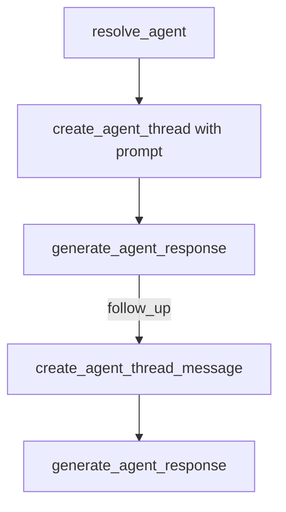

# 30. MCP ai-agent-chat first turn requires prompt on create

Date: 2026-08-21

## Status

Accepted

Amends [29. MCP ai-agent-chat profile conversation boundary](0029-mcp-ai-agent-chat-profile-conversation-boundary.md)

## Context

[ADR-0029](0029-mcp-ai-agent-chat-profile-conversation-boundary.md) decision 4 specified that `create_agent_thread` sends `{}` and that the first user prompt is added via `create_agent_thread_message`, then `generate_agent_response`.

Live Lightdash Cloud rejects that empty create:

`UPSTREAM_VALIDATION` → `AI agent thread not found for uuid: {agentUuid}/{threadUuid}`

Upstream `AiAgentService.createAgentThread` inserts an `ai_thread` (and only inserts an `ai_prompt` when `body.prompt` is set), then always calls `getThread`. `AiAgentModel.buildThreadSummaryQuery` **INNER JOINs** `ai_prompt` on the first prompt, so promptless threads are unfetchable. Upstream even documents this in `createWebAppThreadWithPrompt` (“no promptless (unfetchable) thread”). The public create-thread response type requires `firstMessage` on `AiAgentThreadSummary`, which empty create cannot satisfy.

OpenAPI still marks `prompt` optional on create, but a successful round-trip effectively requires it.

### Alternatives considered

- **Keep empty create + message:** incompatible with live cloud; leaves orphan promptless rows when create fails after insert.
- **`start_conversation` mega-tool:** rejected in ADR-0029; hosts should keep orchestrating primitives.
- **Placeholder/sentinel prompt on create:** pollutes conversation history; worse than requiring the real first prompt.

## Decision

1. Amend ADR-0029 decision 4: **`create_agent_thread` requires `prompt`** (first user turn). Body is `{ prompt }`, not `{}`.
2. **New conversation:** `create_agent_thread({ prompt })` → `generate_agent_response`. Do not call `create_agent_thread_message` on the first turn.
3. **Follow-up:** unchanged — `create_agent_thread_message({ prompt })` → `generate_agent_response`.
4. Still no `start_conversation` mega-tool. Still `/generate` only (not `/stream`). Chart/dashboard `context` pinning on create remains out of v1 scope.

## Consequences

- Host playbooks, MCP prompts, and inventory must teach create→generate for new chats (two calls), not create→message→generate (three).
- MCP schema and unit tests reject missing/empty prompts on create.
- Callers that still send empty create fail closed at the MCP input layer instead of after an upstream NotFound.
- Dashboard/chart pinned `context` on create remains a later enhancement.

## References

- [Create agent thread API](https://docs.lightdash.com/api-reference/post-apiv1projects-aiagents-threads)
- [Generate agent thread response API](https://docs.lightdash.com/api-reference/post-apiv1projects-aiagents-threads-generate)
- Inventory: [ai-agent-chat inventory](../profiles/ai-agent-chat/inventory.md)
- Code: `packages/mcp/src/tools/ai-agents/threads.ts`, playbooks under `packages/mcp/src/profiles/ai-agent-chat/`
