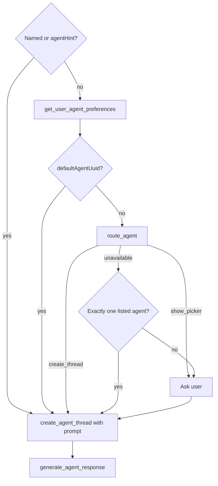

# 31. MCP ai-agent-chat AI Router route_agent selection

Date: 2026-08-21

## Status

Accepted

Amends [29. MCP ai-agent-chat profile conversation boundary](0029-mcp-ai-agent-chat-profile-conversation-boundary.md)

## Context

[ADR-0029](0029-mcp-ai-agent-chat-profile-conversation-boundary.md) ships `ai-agent-chat` with preference resolution and `list_project_agents`, then host-orchestrated create(+prompt)→generate ([ADR-0030](0030-mcp-ai-agent-chat-first-turn-requires-prompt-on-create.md)). The conversation playbook told hosts to “select (ask the user only when necessary)” when no default agent exists.

That underspecified select invited **host heuristics** (matching `enableContentTools`, instruction text such as “このダッシュボード”, agent names). Hosts then opened the wrong managed agent; space-scoped agents answered about **their** dashboard instead of a user-supplied Lightdash URL/UUID.

Upstream already exposes org AI Router (`POST /api/v1/org/aiRouter/route`) and documents `route_agent` on [Lightdash Data MCP](https://docs.lightdash.com/agents/lightdash-mcp) / [AI Router](https://docs.lightdash.com/agents/enable-ai-router). Data MCP **activates session agent context** (`set_agent` scoping). This profile instead runs **managed-agent conversation** (`create_agent_thread` → `generate_agent_response`). Same routing API; different consumption.

### Alternatives considered

- **Playbook-only stricter select:** still host-compliance dependent; repeats the failure mode.
- **Fail-closed ask always:** correct but poor UX when Router is available.
- **Wrap commit + router admin CRUD:** commit is Web/Slack telemetry; admin belongs outside chat.
- **Silent auto on `show_picker`:** matches Data MCP “no picker”, but raises wrong-dashboard risk when confidence is low.

## Decision

1. Add **`route_agent`** to `ai-agent-chat` v1. Client wraps `POST /api/v1/org/aiRouter/route` with `{ projectUuid, prompt }`. Return the upstream decision (`nextAction`, `suggestedAgentUuid`, `confidence`, `candidates`, `reasoning`, `decisionUuid`). Host still orchestrates create→generate.
2. **Selection order** for a new conversation: named agent / `agentHint` → `get_user_agent_preferences` → **`route_agent`** → fallback. Fallback when Router is unavailable: exactly one listed agent → use it; else **ask the user**. **Ban** host fuzzy match on instruction / flags / names.
3. When `nextAction === show_picker`, the host **asks the user** with candidates (safer than silent pick; intentional divergence from Data MCP’s no-picker UX).
4. **URL/UUID grounding** (playbook, no new tool): when the user prompt contains a Lightdash dashboard/chart URL or UUID, prefix a structured target block on **create** (and on `route_agent` only when that selection step runs). Target `projectUuid` must equal the resolved project scope; URL project conflicts → ask/refuse. Require the reply to cite title + UUID; mismatch → one follow-up on the same thread.
5. **Non-goals for this amend:** `commit` decision API; router config/instruction CRUD; Data MCP session activation; create-thread `context` pinning (still deferred); mounting `route_agent` on `ai-agent-ops`; changing preference-before-router order (matches Lightdash UI — residual wrong-agent risk for URL questions when a default is set is mitigated by grounding + title/UUID follow-up).

## Consequences

- Inventory, playbooks, prompts, and invariants teach **named/hint → preference → Router → fail-closed** selection plus URL grounding (not “Router-first” ahead of the user’s default).
- Hosts that ignore the playbook can still pick wrongly; the invariant + tool description reduce that surface.
- Orgs without AI Router enabled fall back to single-agent or explicit user pick — no heuristic invent.
- Operators must not confuse this `route_agent` with Data MCP’s session-scoped `route_agent` / `set_agent`.
- `route_agent` may persist a decision (and prompt) upstream; annotate as non-destructive write, not read-only.

## References

- [AI Router](https://docs.lightdash.com/agents/enable-ai-router)
- [Lightdash MCP](https://docs.lightdash.com/agents/lightdash-mcp)
- Inventory: [ai-agent-chat inventory](../profiles/ai-agent-chat/inventory.md)
- Code: `packages/client/src/api/v1/ai-agents/router.ts`, `packages/mcp/src/tools/ai-agents/`, playbooks under `packages/mcp/src/profiles/ai-agent-chat/`
