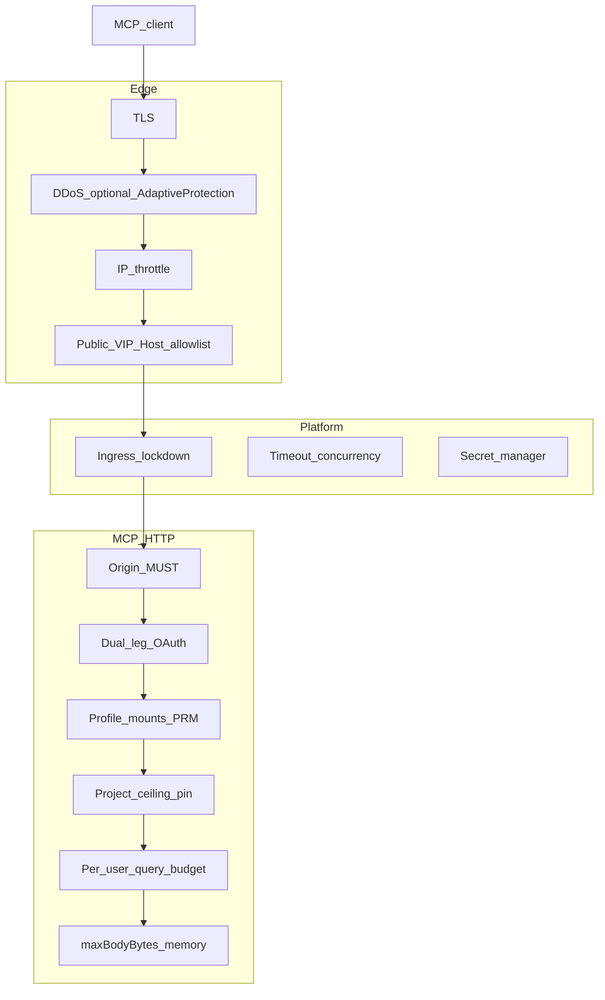

# 32. MCP HTTP three-plane security control ownership

Date: 2026-08-25

## Status

Accepted

Amends [7. MCP HTTP transport, OAuth broker, SDK v2](0007-mcp-http-transport-auth-modes-sdk-v2.md)

Related to [8. MCP request scope and hardening](0008-mcp-request-scope-and-hardening.md)

Related to [24. MCP HTTP profile mount allowlist via env](0024-mcp-http-profile-mount-allowlist-via-env.md)

Amends [27. Extra invoke origins advertise host-aware OAuth metadata](0027-mcp-oauth-extra-invoke-origins.md)

## Context

Hosted `@lightdash-tools/mcp` HTTP is often deployed on Cloud Run behind a Google Cloud load balancer and Cloud Armor. Operators reasonably want a split: the edge should stop volumetric abuse, spoofed Hosts, and TLS issues; the MCP process should not pretend to be a WAF.

The HTTP process already does **not** implement TLS termination, L3/L7 DDoS, IP/geo allowlists, or signature WAF. Those attach to a **global external Application Load Balancer** backend ([Cloud Armor with Cloud Run](https://docs.cloud.google.com/armor/docs/integrating-cloud-armor)). Direct `*.run.app` traffic **bypasses** Armor unless Cloud Run ingress is `internal-and-cloud-load-balancing` or the default URL is disabled ([ingress](https://docs.cloud.google.com/run/docs/securing/ingress)).

What _is_ in the Node process is mostly MCP specification or identity policy:

1. Streamable HTTP **MUST** validate `Origin` (403 if present and invalid) ([2026-07-28](https://modelcontextprotocol.io/specification/2026-07-28/basic/transports/streamable-http)). Missing `Origin` is allowed so non-browser clients (Cursor, Claude Code) work.
2. Dual-leg, audience-bound MCP tokens; no token passthrough ([MCP security best practices](https://modelcontextprotocol.io/docs/2026-07-28/tutorials/security/security_best_practices), [ADR-0026](0026-mcp-oauth-dual-leg-token-boundary.md)).
3. Per-user query budgets. Cloud Armor rate limits are **approximate** and **not for strict quotas** ([rate limiting](https://cloud.google.com/armor/docs/rate-limiting-overview)).
4. Profile mount ceilings and RFC 9728 PRM 404s ([ADR-0024](0024-mcp-http-profile-mount-allowlist-via-env.md)). An edge path filter is easy to get wrong on well-known routes.
5. Project allowlist / HTTP pin ([ADR-0008](0008-mcp-request-scope-and-hardening.md)), identifier validation, tool-output redaction, HMAC preview/`requestState`, in-memory OAuth pending caps.

This package also runs **without** Armor: Compose, stdio (no HTTP), and non-GCP HTTP. Application controls must remain correct when the edge is missing.

Empty `LIGHTDASH_TOOLS_MCP_ALLOWED_ORIGINS` is the correct default for URL-only agent clients. A startup warning that framed that as a misconfiguration was noise, not a missing WAF.

### Alternatives considered

- **Strip Origin, body cap, query budgets, and allowlists; rely on Armor.** Rejected: violates Streamable HTTP MUST Origin; Armor cannot bind OAuth audience or per-`userUuid` warehouse budgets; Compose/non-GCP regress; OWASP CRS SQLi/XSS signatures are false-positive prone on JSON APIs ([troubleshooting](https://docs.cloud.google.com/armor/docs/troubleshooting)) and inspect at most 64 kB ([content parsing](https://docs.cloud.google.com/armor/docs/content-parsing)). MCP tool args carry SQL and Explore JSON.
- **`TRUST_EDGE` / restore `DANGEROUSLY_ALLOW_ANY_ORIGIN`.** Rejected: fail-open if ingress stays `all`; the obsolete-env set already removed that knob family.
- **IAP (or Cloud Run IAM) in front of MCP OAuth.** Rejected as the default: Cursor/Claude URL-only clients do not mint Google identity tokens. Cloud Run `--allow-unauthenticated` plus app OAuth is the identity split; Google IAM is not Lightdash RBAC.
- **Edge-only profile path filter instead of `LIGHTDASH_TOOLS_MCP_PROFILES`.** Already rejected in ADR-0024 (PRM well-known routes).
- **Stock OWASP CRS on profile MCP POSTs.** Rejected as a default recipe. Prefer Armor **throttle** (and optional Adaptive Protection), not signature WAF, on JSON-RPC bodies.

## Decision

**Network volume, Host routing, and TLS belong at the operator edge. MCP HTTP stays protocol-complete even when that edge is missing.**

Ownership:

1. **Edge** (load balancer + WAF/DDoS product): TLS; volumetric DDoS; approximate IP throttle (especially `/oauth/authorize` and `/oauth/register`); public VIP Host allowlist so extra invoke origins are never served there ([ADR-0027](0027-mcp-oauth-extra-invoke-origins.md)). Do not enable generic OWASP CRS on MCP POSTs by default.
2. **Platform** (Cloud Run or equivalent): ingress so the default compute URL cannot skip the edge; request timeout and concurrency; secrets injection. Keep the compute IAM invoker **open** for MCP clients; authentication of Lightdash users remains the MCP OAuth broker ([ADR-0007](0007-mcp-http-transport-auth-modes-sdk-v2.md) / [ADR-0026](0026-mcp-oauth-dual-leg-token-boundary.md)).
3. **Application** (`lightdash-mcp http`): Origin MUST; dual-leg audience tokens; profile mounts and path-specific PRM; project allowlist and pin; identifier validation; output redaction; per-user query budget; `maxBodyBytes` as a **process-memory** backstop (not a WAF); in-memory broker pending/DCR/code caps; audit JSON.

Never delete from the process to “delegate to Armor”: Origin validation, OAuth audience / no passthrough, per-user query budgets, profile PRM 404s, project ceiling.

Do **not** add a process flag that disables those controls when an operator claims an edge exists.

Operator recipes (gcloud, ingress flags, Armor throttle examples) live in [docs/operators/http-control-plane.md](../operators/http-control-plane.md) and [docs/operators/cloud-run.md](../operators/cloud-run.md) — not in this ADR.

## Consequences

- Future HTTP “hardening” PRs must classify the control as edge, platform, or application. Volume/TLS/Host changes go to operator docs, not Node middleware that copies Armor.
- Sample Cloud Run deploys that publish only `*.run.app` remain valid for smoke tests but are **not** a production edge. Armor never sees that path unless ingress is locked down.
- Multi-replica `/oauth/*` still needs a single replica or a dedicated OAuth service: load-balancer session affinity does not pin Cloud Run instances ([ADR-0019](0019-mcp-stateless-protocol-core-without-redis-ephemeral-store.md)).
- Empty Origin allowlist stays the hosted default; browser Origins without an allowlist continue to 403 on profile MCP routes (spec), without a startup scold.

## References

- [MCP Streamable HTTP — Security & Endpoint](https://modelcontextprotocol.io/specification/2026-07-28/basic/transports/streamable-http)
- [MCP Security Best Practices](https://modelcontextprotocol.io/docs/2026-07-28/tutorials/security/security_best_practices)
- [Cloud Armor integrating with Cloud Run](https://docs.cloud.google.com/armor/docs/integrating-cloud-armor)
- [Cloud Run ingress](https://docs.cloud.google.com/run/docs/securing/ingress)
- [Cloud Armor rate limiting](https://cloud.google.com/armor/docs/rate-limiting-overview)
- Operator how: [http-control-plane.md](../operators/http-control-plane.md), [cloud-run.md](../operators/cloud-run.md)
