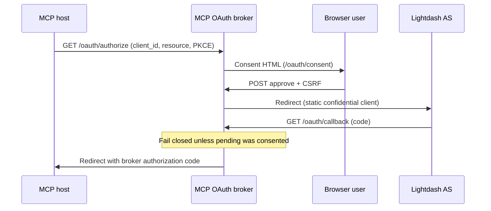

# 32. MCP OAuth downstream client consent

Date: 2026-08-24

## Status

Accepted

Amends [26. MCP OAuth uses a dual-leg, resource-bound token boundary](0026-mcp-oauth-dual-leg-token-boundary.md)

Amends [7. MCP HTTP transport, OAuth broker, SDK v2](0007-mcp-http-transport-auth-modes-sdk-v2.md)

Related to [19. MCP stateless protocol core without Redis ephemeral store](0019-mcp-stateless-protocol-core-without-redis-ephemeral-store.md)

## Context

Hosted `@lightdash-tools/mcp` is a **dual-leg** OAuth broker ([ADR-0026](0026-mcp-oauth-dual-leg-token-boundary.md)): MCP clients talk to this process as an authorization server, and this process talks to Lightdash as a confidential client with one static redirect URI (`{PUBLIC_URL}/oauth/callback`).

That static Lightdash client plus Dynamic Client Registration (DCR) is a **confused-deputy** class. An MCP client can register itself, send the user to `/oauth/authorize`, and ride the already-trusted Lightdash application without the user ever seeing *which* MCP client they are about to authorize. MCP Security Best Practices require **per-client consent** before forwarding to the third-party authorization server. [ADR-0026](0026-mcp-oauth-dual-leg-token-boundary.md) closed token passthrough and audience binding; it explicitly left this control unimplemented.

DCR remains how Cursor / Claude Code / Codex obtain a `client_id`. Client-asserted `client_name` is not a verified identity. Client ID Metadata Documents (CIMD) would let clients present a URL instead of DCR, but fetching that URL from this process is an SSRF surface we are not ready to own.

Pending authorize state is process-local ([ADR-0019](0019-mcp-stateless-protocol-core-without-redis-ephemeral-store.md)). The Lightdash user (subject) is unknown until after the Lightdash login, so this process cannot look up a remembered grant for “this user already approved this client.”

### Alternatives considered

- **Skip consent / “remember this client” cookie:** fastest UX, recreates confused-deputy. Subject is unknown until after Lightdash, so a remembered grant cannot be bound to a user anyway.
- **CIMD as the primary registration path:** avoids unverified DCR names, but requires the broker to fetch client-supplied URLs (SSRF). Deferred.
- **Drop DCR:** breaks MCP hosts that require `/oauth/register`. Keep DCR as a **compatibility stub** (rate-limited; names unverified).
- **Redis / shared consent store:** would enable remembered grants and multi-replica authorize→consent→callback. Rejected — reintroduces the ephemeral store [ADR-0019](0019-mcp-stateless-protocol-core-without-redis-ephemeral-store.md) removed. In-memory pending stays.
- **Consent after Lightdash:** the user has already delegated to our static client; too late to refuse the MCP client that initiated the flow.

## Decision

1. **Always show per-client consent HTML** at `/oauth/consent` **before** redirecting the browser to Lightdash. `/oauth/authorize` creates pending state and renders the page; it does not bounce straight to Lightdash.
2. **No remembered grants.** Do not persist “this client is approved” across flows (no cookies, no durable grant table). Every authorization shows consent. Subject is unknown until after Lightdash; guessing a subject earlier would be a new confused-deputy.
3. **Callback requires a consented pending authorization.** A Lightdash redirect for a pending row that was never approved (or was denied) fails closed. CSRF on the consent POST is required.
4. **DCR stays compatibility-only.** Rate-limit `/oauth/register` (and authorize/token/consent). Display `client_name` as **unverified**. Do not treat DCR metadata as identity.
5. **CIMD is deferred** because of SSRF. Do not fetch client-supplied metadata URLs.
6. **In-memory pending stays** ([ADR-0019](0019-mcp-stateless-protocol-core-without-redis-ephemeral-store.md)). Consent state lives in the same process-local broker store as authorize→code. Sticky `/oauth/*` (or a single replica) remains required while the handshake is in flight.

This closes the ADR-0026 residual that per-client consent was not implemented. It does **not** turn MCP scopes into a broker-owned grant/consent boundary (scope minimization / step-up remain future work on ADR-0026).

## Consequences

- Users see an extra browser page naming the MCP client and requested profile before Lightdash login. DCR `client_name` must be labeled unverified so a malicious registrant cannot impersonate a trusted product name.
- Confused-deputy via “drive the static Lightdash client without user awareness of the MCP client” is **mitigated**, not eliminated: unverified names, no CIMD, and sticky in-memory `/oauth/*` remain residuals (see [mcp-oauth-threat-model.md](../operators/mcp-oauth-threat-model.md)).
- Operators must still sticky-route `/oauth/*` (now including `/oauth/consent`) or run one replica. Consent does not justify Redis.
- Application per-IP rate limits on DCR/authorize/token/consent sit inside the process; replica-local bypass is accepted; a gateway limiter remains the outer layer.

## References

- [MCP Security Best Practices — Confused Deputy](https://modelcontextprotocol.io/docs/2026-07-28/tutorials/security/security_best_practices)
- [MCP Authorization 2026-07-28](https://modelcontextprotocol.io/specification/2026-07-28/basic/authorization)
- Operator notes: [mcp-oauth.md](../operators/mcp-oauth.md), [mcp-oauth-threat-model.md](../operators/mcp-oauth-threat-model.md)
- Code: `packages/mcp/src/auth/oauth-broker/` (`/oauth/authorize`, `/oauth/consent`, `/oauth/callback`)
