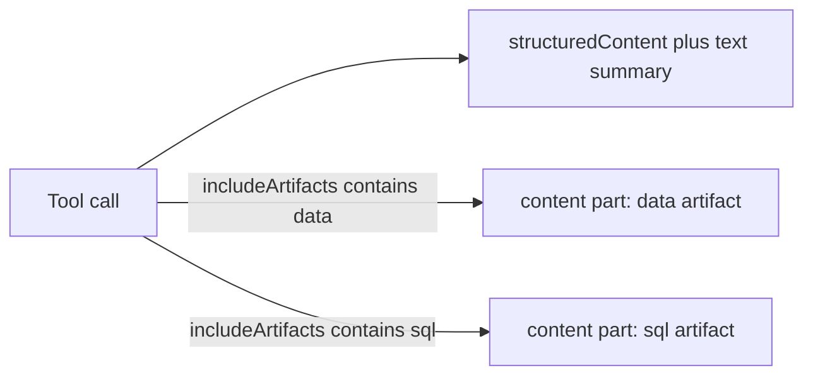

# 32. MCP tool-result artifacts and content-reader SQL body reveal

Date: 2026-08-26

## Status

Accepted

Amends [11. MCP tool response sensitivity classes](0011-mcp-tool-response-sensitivity-classes.md)

Amends [12. MCP content-reader profile saved-content execution boundary](0012-mcp-content-reader-profile-saved-content-execution-boundary.md)

Amends [28. MCP content-reader executes saved dashboard SQL tiles](0028-mcp-content-reader-executes-saved-dashboard-sql-tiles.md)

Related to [25. MCP progressive-disclosure prompt context policies](0025-mcp-progressive-disclosure-prompt-context-policies.md)

## Context

[ADR-0028](0028-mcp-content-reader-executes-saved-dashboard-sql-tiles.md) lets `content-reader` execute dashboard `sql_chart` tiles but keeps **SQL text hidden** (`get_chart` / `explain_content` must not return the SQL body). Standalone SQL chart execution stays denied. That is correct for default agent Q&A, but operators and some hosts need to **inspect authored SQL** for saved SQL charts (standalone and dashboard tiles) without paying that cost on every turn.

Meanwhile, run/poll tools return bounded rows **inside** the same pretty-printed JSON as metadata via `jsonToolResult`, and mirror the full payload in `structuredContent` — duplicating large row sets into the model context even when the host or user only needed a summary.

MCP 2025-11-25 [tool results](https://modelcontextprotocol.io/specification/2025-11-25/server/tools#tool-result) already support multi-part `content` (text, image, embedded `resource`, `resource_link`) plus optional `structuredContent`, and content [annotations](https://modelcontextprotocol.io/specification/2025-11-25/server/resources#annotations) (`audience`, `priority`) so hosts can keep user-facing blobs out of the assistant context. This repo already uses multi-part for PNG export (`imageToolResult`); SQL/data should follow that pattern rather than a second inline JSON field.

### Alternatives considered

- **Inline SQL in summary JSON with a boolean flag**: works, but dumps SQL into every `structuredContent` consumer and fights token efficiency.
- **`resource_link` + ephemeral `resources/read`**: deferred — same host-compatibility caution as [ADR-0025](0025-mcp-progressive-disclosure-prompt-context-policies.md) / progressive-disclosure RFC.
- **New profile for SQL inspection**: discover/explain already belong on `content-reader`; a second mount is unnecessary for reveal-only.
- **Enable standalone `run_chart` SQL execution**: out of scope; reveal ≠ execute.

## Decision

1. **Sensitivity class `secret.sql_body`.** Authored SQL Runner bodies default to **omit** from the compact summary / `structuredContent`. Reveal only as a separate MCP content part when the tool arg allowlist includes `'sql'`. No global `withSensitive`.
2. **Tool-result artifacts.** Content-reader (and shared helpers) may return:
   - Part 0: compact **summary** JSON text (no `rows`, no SQL body).
   - `structuredContent`: same summary plus `artifacts: [{ kind, uri, mimeType, included }]`.
   - Extra parts: embedded `type: "resource"` (`text` payload) with annotations:
     - `sql`: `audience: ["user"]`, lower `priority` (unless the caller opted into `'sql'` for model use).
     - `data`: `audience: ["assistant","user"]` when included.
   - URI scheme: `lightdash://artifacts/content-reader/{kind}/{uuid}`.
   - Defer `resource_link` until host smoke tests prove it.
3. **Tool arg `includeArtifacts?: Array<'sql' | 'data'>`** (strict allowlist):
   - Discover/explain (`get_chart`, `explain_content`): default `[]`. When a saved SQL chart exists, emit warning `SQL_ARTIFACT_AVAILABLE` if `'sql'` was not requested.
   - Run/poll (`run_chart`, `run_dashboard_tile`, `get_query_result`): default `['data']` — rows live in the data artifact, not the summary envelope.
   - SQL body only when `'sql'` is present.
4. **Reveal authored SQL for all saved SQL charts** (standalone UUID/slug and dashboard `sql_chart` via `savedSqlUuid`) using `GET /api/v1/projects/{projectUuid}/sqlRunner/saved/{uuid}` (and by-slug). `get_chart` / `explain_content` may load SQL-source charts for **metadata + optional SQL artifact**; they must not put `sql` in the summary body.
5. **Execution boundary unchanged.** `canExecuteSqlCharts: false`; standalone `run_chart` SQL and `POST …/query/sql-chart` stay off MCP. Ad-hoc `POST …/query/sql` stays off. Semantic compiled warehouse SQL stays on `semantic-layer` / `compile_query`.
6. **Capability flag.** Content-reader `readerCapabilities` gains `canRevealSqlBodies: true`.
7. Inventory: [content-reader inventory](../profiles/content-reader/inventory.md).

## Consequences

- Agents can inspect SQL Runner bodies on demand without bloating default Q&A turns.
- Hosts that honor `audience` / `priority` can show SQL to users while keeping it out of the model context.
- Run/poll summaries shrink; clients that only read `structuredContent` must follow `artifacts` or include `'data'`.
- Operators must treat SQL reveal as a deliberate opt-in — bodies may expose warehouse schema and business logic.
- Enabling standalone SQL **execution** still requires a further ADR.
