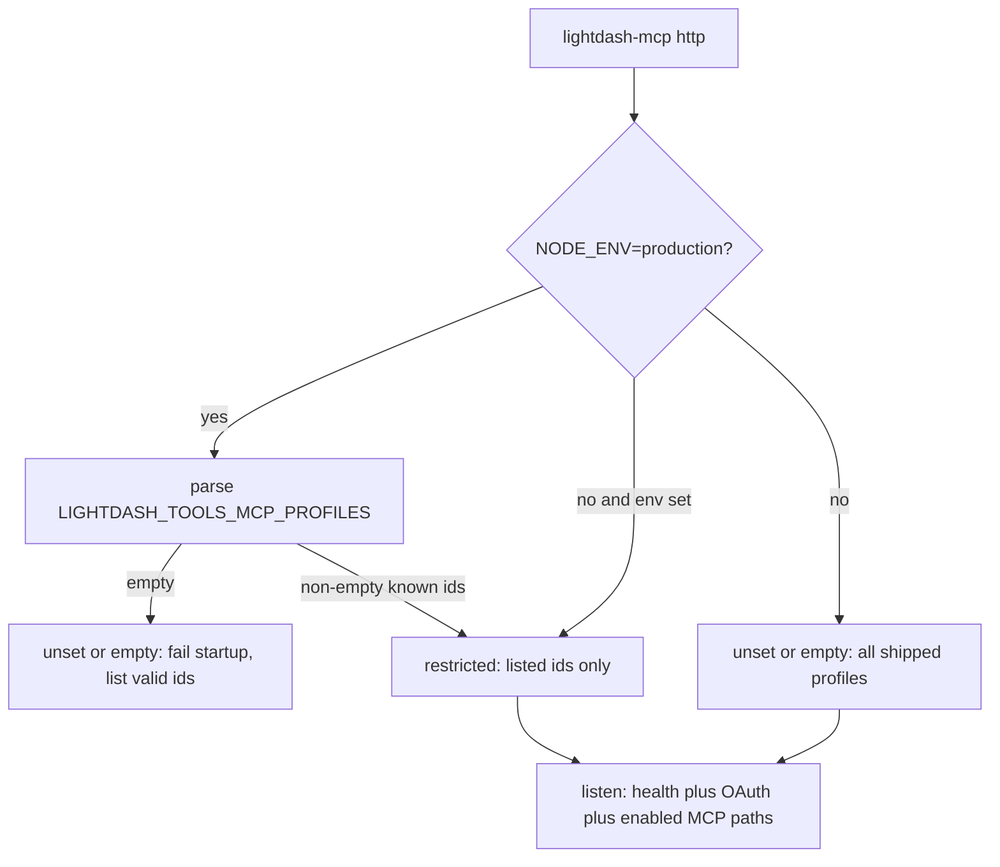

# 33. MCP HTTP production fail-closed profile allowlist

Date: 2026-08-24

## Status

Accepted

Amends [24. MCP HTTP profile mount allowlist via env](0024-mcp-http-profile-mount-allowlist-via-env.md)

Amends [7. MCP HTTP transport, OAuth broker, SDK v2](0007-mcp-http-transport-auth-modes-sdk-v2.md)

Related to [6. MCP profiles, shared registry, fixed paths](0006-mcp-profiles-shared-registry-fixed-paths.md), [8. MCP request scope and hardening](0008-mcp-request-scope-and-hardening.md)

## Context

[ADR-0024](0024-mcp-http-profile-mount-allowlist-via-env.md) added `LIGHTDASH_TOOLS_MCP_PROFILES` as an HTTP-only mount ceiling: **unset or empty mounts every shipped path**. That default is convenient for local `http` and matches “clients pick the URL.” On a hosted production process (`NODE_ENV=production`, Cloud Run) it is the opposite of least privilege: forgetting the var exposes all eight guessable profile URLs (`semantic-layer`, `content-reader`, `content-developer`, `content-governance`, `ai-agent-chat`, `ai-agent-ops`, `data-analyst`, `organization-audit`) to any valid OAuth bearer.

Unauthenticated HTTP (`auth=none`) is already forbidden in production ([ADR-0007](0007-mcp-http-transport-auth-modes-sdk-v2.md)). When it _is_ allowed (non-production), the historical listen default `0.0.0.0` publishes that unauthenticated surface on every interface. Compose needs `0.0.0.0` inside a container; a laptop `npx` does not.

`LIGHTDASH_TOOLS_MCP_PUBLIC_URL` already requires `https://` or loopback `http://`. `LIGHTDASH_URL` (upstream Lightdash) did not get the same check, so a production process could send OAuth and API calls to cleartext non-loopback Lightdash.

[ADR-0007](0007-mcp-http-transport-auth-modes-sdk-v2.md) rejects a `DANGEROUSLY_*` env forest. Production “mount all eight anyway” must not come back as `DANGEROUSLY_ALLOW_ALL_PROFILES`.

### Alternatives considered

- **Keep unset = all mounts in production:** backward compatible, repeats the hosted footgun ADR-0024 already named.
- **`DANGEROUSLY_ALLOW_ALL_PROFILES`:** explicit, but recreates the config surface ADR-0007 removed. Operators who want every path set the eight ids.
- **Fail closed on any non-loopback bind, even explicit `0.0.0.0`:** would break Compose (`LIGHTDASH_TOOLS_MCP_HTTP_HOST=0.0.0.0`) and Cloud Run Dockerfiles. Explicit non-loopback stays allowed with a loud warning.
- **Stdio honor `LIGHTDASH_TOOLS_MCP_PROFILES`:** rejected in ADR-0024; stdio authorization is process credentials, and hosts already pass `--profile`.

## Decision

1. **Production HTTP requires a non-empty allowlist.** When `NODE_ENV=production`, `LIGHTDASH_TOOLS_MCP_PROFILES` MUST be a non-empty comma-separated list of known profile ids. Unset or empty **fails startup** (does **not** mount all eight paths). The error lists valid ids. Unknown ids and empty CSV segments still fail closed (ADR-0024).
2. **Non-production unset still mounts all.** Local Compose / `NODE_ENV=development` keep ADR-0024’s unset/empty = all shipped paths. This is a production-only tightening, not a stdio change.
3. **Stdio unchanged:** `lightdash-mcp stdio --profile <id>` only. The env is ignored on stdio.
4. **`auth=none` bind default is loopback.** When `LIGHTDASH_TOOLS_MCP_HTTP_HOST` is unset and auth mode is `none`, bind `127.0.0.1`. Explicit non-loopback (Compose sets `0.0.0.0`) is still allowed and MUST emit a loud warning. Production continues to reject `auth=none` entirely ([ADR-0007](0007-mcp-http-transport-auth-modes-sdk-v2.md)).
5. **`LIGHTDASH_URL` mirrors public-URL policy:** `https://` or loopback `http://` only. Cleartext non-loopback Lightdash fails startup.
6. **No `DANGEROUSLY_*` escape hatch** ([ADR-0007](0007-mcp-http-transport-auth-modes-sdk-v2.md)). To serve every persona in production, list every id in `LIGHTDASH_TOOLS_MCP_PROFILES`.

Starter hosted allowlist: `semantic-layer,content-reader` (read-oriented). Add write/governance/analyst/chat ids only when that Cloud Run service is meant to expose them.

## Consequences

- A production Cloud Run revision that omits `LIGHTDASH_TOOLS_MCP_PROFILES` will not start. That is intentional. Document the starter list in [cloud-run.md](../operators/cloud-run.md) / [secrets.md](../operators/secrets.md).
- Operators who previously relied on “unset = all eight” in production must set the CSV explicitly (breaking operational default; not a protocol change).
- Local unauthenticated HTTP is harder to accidentally publish: loopback default, warning on `0.0.0.0`. Compose keeps working because it sets the host env.
- Cleartext non-loopback `LIGHTDASH_URL` fails the same way a cleartext public MCP URL already did.
- This is still a **mount** ceiling, not a tool-registration filter ([ADR-0008](0008-mcp-request-scope-and-hardening.md) / [ADR-0022](0022-mcp-profile-owned-toolmodules-replace-operations-catalog.md)).

## References

- Operator notes: [cloud-run.md](../operators/cloud-run.md), [secrets.md](../operators/secrets.md), [mcp-oauth.md](../operators/mcp-oauth.md)
- Package README: `packages/mcp/README.md` (profile allowlist)
- Code: `packages/mcp/src/config/enabled-profiles.ts`, `packages/mcp/src/config/load-mcp-config.ts`
