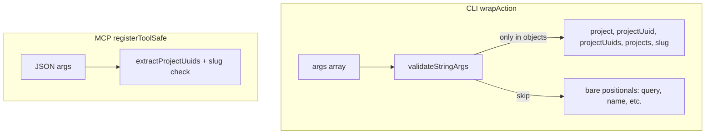

# 34. Input validation: validate only known identifier fields

Date: 2026-03-06

## Status

Accepted

## Context

Input hardening (control chars, resource ID validation) guards against adversarial or hallucinated inputs when AI agents invoke the CLI or MCP tools. `validateResourceId()` rejects `?`, `#`, `%`, and path traversal (`..`) in resource IDs to prevent path/query injection.

An initial implementation applied this validation to **every top-level string argument**. That caused a functional regression: commands with free-form positional strings (e.g. `content search <query>`, `groups create <name>`, `schema get <resource>`) rejected legitimate input such as `what?` or `growth%`, because those are not resource IDs.

**Alternatives considered:**

1. **Only validate known-ID keys in objects** — Validate strings under `projectUuid`, `projectUuids`, `slug`, `project`, `projects` in options/nested objects. Do not validate bare positional strings.
2. **Validate positionals only when they look like UUIDs** — Use regex heuristic; `what?` passes, but `uuid?fields` would not be validated.
3. **Per-command `validatePositionalIndices`** — Each command declares which positionals are IDs; explicit but high maintenance.
4. **Command-metadata reflection** — Infer from Commander; fragile and complex.
5. **Two-phase heuristic** — Combine heuristics; brittle, same trade-offs as (2).

**Trade-off:** Approach (1) means positional IDs (e.g. `charts list <projectUuid>`) are no longer validated; invalid IDs like `uuid?x` reach the API and typically return 400/404. Acceptable given that free-form inputs (search queries, group names) must not be rejected.

## Decision

We validate resource IDs **only when the string is under a known identifier field** in an object. We do **not** validate bare positional strings.

**Known identifier fields:** `project`, `projectUuid`, `projectUuids`, `projects`, `slug`. Both singular values and array elements (for `projectUuids`, `projects`) are validated.

**Implementation:**

- **CLI** (`packages/cli/src/utils/safety.ts`): `validateStringArgs()` recurses into objects and validates only these keys. Bare positional strings (query, name, resource) are ignored.
- **MCP** (`packages/mcp/src/tools/shared.ts`): Already validated by key (`extractProjectUuids`, `args.slug`); no change needed.

## Consequences

- **Regression fix:** `content search "what?"`, `groups create "Team A?"`, and similar free-form inputs succeed.
- **Security:** Identifier fields in options remain validated; path/query injection in IDs is still blocked.
- **Precedent:** New commands with mixed ID/free-form positionals follow this rule; new identifier keys must be added to the known-keys list when introduced.
- **Documentation:** AGENTS.md Common Gotchas documents the rule for future maintainers.

## References

- [ADR-0031 Agent security guardrails](0031-agent-security-guardrails-project-allowlist-dry-run-audit-log.md) — guardrail layers (allowlist, dry-run, audit); input validation runs before these.
- Input validation helpers: `packages/common/src/input-validation.ts`
