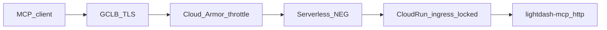
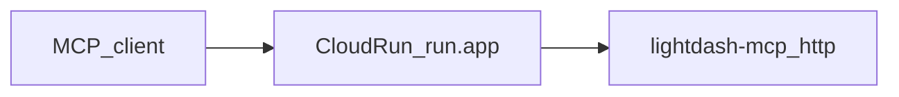

# MCP HTTP control plane

Responsibility split for hosted Streamable HTTP. Binding why (including the three-plane diagram): [ADR-0032](../adr/0032-mcp-http-three-plane-security-control-ownership.md). GCP how: [cloud-run.md](cloud-run.md#production-edge-gclb--cloud-armor). OAuth: [mcp-oauth.md](mcp-oauth.md). Threats: [mcp-oauth-threat-model.md](mcp-oauth-threat-model.md).

This is an **operator contract**, not a provisioned product. lightdash-tools does not ship Terraform or a Cloud Armor policy.

## Three planes

| Plane                                  | Owns                                                                                                                                                                                                             | Does not own                                                     |
| :------------------------------------- | :--------------------------------------------------------------------------------------------------------------------------------------------------------------------------------------------------------------- | :--------------------------------------------------------------- |
| **Edge** (load balancer + WAF/DDoS)    | TLS; volumetric DDoS; approximate IP throttle (especially `/oauth/authorize` and `/oauth/register`); public VIP Host allowlist                                                                                   | Lightdash user identity; per-user warehouse quotas; RFC 9728 PRM |
| **Platform** (Cloud Run or equivalent) | Ingress so the default compute URL cannot skip the edge; request timeout and concurrency; secret injection                                                                                                       | MCP OAuth; tool catalog                                          |
| **Application** (`lightdash-mcp http`) | `Origin` MUST; dual-leg audience tokens; profile mounts + PRM 404s; project allowlist/pin; identifier validation; output redaction; per-user query budget; `maxBodyBytes` memory cap; broker pending caps; audit | TLS offload; IP allowlists; signature WAF                        |

The process stays **protocol-complete** when the edge is missing (Compose, non-GCP, `*.run.app` smoke). Do not add `TRUST_EDGE` or restore `DANGEROUSLY_*`.

## Never delete from the process to “delegate to Armor”

- Streamable HTTP `Origin` validation ([2026-07-28](https://modelcontextprotocol.io/specification/2026-07-28/basic/transports/streamable-http)): 403 if `Origin` is present and not allowlisted; missing `Origin` is allowed (Cursor/Claude).
- Dual-leg OAuth audience / no token passthrough ([ADR-0026](../adr/0026-mcp-oauth-dual-leg-token-boundary.md)).
- Per-user query budgets — Armor throttles are approximate and not strict quotas ([rate limiting](https://cloud.google.com/armor/docs/rate-limiting-overview)).
- `LIGHTDASH_TOOLS_MCP_PROFILES` and path-specific PRM 404s ([ADR-0024](../adr/0024-mcp-http-profile-mount-allowlist-via-env.md)).
- `LIGHTDASH_TOOLS_ALLOWED_PROJECT_UUIDS` and `X-Lightdash-Project`.

## GCP path

Production public traffic: GCLB + Cloud Armor **throttle** + Cloud Run ingress locked so `*.run.app` cannot skip Armor; `PUBLIC_URL` = load-balancer HTTPS origin; no IAP for URL-only clients; no stock OWASP CRS on profile MCP POSTs. Full gcloud: [cloud-run.md — Production edge](cloud-run.md#production-edge-gclb--cloud-armor).

Direct `*.run.app` (smoke only — Armor never sees the request):

## `/oauth/*` affinity

The in-memory broker ([ADR-0019](../adr/0019-mcp-stateless-protocol-core-without-redis-ephemeral-store.md)) needs one replica **or** a dedicated Cloud Run service for `/oauth/*` while authorize→token is in flight. GCLB session affinity does **not** pin Cloud Run instances. Profile MCP paths may scale after token issuance.

## Empty `ALLOWED_ORIGINS`

Unset/empty is the correct hosted default. Non-browser agents omit `Origin`. A present `Origin` that is not allowlisted gets **403** on profile MCP routes (Streamable HTTP MUST). Set `LIGHTDASH_TOOLS_MCP_ALLOWED_ORIGINS` only when a **browser** must call those routes (CORS reflection for listed Origins). That env is not “turn security on.”
