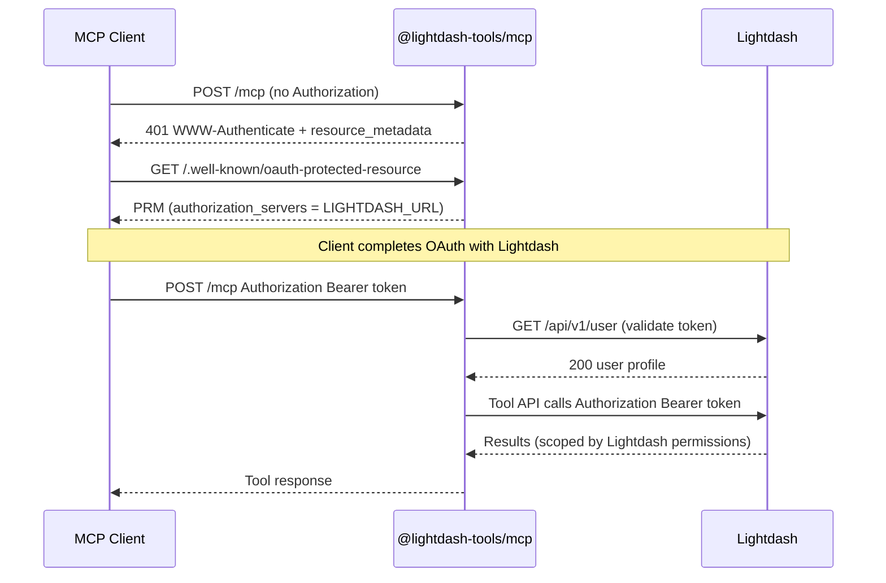
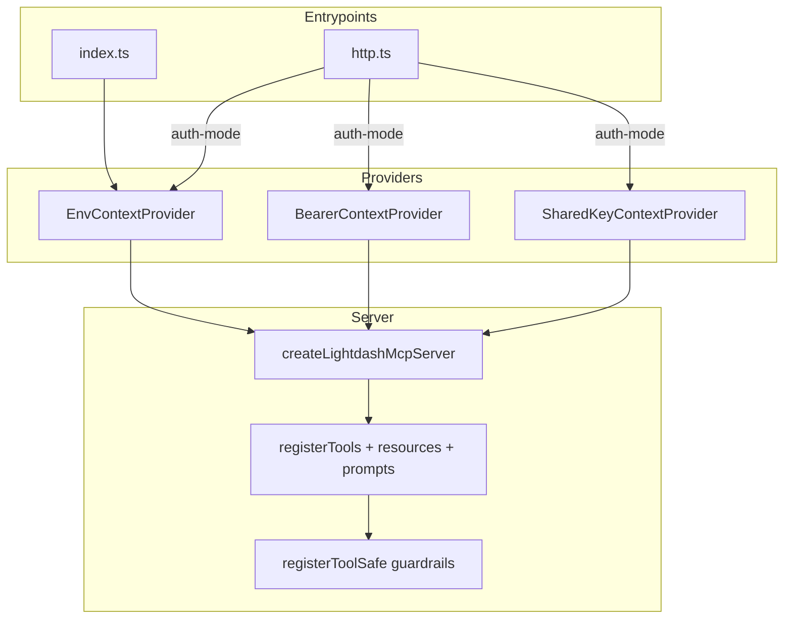

# feat: OAuth-Backed Streamable HTTP Mode for `@lightdash-tools/mcp`

**Created:** 2026-06-15  
**Origin:** `docs/rfc/0040-oauth-backed-streamable-http-mcp.md` (uploaded RFC; to be committed in U0)  
**Depth:** Deep  
**Target packages:** `@lightdash-tools/mcp`, `@lightdash-tools/client`, `@lightdash-tools/common`

---

## Summary

Add production-ready **Lightdash OAuth mode** to `@lightdash-tools/mcp` so hosted Streamable HTTP deployments authenticate each MCP user with their own Lightdash OAuth access token, while **STDIO** and **shared-key HTTP** modes remain backward-compatible. The work spans three layers: client auth (`ApiKey` + `Bearer`), request-scoped MCP context (replacing the process-global `LightdashClient`), and MCP OAuth protocol endpoints (`/.well-known/oauth-protected-resource`, `WWW-Authenticate` challenges, token validation).

This plan adapts the RFC to the actual codebase: incremental module extraction (not a big-bang directory move), Lightdash-as-authorization-server validation via `GET /api/v1/user` (no JWKS/OIDC library required for v1), and reuse of existing `ToolHandler (args, extra?)` plumbing already present in `packages/mcp/src/tools/shared.ts`.

---

## Problem Frame

Today `@lightdash-tools/mcp` supports:

- **STDIO** — one `LightdashClient` from `LIGHTDASH_URL` + `LIGHTDASH_API_KEY` (PAT).
- **Streamable HTTP** — same shared client at module scope (`packages/mcp/src/http.ts:31`), with optional endpoint protection via `MCP_AUTH_ENABLED` + `MCP_API_KEY` (static shared secret, no `WWW-Authenticate` metadata).

This architecture cannot support **per-user Lightdash identity** in hosted deployments. ADR-0013 deferred multi-tenant OAuth; ADR-0017 implemented shared-secret HTTP auth as an interim step. The MCP Authorization spec (2025-11-25) expects HTTP transports to act as OAuth resource servers with protected-resource metadata.

**Core constraint:** `createLightdashMcpServer(client)` and all tool/resource/prompt registrations take a concrete `LightdashClient`. OAuth requires a **request/session-scoped** client factory.

---

## Requirements

| ID | Requirement |
|----|-------------|
| R1 | STDIO mode continues to work with `LIGHTDASH_URL` + `LIGHTDASH_API_KEY` unchanged. |
| R2 | `--http` and existing `MCP_*` env vars continue to work with deprecation warnings. |
| R3 | New `lightdash-oauth` HTTP auth mode works **without** `LIGHTDASH_API_KEY`. |
| R4 | `GET /.well-known/oauth-protected-resource` returns metadata with `authorization_servers: [LIGHTDASH_URL]`. |
| R5 | Missing bearer token returns `401` with `WWW-Authenticate` including `resource_metadata`. |
| R6 | Valid OAuth bearer token is forwarded to Lightdash as `Authorization: Bearer …`. |
| R7 | PAT mode continues to emit `Authorization: ApiKey ldpat_…`. |
| R8 | All existing guardrails (safety mode, dry-run, allowlist, validation, audit) remain applied. |
| R9 | Session token hash binding prevents token switching within a stateful MCP session. |
| R10 | No raw tokens in logs or audit entries. |
| R11 | New MCP HTTP env vars use `LIGHTDASH_TOOLS_MCP_*` prefix per ADR-0035. |
| R12 | Tests cover STDIO, shared-key HTTP, and OAuth HTTP modes. |

---

## Key Technical Decisions

### KTD-1: Full identity OAuth (RFC Mode B), not transport-only

**Decision:** OAuth bearer tokens on the MCP endpoint are the **same** tokens used upstream to Lightdash (`Authorization: Bearer`). Lightdash remains the authorization server and permission source.

**Rationale:** Matches the RFC intent and `lightdash-mcp-demo` pattern. Transport-only OAuth (shared PAT upstream) would not solve user-scoped hosted MCP.

**Alternative rejected:** Transport-only OAuth — lower effort but does not meet R3/R6 user-scoping goals.

### KTD-2: Request context via `McpContextProvider`, not a proxy client

**Decision:** Refactor `createLightdashMcpServer`, `registerCapabilities`, and all handlers to accept `McpContextProvider`. Handlers call `await contextProvider.getContext(extra)` to obtain `lightdashClient`.

**Rationale:** `ToolHandler` already accepts `(args, extra?)`. The MCP SDK passes `authInfo` through `extra` on HTTP transports. A proxy client would still need `extra` threading.

**Alternative rejected:** `ContextualLightdashClient` proxy — adds indirection without reducing churn.

### KTD-3: Lightdash token validation via `GET /api/v1/user`, not JWKS

**Decision:** In `lightdash-oauth` mode, validate bearer tokens by calling `{LIGHTDASH_URL}/api/v1/user` with the token. Cache results by SHA-256 token hash with a short TTL (default 30s).

**Rationale:** Lightdash is both AS and API. No OAuth client secret is needed on the MCP server (RFC non-goal). Avoids adding `openid-client` / JWKS infrastructure for v1.

**Deferred:** RFC 8707 audience binding, JWKS validation — revisit when Lightdash documents token shape and audience claims.

### KTD-4: Incremental module layout, not RFC big-bang `app/` tree

**Decision:** Extract new code into focused modules alongside existing files (`packages/mcp/src/auth/`, `packages/mcp/src/config/`) rather than relocating all entrypoints into `app/` in one PR.

**Rationale:** Reduces merge risk. `index.ts`, `http.ts`, `bin.ts` remain compatibility shims that delegate to extracted modules.

### KTD-5: Default HTTP auth mode stays `none` in 0.x; `lightdash-oauth` is opt-in

**Decision:** `LIGHTDASH_TOOLS_MCP_AUTH_MODE` defaults to `none` for backward compatibility. Emit a loud startup warning when `none` is used outside local dev. Document `lightdash-oauth` as the production recommendation.

**Rationale:** RFC §6.4 notes future major default change. Breaking existing `--http` users on upgrade is unacceptable.

### KTD-6: Reuse MCP SDK auth response shapes; adapt for `node:http`

**Decision:** Implement `WWW-Authenticate` and protected-resource metadata following MCP SDK patterns (`@modelcontextprotocol/sdk/server/auth/*`) but wire into the existing raw `node:http` server. Do **not** add Express solely for SDK middleware.

**Rationale:** ADR-0017 chose `node:http`. SDK helpers are Express-oriented; extract the header/metadata logic into testable pure functions.

### KTD-7: Governance stays process-scoped

**Decision:** `LIGHTDASH_TOOLS_SAFETY_MODE`, `LIGHTDASH_TOOLS_ALLOWED_PROJECTS`, and `LIGHTDASH_TOOLS_DRY_RUN` remain operator-configured per process, not per OAuth user.

**Rationale:** Matches current guardrail architecture. Per-user policy is a follow-up (see Deferred).

---

## High-Level Technical Design

### Auth mode matrix

| Mode | Transport | MCP endpoint auth | Lightdash upstream auth | `LIGHTDASH_API_KEY` required |
|------|-----------|-------------------|-------------------------|------------------------------|
| `env` | STDIO | N/A (host owns process) | `ApiKey ldpat_…` | Yes |
| `none` | HTTP | None (warn loudly) | `ApiKey ldpat_…` | Yes |
| `shared-key` | HTTP | Shared `LIGHTDASH_TOOLS_MCP_SHARED_KEY` | `ApiKey ldpat_…` | Yes |
| `lightdash-oauth` | HTTP | User's Lightdash OAuth bearer | `Bearer …` (same token) | No |

### Request flow (OAuth HTTP)



### Context provider architecture



### Session token binding (stateful mode)

```text
SessionEntry {
  transport, server, lastAccessAt,
  auth: { mode, tokenHash, subject? }
}

On request with Mcp-Session-Id:
  if entry.auth.tokenHash !== hash(incoming bearer): 401 session token mismatch
```

---

## Output Structure

New modules (incremental; existing files become thin wrappers):

```text
packages/mcp/src/
  auth/
    auth-mode.ts
    bearer.ts
    credential-provider.ts
    env-context-provider.ts
    bearer-context-provider.ts
    shared-key-middleware.ts
    lightdash-oauth-middleware.ts
    oauth-protected-resource.ts
    www-authenticate.ts
    token-validation-cache.ts
  config/
    env.ts                    # LIGHTDASH_TOOLS_MCP_* constants
    load-mcp-config.ts        # Zod-validated McpHttpConfig
    normalize-url.ts
  request-context.ts          # McpContextProvider types
  transports/
    session-store.ts          # extracted from http.ts
    streamable-http-handler.ts
  http.ts                     # thin entry; delegates to modules
  index.ts                    # unchanged shape
  bin.ts                      # add serve-http / stdio subcommands

packages/client/src/
  config.ts                   # LightdashAuthConfig union
  http/interceptors.ts          # ApiKey | Bearer switch
  utils/env.ts                  # backward-compatible normalization

docs/
  rfc/0040-oauth-backed-streamable-http-mcp.md
  adr/0040-oauth-backed-streamable-http-mcp.md
  mcp-oauth-http.md
  cursor-lightdash-oauth-mcp.md
  cloud-run-mcp-oauth.md
  security/mcp-oauth-threat-model.md
```

---

## Implementation Units

### U0. Documentation foundation (RFC + ADR)

**Goal:** Commit the RFC and record architectural decisions before code changes.

**Requirements:** R11 (env naming policy), threat model, migration strategy.

**Dependencies:** None.

**Files:**
- `docs/rfc/0040-oauth-backed-streamable-http-mcp.md` (from uploaded RFC)
- `docs/adr/0040-oauth-backed-streamable-http-mcp.md`

**Approach:** ADR covers: chosen auth modes, Lightdash-as-AS model, env-var naming (`LIGHTDASH_TOOLS_MCP_*`), session token binding threat model, backward-compat migration, explicit non-goals (no MCP-side OAuth server, no refresh token storage).

**Test scenarios:**
- Test expectation: none — documentation only.

**Verification:** ADR passes `adr-tools` validation if available; RFC and ADR cross-reference each other.

---

### U1. MCP HTTP config module with env aliases

**Goal:** Centralize HTTP configuration with new `LIGHTDASH_TOOLS_MCP_*` vars and deprecated `MCP_*` aliases.

**Requirements:** R2, R11.

**Dependencies:** U0.

**Files:**
- `packages/mcp/src/config/env.ts` (create)
- `packages/mcp/src/config/load-mcp-config.ts` (create)
- `packages/mcp/src/config/normalize-url.ts` (create)
- `packages/mcp/src/config.ts` (refactor to re-export / delegate)
- `packages/common/src/env.ts` (add MCP HTTP constant exports)
- `packages/mcp/src/config/load-mcp-config.test.ts` (create)

**Approach:**
- Define `McpHttpConfig` per RFC §6.4 with Zod schema.
- Alias resolution: new name wins when both set; emit one-time `console.warn` for deprecated names.
- `lightdash-oauth` mode: `LIGHTDASH_API_KEY` not required; `LIGHTDASH_TOOLS_MCP_PUBLIC_URL` required in production.
- `shared-key` / `none` / STDIO: `LIGHTDASH_API_KEY` still required.
- Public URL normalization: strip trailing slash and `/mcp` suffix.

**Patterns to follow:** `packages/common/src/env.ts` constant style; ADR-0035 prefix rules.

**Test scenarios:**
- New `LIGHTDASH_TOOLS_MCP_HTTP_PORT` wins over `MCP_HTTP_PORT` and `MCP_SERVER_PORT`.
- `MCP_AUTH_ENABLED=1` without explicit auth mode → `shared-key` with warning.
- Invalid auth mode → startup error with descriptive message.
- `lightdash-oauth` without `LIGHTDASH_TOOLS_MCP_PUBLIC_URL` → ready-check failure or startup error.
- Deprecated alias usage emits warning once per alias.

**Verification:** `pnpm --filter @lightdash-tools/mcp test` passes config tests.

---

### U2. Client auth union (`ApiKey` | `Bearer`)

**Goal:** Extend `@lightdash-tools/client` to support both PAT and OAuth bearer upstream auth.

**Requirements:** R6, R7.

**Dependencies:** None (can parallelize with U1).

**Files:**
- `packages/client/src/config.ts`
- `packages/client/src/http/interceptors.ts`
- `packages/client/src/utils/env.ts`
- `packages/client/src/client.ts` (if `mergeConfig` normalization lives here)
- `packages/client/src/config.test.ts` or `packages/client/tests/auth.test.ts` (create/extend)

**Approach:**
- Add `LightdashAuthConfig` union (`api-key` | `bearer`).
- Normalize legacy `personalAccessToken` → `auth: { type: 'api-key', token }`.
- Interceptor switch: `ApiKey ldpat_…` vs `Bearer …` (no `ldpat_` prefix for bearer).
- Add `createBearerConfig({ baseUrl, accessToken, proxyAuthorization? })` helper.
- `loadConfigFromEnv()` behavior unchanged for existing callers.

**Patterns to follow:** `packages/client/src/http/interceptors.ts` existing PAT prefix logic; `SecretString` usage.

**Test scenarios:**
- API key without `ldpat_` prefix → `Authorization: ApiKey ldpat_…`.
- API key with `ldpat_` prefix → no double prefix.
- Bearer config → `Authorization: Bearer <token>`.
- `LIGHTDASH_PROXY_AUTHORIZATION` forwarded in both modes.
- `new LightdashClient({ baseUrl, personalAccessToken })` still works (backward compat).

**Verification:** `pnpm --filter @lightdash-tools/client test` passes; existing client tests unchanged.

---

### U3. Request context provider abstraction

**Goal:** Introduce `McpContextProvider` and refactor server factory to use it.

**Requirements:** R8 (foundation for per-request auth).

**Dependencies:** U2.

**Files:**
- `packages/mcp/src/request-context.ts` (create)
- `packages/mcp/src/auth/env-context-provider.ts` (create)
- `packages/mcp/src/server.ts`
- `packages/mcp/src/capabilities.ts`
- `packages/mcp/src/server.test.ts`
- `packages/mcp/src/index.ts` (wire `EnvContextProvider`)

**Approach:**
- Define `LightdashMcpRequestContext` with `lightdashClient`, `auth` metadata, `governance` snapshot.
- `EnvContextProvider`: wraps existing `getClient()` for STDIO/shared-key/none modes.
- Change signatures:
  - `createLightdashMcpServer(contextProvider, options?)`
  - `registerCapabilities(server, contextProvider, options?)`
  - `registerTools(server, contextProvider)`
- STDIO path must work end-to-end before tool module migration (U4).

**Patterns to follow:** RFC §8.2–8.3; keep governance from existing `config.ts` helpers.

**Test scenarios:**
- `EnvContextProvider.getContext()` returns stable client across calls.
- `createLightdashMcpServer` with provider registers tools (smoke via existing `server.test.ts`).
- STDIO integration test still passes with provider wired.

**Verification:** `pnpm --filter @lightdash-tools/mcp test` — server tests green; STDIO unchanged.

---

### U4. Migrate tool/resource/prompt handlers to context provider

**Goal:** Replace `LightdashClient` parameter with `McpContextProvider` across all MCP handlers.

**Requirements:** R1, R8, R10.

**Dependencies:** U3.

**Files (modify):**
- `packages/mcp/src/tools/index.ts`
- `packages/mcp/src/tools/*.ts` (17 domain modules)
- `packages/mcp/src/tools/ai-agents/*.ts` (4 modules)
- `packages/mcp/src/resources/index.ts`, `packages/mcp/src/resources/ai-agents.ts`
- `packages/mcp/src/prompts/index.ts`, `packages/mcp/src/prompts/ai-agents.ts`
- `packages/mcp/src/completion/index.ts`, `packages/mcp/src/completion/ai-agents.ts`
- `packages/mcp/src/tools/index.test.ts`, `packages/mcp/src/index.integration.test.ts`

**Approach:**
- Mechanical migration pattern in each handler:

```ts
// Before
registerToolSafe(server, 'list_projects', opts, async () => {
  return jsonToolResult(await client.v1.projects.listProjects());
});

// After
registerToolSafe(server, 'list_projects', opts, async (_args, extra) => {
  const { lightdashClient } = await contextProvider.getContext(extra);
  return jsonToolResult(await lightdashClient.v1.projects.listProjects());
});
```

- Consider a codemod or parallel subagent batches by domain (projects/charts, ai-agents, admin).
- No tool names, annotations, or guardrail ordering changes.

**Execution note:** Migrate one domain module first (`projects.ts`) as MVP slice; run tests; then batch the rest.

**Test scenarios:**
- All existing tool unit/integration tests pass without behavior change.
- No handler closes over a module-level `LightdashClient`.
- `registerToolSafe` guardrails still block write tools in `read-only` mode.

**Verification:** `pnpm test` full suite; `pnpm knip` no new unused exports.

---

### U5. OAuth protocol layer (metadata, bearer middleware, WWW-Authenticate)

**Goal:** Implement MCP-compliant OAuth resource server discovery and challenge responses.

**Requirements:** R4, R5, R10.

**Dependencies:** U1, U2.

**Files:**
- `packages/mcp/src/auth/oauth-protected-resource.ts` (create)
- `packages/mcp/src/auth/www-authenticate.ts` (create)
- `packages/mcp/src/auth/bearer.ts` (create)
- `packages/mcp/src/auth/lightdash-oauth-middleware.ts` (create)
- `packages/mcp/src/auth/token-validation-cache.ts` (create)
- `packages/mcp/src/auth/lightdash-oauth-middleware.test.ts` (create)
- `packages/mcp/src/auth/www-authenticate.test.ts` (create)

**Approach:**
- `GET /.well-known/oauth-protected-resource` (+ optional `/mcp` path-specific variant).
- `buildOAuthProtectedResourceMetadata(config)` per RFC §9.2.
- `WWW-Authenticate` builders for: missing token (401), invalid token (401), insufficient scope (403).
- Bearer extraction from `Authorization` header only (no query-string tokens).
- Token validation: `GET /api/v1/user` via bearer-configured client; cache by SHA-256 hash.
- Never log raw tokens; audit entries use `tokenHash` only.

**Patterns to follow:** MCP SDK `server/auth` response shapes; existing `timingSafeEqualString` from `http.ts`.

**Test scenarios:**
- Metadata JSON includes `resource`, `authorization_servers`, `bearer_methods_supported`, `scopes_supported`.
- Missing token → 401 with `resource_metadata` and `scope` params.
- Invalid token (mock 401 from Lightdash) → 401 with `error=invalid_token`.
- Valid token → middleware attaches `authInfo` to request context.
- Cache hit within TTL avoids second `/api/v1/user` call.
- Cache miss after TTL re-validates.

**Verification:** New auth unit tests pass.

---

### U6. HTTP transport refactor (auth modes, session binding, entrypoints)

**Goal:** Wire OAuth middleware into Streamable HTTP; enforce session token binding; add CLI subcommands.

**Requirements:** R2, R3, R9, R12.

**Dependencies:** U1, U3, U4, U5.

**Files:**
- `packages/mcp/src/transports/session-store.ts` (create)
- `packages/mcp/src/transports/streamable-http-handler.ts` (create)
- `packages/mcp/src/auth/bearer-context-provider.ts` (create)
- `packages/mcp/src/auth/shared-key-middleware.ts` (create)
- `packages/mcp/src/http.ts` (slim down to delegate)
- `packages/mcp/src/http.test.ts` (refactor — import from extracted modules instead of mirroring)
- `packages/mcp/src/bin.ts`
- `packages/mcp/src/http.integration.test.ts` (create)

**Approach:**
- Extract session map + cleanup from `http.ts` into `session-store.ts`; add `auth` field to `SessionEntry`.
- Auth mode routing:
  - `none`: warn on startup; existing behavior.
  - `shared-key`: endpoint bearer/key check; upstream uses `EnvContextProvider` (shared PAT).
  - `lightdash-oauth`: OAuth middleware; `BearerContextProvider` per request/session.
- Session binding: on session resume, compare `tokenHash`; mismatch → 401 `{ error: 'Session token mismatch' }`.
- `/health/live` and `/health/ready`: unauthenticated; ready-check validates config for active auth mode (no PAT required in OAuth mode).
- CLI: add `serve-http [--auth-mode <mode>]` and `stdio` subcommands; keep `--http` as alias.
- Remove module-level `const sharedClient = getClient()`.

**Patterns to follow:** `packages/mcp/src/http.ts` existing origin middleware, body size limits, session TTL.

**Test scenarios:**
- `--http` with `MCP_AUTH_ENABLED=1` + `MCP_API_KEY` still works (shared-key compat).
- `LIGHTDASH_TOOLS_MCP_AUTH_MODE=lightdash-oauth`: POST /mcp without token → 401 + WWW-Authenticate.
- Valid bearer → MCP initialize succeeds; upstream mock receives `Bearer`.
- Session created under token A; resume with token B → 401 session mismatch.
- `none` mode logs startup warning.
- `serve-http --auth-mode lightdash-oauth` starts without `LIGHTDASH_API_KEY`.

**Verification:** HTTP unit + integration tests pass; manual smoke with `pnpm --filter @lightdash-tools/mcp build`.

---

### U7. Diagnostic tool `ldt__get_authenticated_user`

**Goal:** Add read-only tool for E2E validation of per-user auth.

**Requirements:** R6 (validation aid).

**Dependencies:** U4, U6.

**Files:**
- `packages/mcp/src/tools/users.ts` (or new `packages/mcp/src/tools/auth-diagnostics.ts`)
- `packages/mcp/src/tools/index.ts`
- `packages/mcp/src/tools/users.test.ts` (extend or create)

**Approach:**
- Register `get_authenticated_user` with `READ_ONLY_DEFAULT` annotation.
- Calls `lightdashClient.v1.users.getAuthenticatedUser()` (or equivalent existing client method).
- Response excludes tokens and sensitive headers.
- Works in all auth modes (PAT and OAuth).

**Test scenarios:**
- OAuth mode with mock user → returns user UUID/email fields.
- PAT mode → returns PAT owner user.
- Response JSON does not contain `token`, `Authorization`, or `apiKey` fields.

**Verification:** Tool appears in `list_tools` output; integration test calls it.

---

### U8. Documentation and operator guides

**Goal:** Document setup, migration, security, and deployment for all auth modes.

**Requirements:** R2, R11, R12 (operator-facing).

**Dependencies:** U6.

**Files:**
- `packages/mcp/README.md`
- `docs/secrets-and-credentials.md`
- `docs/mcp-oauth-http.md` (create)
- `docs/cursor-lightdash-oauth-mcp.md` (create)
- `docs/cloud-run-mcp-oauth.md` (create)
- `docs/security/mcp-oauth-threat-model.md` (create)

**Approach:**
- Env-var tables with old → new alias mapping.
- Cursor remote MCP config example.
- Cloud Run Dockerfile + env example (from RFC §14).
- Security checklist: no `LIGHTDASH_API_KEY` in OAuth mode, redact `Authorization` in logs, default `read-only`.
- Troubleshooting: 401 loops, metadata URL mismatches, session token mismatch.

**Test scenarios:**
- Test expectation: none — docs only.

**Verification:** `pnpm lint` passes on touched markdown/YAML.

---

### U9. End-to-end test matrix and release notes

**Goal:** Comprehensive test coverage and changelog entry for the feature.

**Requirements:** R12.

**Dependencies:** U1–U8.

**Files:**
- `packages/mcp/src/http.integration.test.ts`
- `packages/mcp/src/index.integration.test.ts` (extend)
- `.changes/unreleased/` fragment (if changie available)

**Approach:**
- Mock Lightdash HTTP server for OAuth validation + tool calls.
- Matrix per RFC §16.3:
  - OAuth: missing/invalid/valid bearer; two users → distinct `get_authenticated_user`.
  - Shared-key: endpoint secret + upstream ApiKey.
  - STDIO: env PAT only.
- Optional live test gated by `LIGHTDASH_TOOLS_TEST_OAUTH_ACCESS_TOKEN` env var.
- Run `pnpm verify:pr` before merge.

**Test scenarios:**
- Full matrix from RFC §16.2–16.3 (config, auth headers, metadata, session binding, guardrails).
- Coverage thresholds in `coverage-thresholds.mjs` still met.

**Verification:** `pnpm verify:pr` green.

---

## Scope Boundaries

### In scope
- Dual auth scheme in client (`ApiKey` | `Bearer`)
- Four MCP auth modes (`env`, `none`, `shared-key`, `lightdash-oauth`)
- Protected-resource metadata + `WWW-Authenticate`
- Request-scoped Lightdash clients for OAuth
- Env-var migration with aliases and warnings
- Session token hash binding
- Docs, ADR, tests

### Non-goals (from RFC §4.2)
- MCP server as OAuth authorization server
- Refresh token storage
- Custom RBAC replacing Lightdash permissions
- Removing STDIO or PAT workflows
- Browser-based OAuth UI inside the MCP package
- `LIGHTDASH_OAUTH_CLIENT_SECRET` on MCP server

### Deferred to Follow-Up Work
- **RFC 8707 audience binding** — needs Lightdash token claim documentation
- **Stateless session mode** (`LIGHTDASH_TOOLS_MCP_SESSION_MODE=stateless`) — evaluate after client compatibility testing
- **External session store** (Redis) for horizontal scale — in-memory map remains for v1
- **Per-user governance** (safety mode / allowlist per OAuth subject)
- **Rate limiting** per IP / token hash
- **CLI subcommand full migration** — `lightdash-mcp serve-http` preferred; boolean `--http` remains alias through 1.0
- **Default auth mode flip to `lightdash-oauth`** — deferred to future major per KTD-5

---

## Open Questions

| # | Question | Plan assumption | Resolve during |
|---|----------|-----------------|----------------|
| Q1 | What scopes does Lightdash OAuth issue? Can they include `mcp:read` / `mcp:write`? | Advertise `scopes_supported` from config; enforce coarse scope check only if Lightdash provides scopes in token | U5 — validate with live Lightdash OAuth app |
| Q2 | Exact Lightdash issuer URL for `authorization_servers` — base URL or specific path? | Use normalized `LIGHTDASH_URL` | U5 — E2E with Cursor |
| Q3 | Stateful vs stateless Streamable HTTP default for OAuth? | Keep stateful (current behavior) | U6 — test with target MCP clients |
| Q4 | Should `get_authenticated_user` be always on or profile-gated? | Always registered (diagnostic default) | U7 |
| Q5 | Should `LIGHTDASH_PROJECT` affect MCP tool defaults? | No — remain CLI-only; use `LIGHTDASH_TOOLS_ALLOWED_PROJECTS` | U8 docs |

---

## Risks and Dependencies

| Risk | Impact | Mitigation |
|------|--------|------------|
| U4 touches ~25 files — high merge conflict surface | Schedule | MVP slice on `projects.ts` first; batch by domain |
| MCP SDK `authInfo` shape may differ from assumed `extra` | OAuth context broken | Spike in U3: log/extract `extra` in HTTP handler before full migration |
| `http.test.ts` mirrors `http.ts` | Drift | U6: extract testable pure functions; delete mirrors |
| Lightdash OAuth scope semantics unknown | Scope checks too strict/loose | Default: delegate to Lightdash API; optional coarse MCP scope check |
| In-memory sessions + multi-instance deploy | Session loss / stickiness | Document single-instance requirement; defer Redis |
| Breaking env var renames | Operator confusion | Aliases + one-time warnings through 1.0 |

**Prerequisites:** Node >=24.13, pnpm >=11.5.3, `@modelcontextprotocol/sdk` ^1.29.0 (already dep).

---

## Suggested Delivery Phases

| Phase | Units | MVP slice |
|-------|-------|-----------|
| **A — Foundation** | U0, U1, U2 | Config loads; client emits Bearer header |
| **B — Context refactor** | U3, U4 | STDIO works with provider; one tool module migrated |
| **C — OAuth protocol** | U5, U6, U7 | POST /mcp OAuth 401/200 loop works |
| **D — Ship** | U8, U9 | Docs + full verify |

Each phase should leave `main` in a working state (STDIO always green).

---

## Acceptance Criteria (from RFC §17)

1. `npx @lightdash-tools/mcp` works in STDIO mode.
2. `npx @lightdash-tools/mcp --http` works with backward-compatible behavior.
3. `lightdash-mcp serve-http --auth-mode lightdash-oauth` works without `LIGHTDASH_API_KEY`.
4. `GET /.well-known/oauth-protected-resource` returns metadata.
5. Missing OAuth bearer → `401` + `WWW-Authenticate` + `resource_metadata`.
6. Valid OAuth bearer forwarded to Lightdash as `Bearer`.
7. PAT mode still uses `ApiKey ldpat_…`.
8. No raw tokens in logs/audit.
9. Tool names and annotations unchanged.
10. Guardrails still apply.
11. Session token hash binding enforced.
12. Docs cover env migration.
13. Tests cover OAuth, shared-key, STDIO.

---

## Sources and Research

- RFC: uploaded `rfc-lightdash-tools-mcp-oauth` (to be committed as `docs/rfc/0040-…`)
- ADR-0013 (phased transport; OAuth deferred), ADR-0017 (HTTP shared-secret), ADR-0035 (env prefix), ADR-0037 (agent-safe surface)
- [MCP Authorization 2025-11-25](https://modelcontextprotocol.io/specification/2025-11-25/basic/authorization)
- MCP SDK auth helpers: `@modelcontextprotocol/sdk/server/auth/*` (Express-oriented; adapt for `node:http`)
- Codebase: `packages/mcp/src/http.ts` (shared client, session map), `packages/mcp/src/tools/shared.ts` (`ToolHandler` already accepts `extra`)
