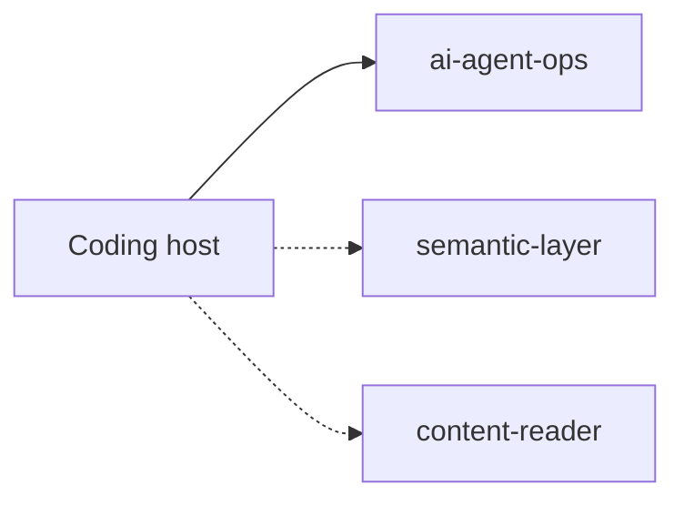
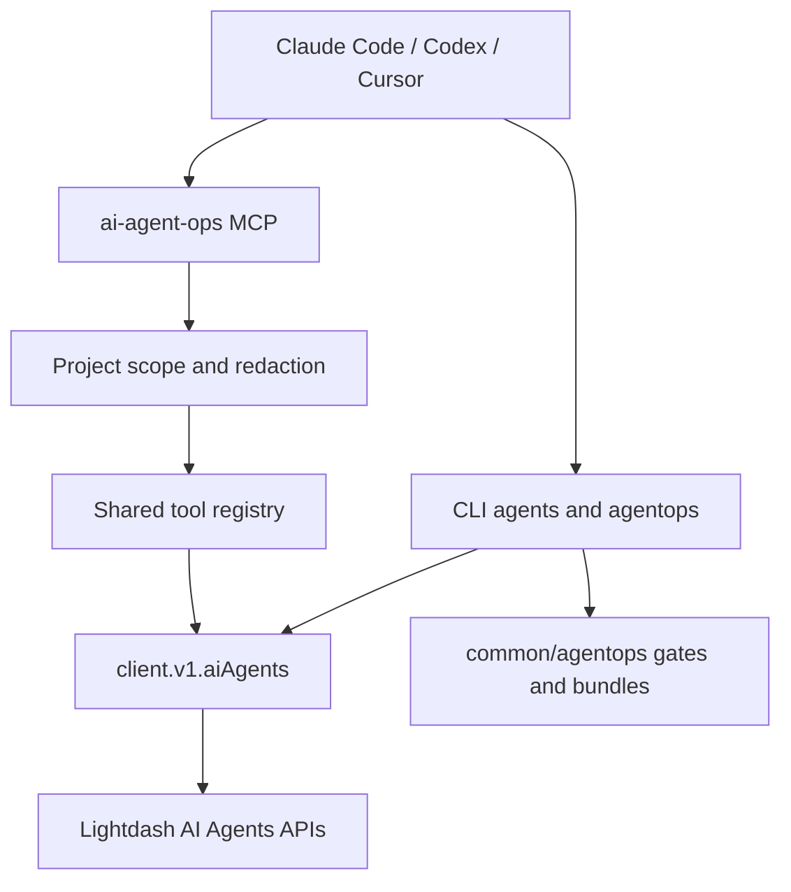
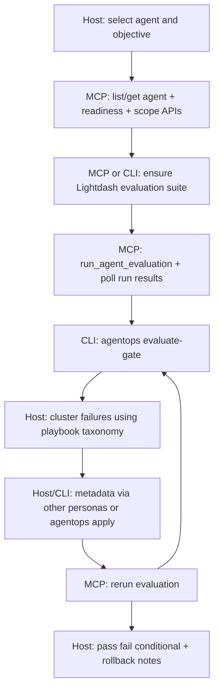

# RFC: Project-Level `ai-agent-ops` MCP Persona (revised)

- **Status:** Accepted (see [ADR-0018](adr/0018-mcp-ai-agent-ops-persona-thin-api-boundary.md))
- **Repository:** `yu-iskw/lightdash-tools`
- **Package:** `@lightdash-tools/mcp` (thin API surface) + `@lightdash-tools/common` / `client` / `cli` (loop)
- **Persona ID:** `ai-agent-ops`
- **HTTP path:** `/ai-agent-ops/v1/mcp`
- **Server name:** `lightdash-mcp-aops` (shortened for the ~60-char combined server+tool limit)
- **Project scope:** Exactly one Lightdash project
- **Primary operating model:** Distributed AgentOps loop (MCP APIs + host synthesis + CLI/`agentops`)
- **Last updated:** 2026-08-03

---

## 1. Executive Summary

This RFC defines a project-level **`ai-agent-ops` MCP persona** for inspecting Lightdash AI agents and driving product evaluation APIs — while keeping the MCP server **thin**.

**Binding constraint:** Loop engineering spans the MCP server **and** clients (coding host, CLI, GitOps). The MCP server does **not** host offline scorers, Git dataset stores, failure clustering, or promotion decision engines. MCP tools map to **Lightdash APIs only**.

```text
MCP: list/get agents, readiness, threads (read), evaluation suite/run APIs
Host: diagnose failures, choose interventions, write reports
CLI/agentops: bundles, drift, evaluate-gate, CI
Optional other MCP personas: semantic-layer / content-reader for metadata fixes
```

Recommended v1 capabilities on MCP:

- list and get project AI agents;
- evaluate agent readiness (product API);
- list suggestions / models / explore-access summary;
- list/get threads (bounded, redacted);
- list/get/create/update/append/delete evaluation suites;
- run evaluations and fetch run results.

Agent create/update/delete, thread generate/continue, org admin mutations, and local offline evaluation stores are **out of MCP v1** (use CLI / `@lightdash-tools/client` / `agentops`).

---

## 2. Context

Shipped personas: `semantic-layer`, `content-reader`, `content-developer`, `content-governance`, `organization-audit`.

The repository already provides:

- 22+ catalogued AI-agent operations (`packages/common/src/operations/ai-agents.ts`) with client + CLI;
- Lightdash-native evaluation suite/run APIs;
- GitOps AgentOps (`LightdashAiAgentBundle`, `LightdashAiEvaluationGate`, CLI `agentops`).

ADR-0010 forbids mega-tools and server-side audit crawls. The same rule applies here: **host orchestrates; MCP stays primitives.**



`ai-agent-ops` does **not** compose other personas internally. The host may attach multiple MCP servers.

---

## 3. Problem Statement

Lightdash AI-agent quality depends on instructions, tags, semantic metadata, content, access, and runtime behavior. Coding agents need a reproducible loop, but putting that loop **inside** MCP duplicates CLI/`agentops` and violates thin-server norms.

Primary objective:

> Expose project-scoped Lightdash AI-agent APIs on MCP, and document a distributed AgentOps loop so hosts and CLI can evaluate, improve, and gate agents without inventing a second evaluation platform in the MCP process.

---

## 4. Goals

1. Resolve exactly one Lightdash project.
2. Inventory and inspect project AI agents via project-scoped APIs.
3. Expose product readiness and evaluation APIs as thin tools.
4. Guide hosts through loop engineering via prompts/playbooks.
5. Keep promotion gates in CLI/`agentops` (`evaluateGatePolicy`).
6. Clearly distinguish readiness API results, evaluation runs, and host hypotheses.
7. Redact conversation-class data by default (ADR-0011).
8. Integrate with coding-agent and GitHub/`agentops` workflows.

---

## 5. Non-Goals (MCP v1)

1. Offline Git dataset CRUD tools on MCP.
2. Local scorers, failure clustering, or `recommend_*` mega-tools on MCP.
3. Custom “agent runner” adapters inside MCP.
4. Agent create/update/delete on MCP.
5. Thread start/continue (open-world generation) on MCP.
6. Org admin agent/settings mutation on MCP.
7. Treating readiness as end-to-end evaluation.
8. Formal compliance certification.
9. Storing secrets in tool responses.
10. Composing semantic/content tools into this persona’s allowlist.

---

## 6. Lightdash API Model

Prefer **project-scoped** endpoints:

```http
GET /api/v1/projects/{projectUuid}/aiAgents
GET /api/v1/projects/{projectUuid}/aiAgents/{agentUuid}
POST /api/v1/projects/{projectUuid}/aiAgents/{agentUuid}/evaluateReadiness
GET /api/v1/projects/{projectUuid}/aiAgents/{agentUuid}/evaluations
POST /api/v1/projects/{projectUuid}/aiAgents/{agentUuid}/evaluations/{evalUuid}/run
…
```

No custom adapter layer. Missing capabilities are simply not registered. Errors follow existing MCP patterns (`PROJECT_SCOPE_REQUIRED`, HTTP status mapping).

---

## 7. Architecture



### Architectural invariants

1. Exactly one project is resolved (pin → arg → `PROJECT_SCOPE_REQUIRED`).
2. Every MCP tool maps to a catalogued Lightdash API operation (ADR-0013).
3. No Git artifact store, scorer, or promotion engine in `packages/mcp`.
4. Evaluation mode truth: readiness ≠ eval run ≠ thread generate.
5. Agent mutations stay on CLI/`agentops apply` in v1.
6. Cross-domain fixes use optional other MCP personas or out-of-band tools.

---

## 8. Distributed Loop Engineering



Default host iteration budget: 3. Playbooks forbid silent substitution of readiness for evaluation runs.

---

## 9. Persona Definition

```ts
export const AI_AGENT_OPS_PERSONA_PATH = '/ai-agent-ops/v1/mcp' as const;

export const AI_AGENT_OPS_TOOL_IDS = [
  'list_project_agents',
  'get_project_agent',
  'evaluate_agent_readiness',
  'get_agent_suggestions',
  'get_agent_models',
  'get_explore_access_summary',
  'list_agent_threads',
  'get_agent_thread',
  'list_agent_evaluations',
  'get_agent_evaluation',
  'create_agent_evaluation',
  'update_agent_evaluation',
  'append_agent_evaluation_prompts',
  'delete_agent_evaluation',
  'run_agent_evaluation',
  'list_agent_evaluation_runs',
  'get_agent_eval_run_results',
] as const;
```

Wire names: `lightdash_` + id. Server display name: `lightdash-mcp-aops`.

Catalog profile: `ai-agent-ops` (persona parity). Ops also keep CLI profiles (`evaluations`, `discovery-readonly`, etc.).

---

## 10. Tool Catalog (v1)

| Tool                              | Lightdash API               | Mutability  |
| --------------------------------- | --------------------------- | ----------- |
| `list_project_agents`             | GET project agents          | read        |
| `get_project_agent`               | GET agent                   | read        |
| `evaluate_agent_readiness`        | POST evaluateReadiness      | read-shaped |
| `get_agent_suggestions`           | GET suggestions             | read        |
| `get_agent_models`                | GET models                  | read        |
| `get_explore_access_summary`      | POST explore-access-summary | read-shaped |
| `list_agent_threads`              | GET threads                 | read        |
| `get_agent_thread`                | GET thread                  | read        |
| `list_agent_evaluations`          | GET evaluations             | read        |
| `get_agent_evaluation`            | GET evaluation              | read        |
| `create_agent_evaluation`         | POST evaluation             | write       |
| `update_agent_evaluation`         | PATCH evaluation            | write       |
| `append_agent_evaluation_prompts` | POST append                 | write       |
| `delete_agent_evaluation`         | DELETE evaluation           | destructive |
| `run_agent_evaluation`            | POST run                    | open-world  |
| `list_agent_evaluation_runs`      | GET runs                    | read        |
| `get_agent_eval_run_results`      | GET run results             | read        |

---

## 11. Prompts and Playbooks

Prompts (host entry points; embed playbooks):

1. `audit_project_ai_agent`
2. `build_agent_evaluation_suite`
3. `run_agent_baseline`
4. `investigate_agent_failures`
5. `improve_agent_with_loop_engineering`
6. `review_agent_access_and_scope`
7. `review_agent_self_improvement`
8. `compare_agent_candidates`
9. `prepare_agent_release`

Resources:

```text
lightdash://playbooks/ai-agent-ops
lightdash://playbooks/ai-agent-ops/core
lightdash://playbooks/ai-agent-ops/evaluation
lightdash://playbooks/ai-agent-ops/loop-engineering
lightdash://playbooks/ai-agent-ops/release-gate
```

---

## 12. Safety and Privacy

- Project scope required on every tool.
- Thread/message bodies treated as conversation-class; redact aggressively unless an explicit future opt-in is added.
- `run_agent_evaluation` is open-world (warehouse/LLM side effects); playbooks require budgets.
- No agent CRUD on MCP v1.
- Secrets never logged.

---

## 13. Repository Layout

```text
packages/mcp/src/
├── personas/ai-agent-ops/v1/
│   ├── index.ts
│   ├── prompts.ts
│   └── resources/playbooks/
├── tools/ai-agents/
│   ├── agents.ts
│   ├── discovery.ts
│   ├── threads.ts
│   └── evaluations.ts
└── tools/registry.ts

packages/common/src/
├── operations/ai-agents.ts   # exposed + ai-agent-ops profile
└── agentops/                 # gates/bundles (unchanged ownership)

packages/cli/                 # agents + agentops loop
docs/
├── rfc-ai-agent-ops-mcp-persona.md
├── ai-agent-ops-endpoint-inventory.md
└── adr/0018-….md
```

**Do not create** `packages/mcp/src/ai-agent-ops/{evaluation,artifacts,runners}`.

---

## 14. Acceptance Criteria

1. Persona mounted at `/ai-agent-ops/v1/mcp` with server name `lightdash-mcp-aops`.
2. Every MCP tool maps to a catalogued Lightdash API operation.
3. No MCP tool writes Git eval artifacts or runs local scorers.
4. Playbooks describe the distributed loop (MCP + CLI agentops + optional other personas).
5. Product evaluation run/results work via MCP; promotion gate remains CLI/`evaluateGatePolicy`.
6. Agent CRUD mutation stays off MCP v1.
7. Combined server+tool wire names ≤ 60 characters.
8. Integration tests mock project agent + evaluation APIs only.

---

## 15. Open Questions (remaining)

1. Consumer-repo holdout policy for restricted fixtures.
2. When to expose thread generate/continue on MCP (cost/safety).
3. When to expose agent update on MCP (optimistic concurrency / rollback).

Closed by this revision: conversations/evals exist in OpenAPI + client; GitOps lives in `agentops`; no custom MCP runner required for v1.
