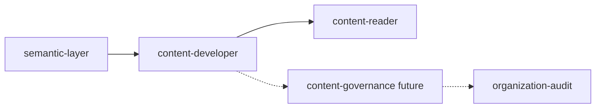
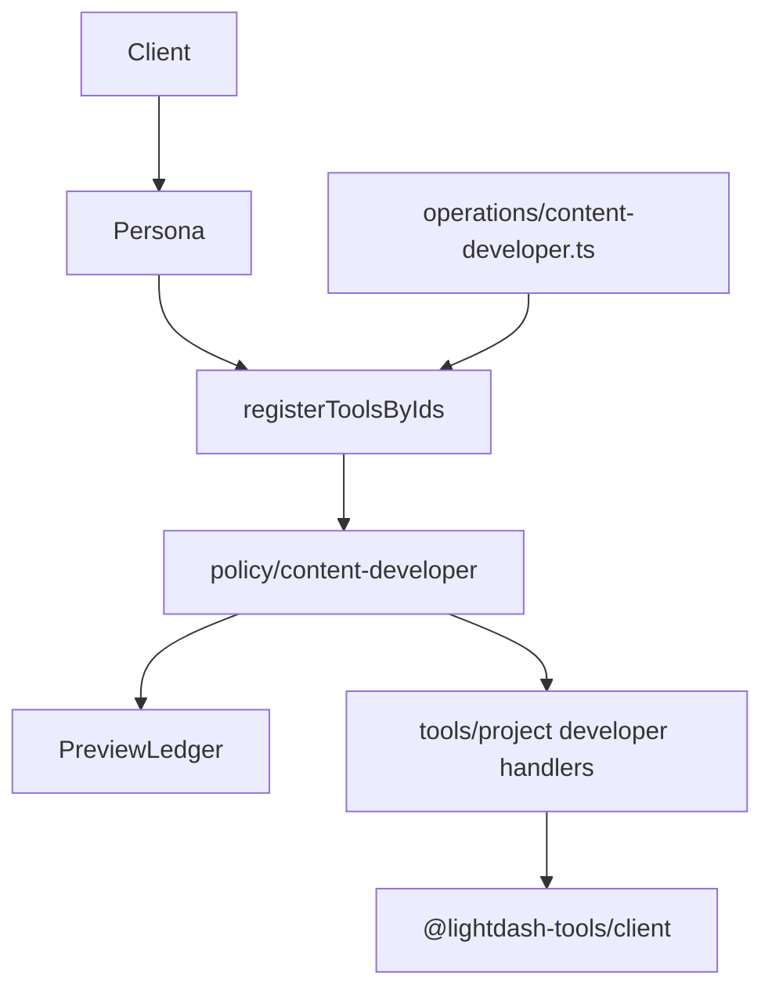

# RFC: Project-Level `content-developer` MCP Persona (amended)

**Status:** Accepted (see [ADR-0014](adr/0014-mcp-content-developer-persona-mutation-boundary.md))
**Repository:** `yu-iskw/lightdash-tools`
**Package:** `@lightdash-tools/mcp`
**Persona ID:** `content-developer`

## Executive Summary

Project-scoped persona for safely creating, modifying, validating, previewing, and organizing Lightdash analytical content.

Core principles:

- Project-pinned execution
- Preview before mutation (hard gate)
- Validation before apply
- Workflow-oriented MCP tools
- Reversible operations only (no hard delete in v1)

## Capability Boundary



## Architecture (implementation)



Catalog SSOT: [ADR-0013](adr/0013-operation-catalog-as-sole-agent-surface-ssot.md).

## Authoring model (hybrid)

- **Charts:** as-code upsert (`upsertChartAsCode`); duplicate via composition
- **Dashboards:** native REST create / v2 PATCH / `duplicateFrom`
- **Tiles:** MCP composition over full dashboard PATCH
- **Spaces:** create/update + bulk move

## Safety mapping

| RFC class                        | Annotations / impact                       |
| -------------------------------- | ------------------------------------------ |
| READ_ONLY / PREVIEW / VALIDATION | `READ_ONLY_DEFAULT` / transient-safe reads |
| SAFE_WRITE (as-code)             | `WRITE_IDEMPOTENT`                         |
| SAFE_WRITE (other)               | `WRITE_NONDESTRUCTIVE`                     |

## Wire naming

Tool ids are unprefixed catalog names (`create_chart`). Registration applies `lightdash_` prefix. Server display name: `lightdash-mcp-cdev`. Path: `/content-developer/v1/mcp`. Stdio: `lightdash-mcp content-developer`.

## Hard preview gate

1. `preview_*` → `previewId` (draft) + `contentHash`
2. `confirm_preview` with exact `resourceKind`/`resourceKey` → status `validated`
3. SAFE_WRITE requires matching validated `previewId`; apply consumes it
4. `validate_*` is optional on a saved UUID only and does not unlock apply

## Tool surface

See [content-developer-endpoint-inventory.md](content-developer-endpoint-inventory.md) and ADR-0014.

## Non-Goals (v1)

- Arbitrary SQL / semantic query execution
- Organization administration
- Destructive delete / rollback / promote
- `content-governance` persona

## Repository Layout

```text
packages/mcp/src/personas/content-developer/v1/
├── index.ts
├── prompts.ts
└── resources/
    ├── playbooks.ts
    └── playbooks/
        ├── index.md
        ├── core.md
        ├── dashboards.md
        └── content-move.md
packages/common/src/operations/content-developer.ts
packages/mcp/src/policy/{content-developer,preview-ledger}.ts
```

Spaces are not created/updated on this persona (Terraform / out-of-band). Dashboard-first SOP: charts as tiles; UI dashboard promote as the release unit.

## Acceptance Criteria

- Project pinned
- Preview before write (enforced)
- Validation before apply (enforced)
- No arbitrary SQL
- No destructive delete
- Version comparison
- Prompt/playbook coverage
- Catalog + client-coverage parity
