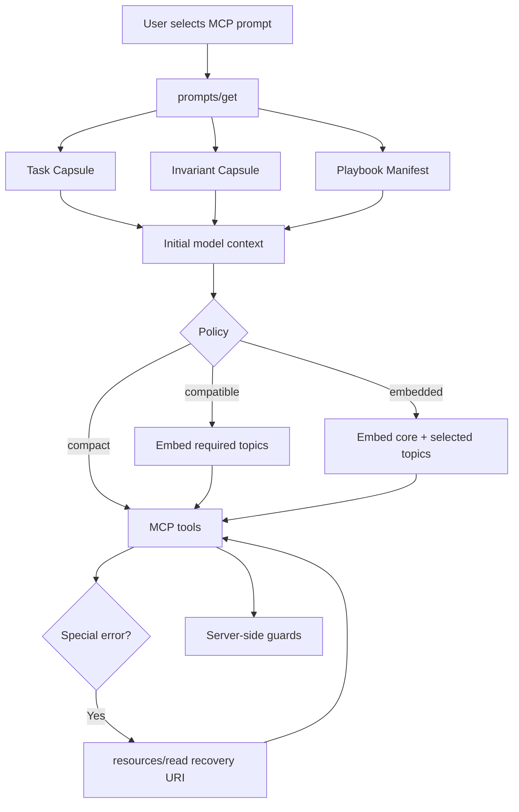

# RFC: Token-Efficient MCP Prompts and Progressive-Disclosure Playbooks

- **Status:** Accepted for implementation (revised 2026-08-11)
- **Authors:** lightdash-tools maintainers
- **Target repository:** yu-iskw/lightdash-tools
- **Target package:** `@lightdash-tools/mcp`
- **Date:** 2026-08-11
- **Protocol baseline:** Model Context Protocol (MCP) 2026-07-28
- **SDK baseline:** `@modelcontextprotocol/{server,node,client}` `2.0.0` (annotations + `cacheHint` available)
- **Decision scope:** MCP prompt composition, playbook resources, prompt-context policy, token-budget validation, deterministic behavioral gates
- **Out of scope:** Redesigning Lightdash business APIs; replacing profile-owned ToolModules; removing MCP prompts or resources; vendor-specific prompt caching; live LLM eval harnesses in CI; custom MCP extensions in v1

---

## 1. Summary

Replace eager full-playbook embedding in `@lightdash-tools/mcp` with progressive-disclosure prompt composition.

Today `createPromptPlaybookEmbedder()` always embeds the complete profile core and selected topic playbooks into `prompts/get`, while prompt bodies also paste `*_HARD_BANS` that duplicate `core.md`. Measured cost peaks on content-developer (`create_dashboard` ≈ core 14KB + three topics ≈ **~44KB / ~11k approx tokens**). Content-reader is smaller (~2–2.5k) but still double-pays bans.

Four layers:

1. **Task Capsule** — request-specific objective, arguments, short workflow skeleton
2. **Invariant Capsule** — compact eager safety/correctness kernel (structured SSOT)
3. **Playbook Manifest** — URI + when-to-read routing metadata
4. **Detailed Playbooks** — MCP resources, read lazily or selectively embedded by policy

Policies: `compact` | `compatible` | `embedded`. **Package default is `compact`.** `LIGHTDASH_TOOLS_MCP_PROMPT_CONTEXT=embedded` remains the trivial rollback.

This revision rejects pure URI-only as the universal default, rejects client-name branching, and requires **deterministic** CI gates (not live model evals) before claiming success.

---

## 2. Adversarial review of the original proposal (delta)

### 2.1 What held up

- Eager safety kernel + lazy cold-path is the right hybrid.
- Explicit policies beat silent client sniffing.
- Structured invariants fix HARD_BANS / core.md / prompt drift.
- Token growth must be CI-visible.
- Profile-owned ToolModules and resource URI stability must remain.

### 2.2 Findings against the live codebase

| Finding | Impact |
| --- | --- |
| content-developer, not content-reader, is the cost crisis (~11k vs ~2.5k tokens) | Architecture pilots on reader; **all profiles migrate in this change set**; developer gets recovery split |
| SDK 2.0.0 already types `annotations` + `cacheHint` | Use them; do not defer as “unknown SDK support” |
| Prompt messages use single content object per message; embedded `type: 'resource'` with full `text` | compact = text-only messages; compatible/embedded keep standard embedded resources |
| `resource_link` exists in SDK but is unused and unproven across hosts | **Not used in v1** |
| Error envelope is `{ error: { code, message } }` only | Optional `recovery` + `playbookUri` are additive; must not break parsers that only read `code`/`message` |
| No OTEL in MCP package | **CI report + char metrics only** for v1; no OTEL dependency |
| `registerPrompt` is eslint-deprecated in-repo | Do not migrate registration API in this work |
| Index playbooks are registered but never embedded | Good discovery surface; keep |
| HARD_BANS are duplicated into every prompt **and** core embed | Invariant capsule replaces prompt paste; HARD_BANS become generated projections |
| Live multi-client LLM behavioral eval suite does not exist | Acceptance = **deterministic** unit/snapshot/budget + protocol integration tests |

### 2.3 Revised decisions (closed open questions)

| # | Question | Decision |
| --- | --- | --- |
| 1 | Eventual default? | **`compact`** (this implementation ships it) |
| 2 | Official client matrix? | Documented smoke checklist outside CI; CI is protocol-level |
| 3 | SDK cache/annotations? | **Yes** on 2.0.0 — enable on static playbooks |
| 4 | Token estimation? | UTF-8 bytes + `approxTokens = ceil(chars / 4)`; no tokenizer dependency |
| 5 | Resource size? | Populate from raw UTF-8 byte length of markdown when emitting reports; optional description hint |
| 6 | `playbookUri` on errors? | Optional additive fields `recovery` + `playbookUri` on structured error object |
| 7 | Remove prose after server enforcement? | Keep eager invariant short-forms; do not delete enforcement |
| 8 | Index format? | Keep markdown index; composer renders typed metadata into prompt manifest |
| 9 | Custom MCP extension? | Deferred |
| 10 | How long keep `embedded`? | At least one minor release / deprecation cycle; env rollback forever until removed in a later ADR |

### 2.4 Scoring revision

Directional scores stand, with one correction: **Reliability of pure compact depends on hosts fetching resources.** Shipping default `compact` is acceptable because (a) invariant capsule remains eager, (b) server guards enforce hard boundaries, (c) `compatible`/`embedded` are one env flip away. Deterministic tests must assert compact does not embed full playbook text.

---

## 3. Goals / non-goals

Unchanged from original primary goals 1–10 and non-goals 1–10, with these amendments:

- **MUST** default to `compact` after migration.
- **MUST** keep `embedded` as fail-safe via env/CLI.
- **MUST NOT** require live LLM evals in CI.
- **MUST NOT** introduce `resource_link` or custom MCP extensions in v1.
- **SHOULD** generate `*_HARD_BANS` from structured invariants.

---

## 4. Architecture



### 4.1 Policies

| Policy | Includes | Embeds |
| --- | --- | --- |
| `compact` (default) | task + invariants + manifest | none |
| `compatible` | task + invariants + manifest | `requiredTopics` only |
| `embedded` | task (+ optional invariant capsule) | core + required + prompt-selected topics (legacy parity) |

Precedence:

```text
CLI --prompt-context
> LIGHTDASH_TOOLS_MCP_PROMPT_CONTEXT
> package default (compact)
```

Invalid values fail closed (throw at startup), matching `LIGHTDASH_TOOLS_MCP_PROFILES`.

Do **not** infer policy from `clientInfo.name`.

### 4.2 Composer API (normative sketch)

Replace call-site usage of `createPromptPlaybookEmbedder` with `createPromptContextComposer`. Keep the old helper as a thin `embedded`-parity wrapper temporarily or delete once all profiles migrate (this change set migrates all seven).

```ts
export type PromptContextPolicy = 'compact' | 'compatible' | 'embedded';

export type PromptInvariant = {
  id: string;
  severity: 'critical' | 'important';
  short: string;
  detail?: string;
  tags?: readonly string[];
};

export function createPromptContextComposer<TopicId extends string>(options: {
  policy: PromptContextPolicy;
  invariants: readonly PromptInvariant[];
  core: EmbeddedPlaybook;
  topics: Readonly<Record<TopicId, EmbeddedPlaybook>>;
  topicMeta: Readonly<Record<TopicId, { description: string; useWhen?: string }>>;
}): (spec: {
  task: string;
  invariantIds: readonly string[];
  requiredTopics?: readonly TopicId[];
  conditionalTopics?: readonly { topic: TopicId; when: string }[];
  recoveryTopics?: readonly { topic: TopicId; when: string }[];
}) => { messages: PromptUserMessage[] };
```

Rendering rules:

1. Resolve invariant ids in **declaration order** of `invariantIds` (deterministic).
2. Manifest lists required / conditional / recovery with stable URI + when text; sort by topic id within each section.
3. `compact`: one user text message (task + invariants + manifest).
4. `compatible`: text message + embedded resources for `requiredTopics` only.
5. `embedded`: text message + embedded core + each of `requiredTopics` then conditional topics’ topic ids that the prompt historically embedded (pass them as `requiredTopics` for parity).

### 4.3 Invariants SSOT

Per profile `invariants.ts` exports `*_INVARIANTS`. Generate:

- prompt invariant capsule (`formatInvariantCapsule`)
- `*_HARD_BANS` string (`formatHardBansProjection`) for markdown sync tests / legacy exports
- optional detailed bullets for core.md generation later (not required to rewrite all core.md in v1)

Prompts **must not** manually paste HARD_BANS blocks once migrated.

### 4.4 Resources

- Preserve URIs: `lightdash://playbooks/<profile>`, `/core`, `/<topic>`, and new `/recovery/<id>` where added.
- Register with `annotations: { audience: ['assistant'], priority }` and `cacheHint: { cacheScope: 'public', ttlMs: long }` for static shipped markdown.
- content-developer adds recovery topics under `resources/playbooks/recovery/*.md` without removing existing topic URIs.
- Avoid fragment explosion: recovery split is selective; do not atomize every paragraph.

### 4.5 Tool errors

Extend structured errors additively:

```ts
{ error: { code, message, recovery?: string, playbookUri?: string } }
```

Known codes (e.g. `PREVIEW_STALE`) SHOULD set concise `recovery` and a stable `playbookUri` when a recovery resource exists.

---

## 5. Budgets (CI)

Provider-neutral metrics per rendered prompt scenario × policy:

- `task_chars`, `invariant_chars`, `manifest_chars`, `embedded_resource_chars`, `total_chars`
- `approx_*_tokens` via `ceil(chars / 4)`

Initial guardrails (exceptions allowed with explicit test opt-out comment):

| Artifact | Target |
| --- | --- |
| task capsule | ≤ 400 approx tokens |
| invariant capsule | ≤ 300 |
| manifest | ≤ 200 |
| compact `prompts/get` typical | ≤ 900 |
| compact `prompts/get` maximum | ≤ 1500 |
| specialized topic resource | ≤ 4000 chars≈1000 tokens preferred; large existing topics grandfathered until split |
| median compact vs embedded reduction | ≥ 40% across registered scenarios |

content-developer topic files already exceed “specialized ≤ 1500 tokens”; **do not fail CI on historical topic file size** in v1 — fail on **compact prompt total** and on **growth** of compact totals.

---

## 6. Testing strategy (deterministic only)

1. **Unit:** policy parse; invariant render; topic selection; unknown topic throws; stable ordering; no duplicate invariant ids.
2. **Budget:** fixtures render every migrated prompt under all three policies; assert compact totals and reduction vs embedded.
3. **Invariant coverage:** `expectProfileHasCriticalInvariant(profile, id)` replaces fragile substring-only bans where practical; keep playbook tool-coverage helper.
4. **Protocol:** `prompts/get` under compact has **no** embedded playbook markdown text; compatible embeds only required URIs; embedded includes core URI.
5. **Resource:** every manifest URI is registered; recovery URIs resolve.
6. **No live LLM suite** in this RFC’s acceptance bar.

---

## 7. Migration (this change set)

| Step | Work |
| --- | --- |
| 0 | Revised RFC (this doc) + measurement helpers |
| 1 | Shared composer, policy env/CLI, annotations/cacheHint |
| 2 | Migrate all seven profiles; content-developer recovery resources |
| 3 | Budget + protocol tests; **default `compact`** |
| 4 | ADR + changelog; keep `embedded` rollback |

Order within step 2: content-reader → ai-agent-ops → content-developer → remaining (semantic-layer, organization-audit, content-governance, data-analyst).

---

## 8. Security / compatibility / rollback

- Prompt text is defense in depth, not authorization.
- Static playbooks are server-authored; never put user content into invariant capsules.
- Static resources: `cacheScope=public`; never public-cache auth-sensitive resources.
- Rollback: `LIGHTDASH_TOOLS_MCP_PROMPT_CONTEXT=embedded` or `--prompt-context embedded`.
- No resource URI removals in this rollout.

---

## 9. Success criteria

1. Median compact prompt context ≥ 40% smaller than embedded for registered scenarios.
2. Critical invariants present in every policy’s prompt text.
3. Deterministic tests green; unknown policy fails closed.
4. `embedded` restores prior eager embedding shape.
5. HARD_BANS prose no longer manually duplicated into prompt bodies.
6. Detailed playbooks remain readable via `resources/read`.

---

## 10. References

- ADR-0006, 0010, 0012, 0014, 0018, 0019, 0022, 0023, 0024
- `packages/mcp/src/profiles/lib/playbook-resources.ts`
- MCP 2026-07-28 prompts, resources, caching utilities
- Operator context: `docs/operators/agent-context.md`
