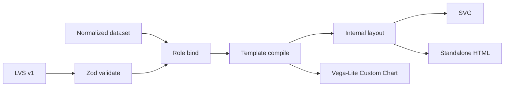
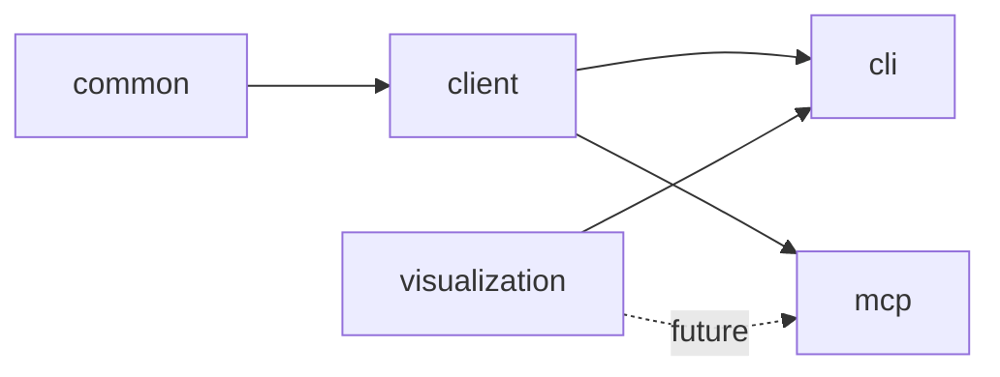
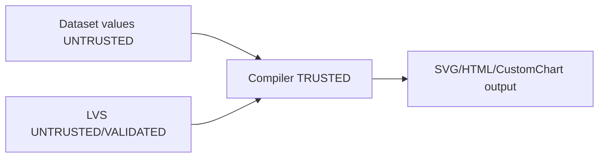

# RFC: Lightdash Tools Visualization Platform (MVP)

- **Status:** Accepted (MVP scope)
- **Date:** 2026-08-11
- **Repository:** `yu-iskw/lightdash-tools`
- **Primary package:** `@lightdash-tools/visualization`
- **Binding ADR:** [ADR-0026](adr/0026-add-visualization-package-for-lvs-multi-target-compilers.md) (amends [ADR-0002](adr/0002-monorepo-packages-client-common-cli-mcp.md))
- **Affected packages (MVP):** `visualization`, `cli` (+ docs/ADR)
- **Deferred:** MCP Apps / MCP viz tools / content-developer compile tool / Data Apps

---

## 1. Executive summary

Ship a **pure**, offline visualization package that validates a compact **Lightdash Visualization Specification (LVS v1)** and compiles it to:

1. **SVG** (deterministic static output)
2. **Standalone HTML** (self-contained; data embed opt-in)
3. **Lightdash Custom Chart** partial (`chartConfig.type: 'custom'` + Vega-Lite `spec` + aligned `metricQuery`)

MVP includes **two templates** (`metric-hero`, `ranked-cards`), CLI `viz validate|compile|render`, and ADR-backed package boundaries.

MVP does **not** include MCP Apps, MCP tools, content-developer persistence helpers, a public Scene Graph language, multi-theme design system, or Data Apps.



---

## 2. Motivation (brief)

`lightdash-tools` already covers semantic discovery, bounded metric query (ADR-0020), and preview-gated chart mutation (ADR-0014). Missing was a **target-independent** declarative document for KPI/ranking stories that can render offline and optionally feed Custom Charts.

AntV Infographic inspired declarative templates and SVG-centric output; this repo does **not** depend on `@antv/infographic`.

Vega-Lite remains the Custom Chart wire format, not the public agent-facing grammar.

---

## 3. Goals and non-goals (MVP)

### Goals

1. Versioned JSON/YAML LVS with Zod validation.
2. Works without MCP and without network I/O.
3. Compile `ranked-cards` to Custom Chart golden shape.
4. Deterministic SVG; XSS-safe text escaping.
5. HTML self-contained; `--embed-data` opt-in (default off).
6. Capability negotiation with machine-readable warnings/errors.
7. Independently testable with fixtures.

### Non-goals (MVP)

- MCP Apps / `ui://` resources / host bridge loops
- MCP tools (`visualize_metric_query`, `recommend_visualization`, `compile_custom_chart`)
- 8–10 templates, recommender productization, multi-theme
- Public Scene Graph programming language
- `type: vegaLite` escape hatch on governed compile paths
- Data Apps publication
- Amending content-developer `queryCapability: none`
- Drill-down / underlying-data capabilities on any target

---

## 4. ADR conflicts resolved

| Constraint                                                | Resolution                                                             |
| --------------------------------------------------------- | ---------------------------------------------------------------------- |
| ADR-0002 four packages                                    | **ADR-0026** adds `@lightdash-tools/visualization`                     |
| ADR-0014 preview gate / no warehouse on content-developer | Compile is pure; persistence tools deferred; no queryCapability change |
| ADR-0020 no underlying-data / drill-down on data-analyst  | Capability matrix MVP marks these **No**; MCP App deferred             |
| content-developer Custom viz playbook                     | Unchanged in MVP (no `compile_custom_chart` tool yet)                  |
| CLI `preview` naming vs ADR-0014                          | CLI uses `viz render`, not `preview`                                   |

---

## 5. Architecture

### Package ownership

`packages/visualization` owns LVS, templates, capability negotiation, SVG/HTML renderers, and Custom Chart compile helpers.

It MUST NOT call Lightdash APIs, know MCP auth/profiles, or depend on `client` / `mcp`. Enforced by `pnpm validate:deps`.

### Dependency direction



MVP CLI depends on `visualization`. MCP may depend later; not in this ship.

---

## 6. Package layout (MVP)

```text
packages/visualization/src/
  spec/          # types, Zod schema, validate
  data/          # dataset contract
  templates/     # metric-hero, ranked-cards, registry
  layout/        # internal layout nodes (private)
  compile/       # bind, capability, compileVisualization
  targets/       # svg, html, custom-chart
  theme/         # single lightdash theme
  format/        # escape + number format
  recommend/     # trivial deterministic ranking
  index.ts
```

---

## 7. LVS v1

### Principles

- Higher-level than Vega-Lite; lower-level than natural language
- Deterministic after validation
- Semantic-field-aware via roles
- No executable callbacks / embedded JS in the document

### Example

```yaml
version: '1'
metadata:
  title: Revenue health
intent:
  type: rank
  message: APAC is the strongest growth region
data:
  source:
    type: metricQuery
    explore: orders
  query:
    dimensions: [orders_region]
    metrics: [orders_total_revenue, orders_revenue_yoy]
  roles:
    category: orders_region
    value: orders_total_revenue
    secondaryValue: orders_revenue_yoy
visual:
  type: template
  template: ranked-cards
emphasis:
  mode: max
  field: orders_revenue_yoy
accessibility:
  title: Revenue by region
```

### Normative fields

- `version: "1"`
- `data.source.type: metricQuery` + `explore`
- `data.query` mirrors ADR-0020 inputs (`dimensions`, `metrics`, optional `filters.{dimensions,metrics}`, `sorts`, `limit`)
- `data.roles` partial map of field roles → fieldIds
- `visual`: template only on governed compile (`vegaLite` rejected in MVP)
- `capabilities.required` / `capabilities.preferred` optional
- `intent.message` is **display-only**; compilers MUST NOT distort values to make it true

### Intent enum (MVP)

`overview` | `rank` | `executive-summary`

(geo / relationship / process / etc. deferred until templates exist)

### Template options

Per-template Zod option objects (not `Record<string, unknown>`).

---

## 8. Dataset contract

Renderers consume `VisualizationDataset` (`columns[]`, `rows[]`, optional provenance). Provenance MUST NOT include credentials.

---

## 9. Templates (MVP = 2)

| Template       | Targets                                      | Purpose                                 |
| -------------- | -------------------------------------------- | --------------------------------------- |
| `metric-hero`  | svg, standalone-html                         | One headline KPI (+ optional secondary) |
| `ranked-cards` | svg, standalone-html, lightdash-custom-chart | Categorical ranking bars                |

Production bar for each template: null handling, long labels, cardinality warnings, XSS fixtures, golden snapshots.

---

## 10. Internal layout (not public IR)

Templates emit internal layout nodes (`text`, `bar`, `card`, `group`, …) consumed by SVG/HTML. This is an implementation detail, not a stable public language. Custom Chart path emits Vega-Lite separately.

---

## 11. Capability negotiation (MVP matrix)

| Capability           | SVG | Standalone HTML | Custom Chart |
| -------------------- | :-: | :-------------: | :----------: |
| Tooltip              | No  |       No        |      No      |
| Selection            | No  |       No        |      No      |
| Rerun semantic query | No  |       No        |      No      |
| Drill-down           | No  |       No        |      No      |
| Underlying data      | No  |       No        |      No      |
| Responsive layout    | No  |       No        |      No      |

MVP renderers advertise an empty capability set. Unsupported **required** capabilities fail in strict mode; preferred produce `CAPABILITY_DEGRADED` warnings. (Local HTML selection/tooltip and Vega tooltips are deferred until wired end-to-end.)

---

## 12. Custom Chart target

### Wire contract (closed Q3)

OpenAPI `CustomVisConfig`:

```ts
chartConfig: {
  type: 'custom';
  config: { spec: /* Vega-Lite object */ }
}
```

Compile also returns aligned `metricQuery` from LVS `data.query` + `exploreName` from `data.source.explore`.

Full upsert still requires caller/seed fields: `name`, `slug`, `spaceSlug`, `version`, `tableName`, etc. The package does **not** invent skinny as-code documents for persistence.

### Security

- Deny external Vega-Lite `data.url` (and nested data sources) — `EXTERNAL_RESOURCE_BLOCKED`. Row field ids named `url` inside `data.values` are allowed.
- Ban `visual.type: vegaLite` on governed compile paths in MVP

---

## 13. SVG and HTML

### SVG

Deterministic node ordering; escaped text/attributes; no external resources; no `<foreignObject>`.

### HTML

Self-contained file. Default: **do not** embed dataset rows. `--embed-data` embeds JSON and prints a sensitivity warning.

Trusted bundle JS (selection highlighting) is allowed; data-driven JS from LVS is not.

---

## 14. CLI

```bash
lightdash-tools viz validate -f visualization.yaml
lightdash-tools viz compile -f visualization.yaml --dataset result.json --target lightdash-custom-chart
lightdash-tools viz render -f visualization.yaml --dataset result.json --format svg -o out.svg
lightdash-tools viz render -f visualization.yaml --dataset result.json --format html --embed-data -o out.html
```

Offline only in MVP (no live Lightdash HTTP). Uses CLI safety wrap (`READ_ONLY_DEFAULT`).

---

## 15. Security

Threats addressed in MVP:

1. XSS via dataset/narrative → escape as text
2. External Vega URLs → blocked on Custom Chart compile
3. Credential leakage → package never holds credentials; HTML embed opt-in
4. Escape-hatch bypass → `vegaLite` banned on governed compile



---

## 16. Testing

- Unit: schema, role bind, capability, recommend, compile
- Golden: Custom Chart shape for ranked-cards
- Security: XSS fixture must not execute / must escape
- Determinism: identical SVG for identical inputs

Visual regression / a11y CI tooling deferred.

---

## 17. Phased roadmap

| Phase       | Scope                                                                                            | Status        |
| ----------- | ------------------------------------------------------------------------------------------------ | ------------- |
| **0 / MVP** | Package + 2 templates + SVG/HTML + Custom Chart compile + CLI validate/compile/render + ADR-0026 | **This ship** |
| 1           | More templates, richer HTML interactions (still no credentials)                                  | Deferred      |
| 2           | Connected CLI convenience (client + viz)                                                         | Deferred      |
| 3           | MCP App + `visualize_metric_query` (separate ADR; pin ext-apps APIs; follow-up arg allowlist)    | Deferred      |
| 4           | content-developer compile helper + playbook update + seed policy                                 | Deferred      |
| 5           | Data Apps adapter after stable public automation contract                                        | Deferred      |

---

## 18. Acceptance criteria (MVP)

- [x] `@lightdash-tools/visualization` independent of `client` / `mcp`
- [x] ADR-0026 accepted; ADR-0002 amended
- [x] LVS v1 Zod/types for 2 templates
- [x] Invalid bindings → deterministic errors
- [x] Capability warnings/errors deterministic
- [x] SVG deterministic + XSS escaped
- [x] HTML self-contained; embed-data default off
- [x] `ranked-cards` → Custom Chart golden `{ type: 'custom', config.spec }` + metricQuery
- [x] CLI `viz validate|compile|render`
- [ ] MCP Apps / 8 templates / content-developer tool — **explicitly out of MVP**

---

## 19. Decision log

- **D1:** shared `@lightdash-tools/visualization` package — **accepted** (ADR-0026)
- **D2:** LVS higher-level than Vega-Lite — **accepted**
- **D3:** layout nodes internal, not public IR — **accepted**
- **D4:** declarative interactions only — **accepted** (mostly deferred to later targets)
- **D5:** MCP App static bundle — **deferred** (not MVP)
- **D6:** no credentials / direct API from future App — **hard requirement when Phase 3 lands**
- **D7:** Data Apps deferred — **accepted**
- **D8:** Custom Chart persistence reuses preview gate — **hard requirement when Phase 4 lands**
- **D9:** MVP product slice = offline package + CLI; not MCP Apps — **accepted**
- **D10:** `vegaLite` escape hatch banned on governed compile in MVP — **accepted**
- **D11:** HTML embed-data default off — **accepted**
- **D12:** Custom Chart output = CustomVisConfig + aligned metricQuery (not full upsert) — **accepted**
- **D13:** Capability matrix must not claim ADR-0020-forbidden interactions — **accepted**

---

## 20. Adversarial review → revisions

P0 findings addressed:

1. ADR-0002 violation → ADR-0026
2. Inflated MCP App capabilities vs ADR-0020 → matrix corrected; Apps deferred
3. Cross-profile Custom Chart tool without playbook/seed policy → deferred Phase 4
4. Undefined Custom Chart wire format → closed to OpenAPI CustomVisConfig + metricQuery
5. `unknown` escape hatches → typed filters/options; `vegaLite` banned on governed path
6. MCP Apps as MVP acceptance → removed from MVP criteria
7. §34 “8 templates + live Apps” → replaced with spike/MVP checklist above

---

## 21. Final recommendation

Adopt this narrowed MVP. Proceed to later phases only after this package demonstrates cross-target reuse without LVS becoming a general drawing language.

---

## 22. References

- ADR-0002, ADR-0014, ADR-0020, ADR-0026
- Custom Charts: https://docs.lightdash.com/references/chart-types/custom-charts
- MCP Apps (future): https://modelcontextprotocol.io/extensions/apps/overview
- Bounded metric query: `packages/mcp/src/tools/query/run-metric-query.ts`
- Package implementation: `packages/visualization/`
- CLI: `packages/cli/src/commands/viz.ts`
