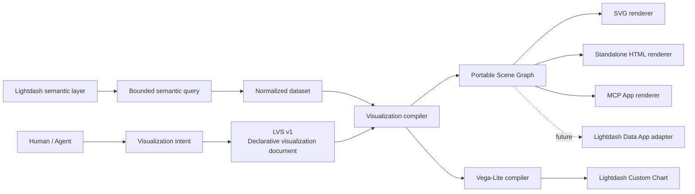
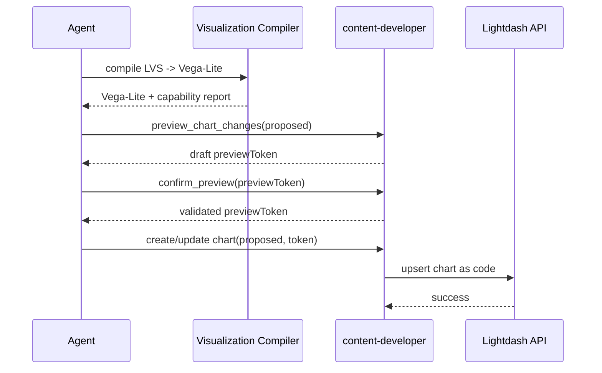
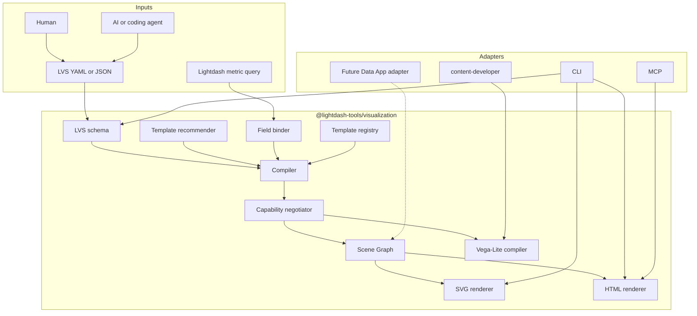
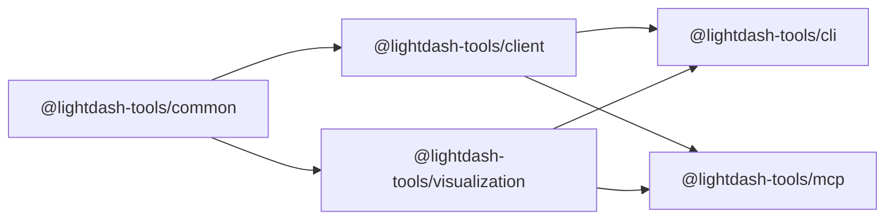
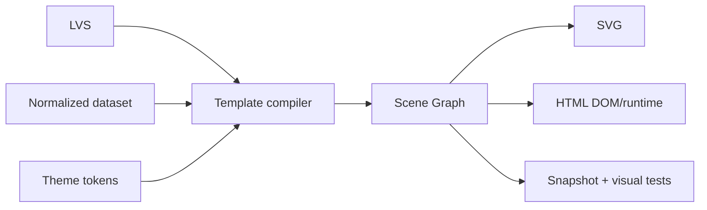
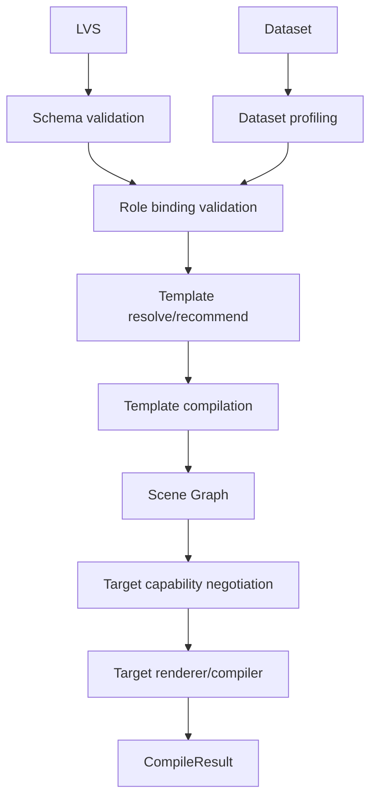
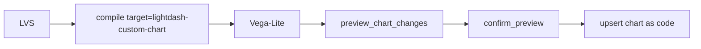
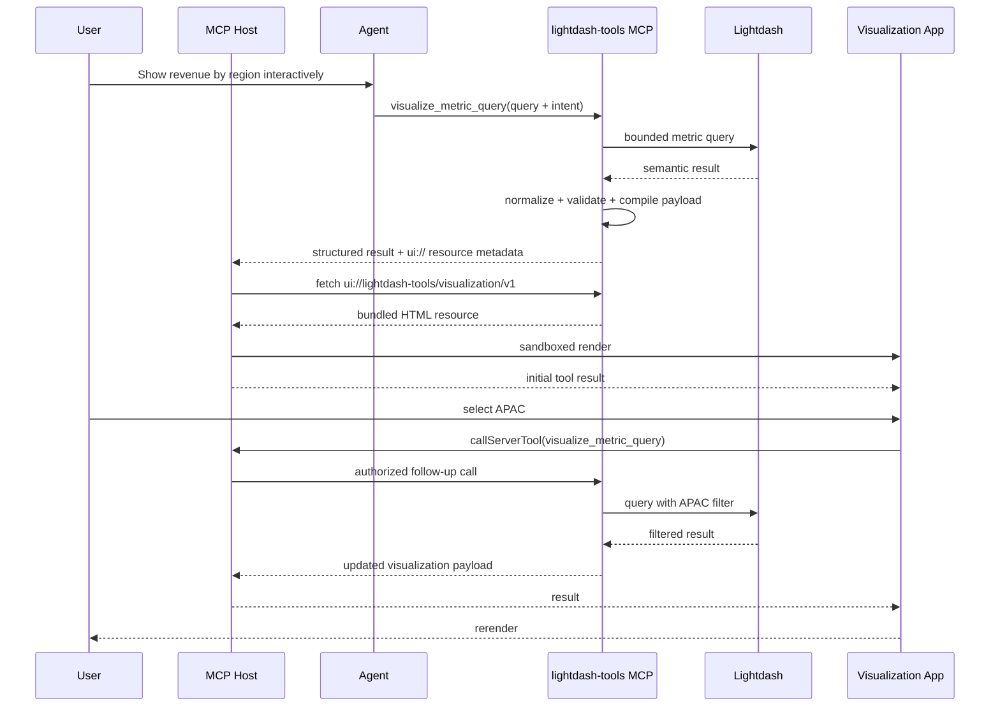
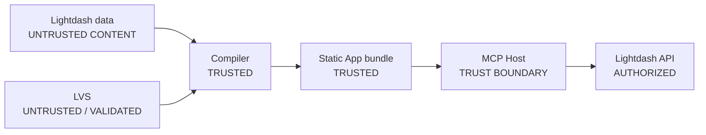
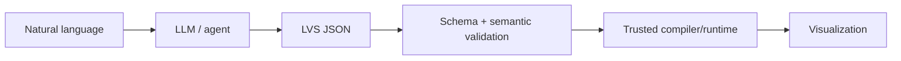

# RFC: Lightdash Tools Visualization Platform

## A declarative, AI-native visualization layer for Custom Charts, standalone rendering, MCP Apps, and future Data Apps

- **Status:** Proposed
- **Date:** 2026-08-11
- **Repository:** `yu-iskw/lightdash-tools`
- **Primary new package:** `@lightdash-tools/visualization`
- **Affected packages:** `@lightdash-tools/common`, `@lightdash-tools/client`, `@lightdash-tools/cli`, `@lightdash-tools/mcp`
- **Primary MCP profiles:** `data-analyst`, `content-developer`
- **Target MCP generation:** 2026-07-28
- **Decision type:** Architecture / public API / visualization runtime

---

## 1. Executive summary

This RFC proposes a reusable visualization subsystem for `lightdash-tools` that can create rich, infographic-style and interactive visualizations from governed Lightdash semantic-layer data **without depending on AntV Infographic**.

The central design is a new package:

```text
@lightdash-tools/visualization
```

It defines a compact, versioned **Lightdash Visualization Specification (LVS)** and compiles LVS into multiple targets:

1. **Lightdash Custom Charts** via Vega-Lite.
2. **Standalone HTML** for browser/local use without MCP.
3. **SVG** for deterministic static rendering and export.
4. **MCP Apps** for interactive visualization inside compatible AI hosts.
5. **Future Lightdash Data Apps**, through a separate adapter after stable supported publication contracts are available.

The architecture deliberately does **not** put the visualization engine inside `@lightdash-tools/mcp`. MCP is one adapter, not the visualization domain model.



The system is **AI-native but not AI-dependent**. Deterministic code performs validation, field compatibility checks, recommendation, compilation, capability negotiation, escaping, rendering, and security enforcement. An LLM may infer visualization intent and produce LVS, but it is never required to emit arbitrary JavaScript, HTML, SVG coordinates, or raw SQL.

The MVP should include:

- LVS v1;
- a small portable scene graph;
- 8–10 curated visualization templates;
- Vega-Lite compilation;
- SVG and self-contained HTML rendering;
- CLI validate/compile/render/preview commands;
- one interactive MCP App backed by bounded Lightdash metric queries;
- Custom Chart persistence through the existing `content-developer` preview gate.

Direct Data App publication, arbitrary JavaScript, a drag-and-drop editor, and a large template marketplace are explicitly deferred.

---

## 2. Motivation

### 2.1 Problem

Lightdash increasingly exposes governed semantic data through several experiences:

- standard charts and dashboards;
- Vega-Lite Custom Charts;
- Data Apps;
- APIs and SDKs;
- MCP tools;
- MCP Apps.

`lightdash-tools` already exposes semantic discovery, bounded metric queries, content development, and governance. The missing abstraction is a target-independent way to express:

- what governed semantic data is being visualized;
- what analytical/story intent should be conveyed;
- what visual template/composition should be used;
- how semantic fields map to visual roles;
- which interactions are desired;
- which theme should be used;
- which capabilities are required or optional.

### 2.2 Inspiration from AntV Infographic

AntV Infographic demonstrates valuable ideas: declarative syntax, reusable templates, themes, SVG-centric output, and AI-friendly generation. This RFC adopts those **ideas**, not the runtime.

`lightdash-tools` should not depend on `@antv/infographic` because:

1. The primary domain is governed Lightdash semantic data.
2. Lightdash Custom Charts require Vega-Lite.
3. MCP Apps need a sandbox-friendly browser artifact.
4. The project should own its schema and compatibility contract.
5. A purpose-built grammar is easier to validate and safer for AI generation.
6. The durable value is semantic-layer-aware compilation and governance rather than a generic drawing library.

### 2.3 Why Vega-Lite alone is not the public abstraction

Vega-Lite is an excellent low-level chart grammar and remains a key target. However, many desired experiences are **data-story compositions** rather than single charts:

```text
┌──────────────────────────────────────────────────────┐
│ Executive Revenue Health                             │
│                                                      │
│ $23.4M              +17.5%               91%         │
│ Revenue             YoY growth           Target      │
│                                                      │
│ ──────────────────────────────────────────────────── │
│ APAC          █████████████████      $8.4M           │
│ EMEA          █████████████          $6.1M           │
│ North America ███████████            $5.2M           │
│ LATAM         █████                  $2.1M           │
│                                                      │
│ ★ APAC is the strongest growth region (+31% YoY)     │
│                                                      │
│ [Region ▼] [Inspect APAC]                            │
└──────────────────────────────────────────────────────┘
```

This combines KPI blocks, narrative, ranking, emphasis, layout, conventional charts, and interactions. LVS therefore sits **above** Vega-Lite and delegates conventional chart details to it.

---

## 3. Goals and non-goals

### 3.1 Goals

The implementation SHALL:

1. provide a declarative, versioned, JSON/YAML-serializable visualization specification;
2. work without MCP;
3. support interactive MCP Apps without coupling core rendering to MCP;
4. compile suitable visualizations to Lightdash Custom Chart Vega-Lite;
5. reuse existing semantic query and governance paths;
6. prevent arbitrary visualization code from bypassing Lightdash authorization;
7. preserve the current content-developer preview/confirmation mutation model;
8. explicitly negotiate target capabilities and degradation;
9. be independently testable without a live Lightdash instance for most tests;
10. permit future render targets without redesigning the domain model.

The implementation SHOULD:

- produce polished responsive visualizations;
- support accessibility and light/dark/system themes;
- support deterministic SVG output;
- support self-contained browser HTML;
- provide deterministic recommendation from dataset shape;
- preserve semantic field IDs and provenance.

### 3.2 Non-goals for v1

The MVP SHALL NOT:

- reproduce all of Vega/Vega-Lite;
- reproduce AntV Infographic's template library;
- support arbitrary user JavaScript inside LVS;
- generate arbitrary SQL;
- implement a general web application framework;
- implement a drag-and-drop/vector editor;
- implement a template marketplace;
- publish Data Apps through reverse-engineered private endpoints;
- replace Lightdash dashboards;
- change existing MCP authentication architecture.

---

## 4. Current-state constraints

### 4.1 MCP architecture

`@lightdash-tools/mcp` is profile-oriented. Shared tools live under `src/tools/`; profiles own prompts/playbooks/resources and mount selected tool modules. Visualization changes MUST preserve that structure.

Relevant profiles:

- `data-analyst`: bounded ad-hoc semantic metric queries;
- `content-developer`: preview-gated chart/dashboard mutations;
- `content-reader` and `content-governance`: existing read/governance boundaries.

### 4.2 Existing semantic-query boundary

`run_metric_query` already accepts semantic dimensions and metrics, filters and sorts, clamps row limits, disallows table-calculation SQL in this surface, and executes through the Lightdash API.

Interactive visualization should compose this existing boundary rather than introduce another query language.

### 4.3 Existing content mutation boundary

Generated Custom Charts MUST continue through the current preview gate:



Visualization compilation itself is pure and non-mutating.

### 4.4 Custom Chart limitations

Custom Charts are Vega-Lite based, but target features differ from an interactive app. The compiler must not pretend every interaction can be represented. In particular, features such as Lightdash drill-down, click-through underlying data, and dashboard cross-filtering are not generally available to Custom Charts today.

### 4.5 MCP Apps boundary

MCP Apps provide a tool-associated `ui://` resource rendered by the host in a sandboxed iframe. The UI can request subsequent server tool calls through the host bridge.

For enterprise safety, the visualization App SHOULD be a predeclared, self-contained bundle:

```text
visualization.html
├── HTML
├── inline CSS
├── inline JS
├── inline SVG icons
└── system fonts
```

It SHOULD require no third-party CDN.

### 4.6 Data Apps boundary

Data Apps are strategically aligned because they support richer governed applications over Lightdash data. However, they are a newer Cloud/licensed surface. The MVP treats Data Apps as a future adapter and does not make them the foundational runtime.

---

## 5. Architecture decision

Create a pure visualization-domain package:

```text
packages/visualization
```

It owns:

- LVS schema/types/versioning;
- dataset normalization contracts;
- template registry;
- deterministic template recommendation;
- internal scene graph;
- compilers/renderers;
- capability negotiation;
- themes/formatting;
- validation/security helpers.

It MUST NOT:

- call Lightdash APIs;
- know MCP authentication;
- persist remote state;
- know MCP profile routing;
- bypass `@lightdash-tools/client`.

### 5.1 High-level architecture



### 5.2 Dependency direction



`visualization` MUST NOT depend on `client` or `mcp`.

---

## 6. Recommended package layout

```text
packages/
├── common/
├── client/
├── cli/
├── mcp/
└── visualization/
    ├── package.json
    ├── tsconfig.json
    └── src/
        ├── index.ts
        ├── spec/
        │   ├── schema.ts
        │   ├── types.ts
        │   ├── version.ts
        │   └── validate.ts
        ├── data/
        │   ├── dataset.ts
        │   ├── normalize.ts
        │   ├── profile.ts
        │   ├── roles.ts
        │   └── provenance.ts
        ├── templates/
        │   ├── registry.ts
        │   ├── contracts.ts
        │   ├── metric-hero.ts
        │   ├── kpi-grid.ts
        │   ├── ranked-cards.ts
        │   ├── comparison-story.ts
        │   ├── trend-story.ts
        │   ├── progress-story.ts
        │   ├── timeline.ts
        │   ├── composition-story.ts
        │   ├── process-flow.ts
        │   └── executive-scorecard.ts
        ├── recommend/
        │   ├── rules.ts
        │   ├── score.ts
        │   └── recommend.ts
        ├── scene/
        │   ├── types.ts
        │   ├── layout.ts
        │   └── validate.ts
        ├── compile/
        │   ├── compile.ts
        │   ├── bind.ts
        │   ├── capability.ts
        │   └── warnings.ts
        ├── targets/
        │   ├── capabilities.ts
        │   ├── vega-lite/
        │   ├── svg/
        │   └── html/
        ├── theme/
        └── format/
```

---

## 7. Lightdash Visualization Specification (LVS)

### 7.1 Principles

LVS is:

- higher-level than Vega-Lite;
- lower-level than natural language;
- deterministic after validation;
- semantic-field-aware;
- target-independent;
- compositional but deliberately bounded;
- safe for AI generation.

LVS does not expose arbitrary executable callbacks.

### 7.2 Example

```yaml
version: "1"

metadata:
  title: Revenue health
  description: Executive summary of revenue by region

intent:
  type: rank
  audience: executive
  message: APAC is the strongest growth region

data:
  source:
    type: metricQuery
    explore: orders
  query:
    dimensions:
      - orders_region
    metrics:
      - orders_total_revenue
      - orders_revenue_yoy
  roles:
    category: orders_region
    value: orders_total_revenue
    secondaryValue: orders_revenue_yoy

visual:
  type: template
  template: ranked-cards

emphasis:
  mode: max
  field: orders_revenue_yoy

interaction:
  tooltip: true
  selection:
    type: single
    field: orders_region
  actions:
    - trigger: selection
      action:
        type: rerunQuery
        filterField: orders_region

theme:
  name: executive
  appearance: system

accessibility:
  title: Revenue by region
  description: Regions ranked by total revenue with year-over-year growth
```

### 7.3 Top-level interface

```ts
export interface VisualizationSpecV1 {
  version: '1';
  metadata?: VisualizationMetadata;
  intent?: VisualizationIntent;
  data: VisualizationDataBinding;
  visual: VisualizationDefinition;
  emphasis?: VisualizationEmphasis;
  interaction?: VisualizationInteraction;
  theme?: ThemeReference;
  accessibility?: AccessibilitySpec;
}
```

### 7.4 Intent

```ts
export type VisualizationIntentType =
  | 'overview'
  | 'compare'
  | 'rank'
  | 'trend'
  | 'progress'
  | 'distribution'
  | 'composition'
  | 'process'
  | 'timeline'
  | 'relationship'
  | 'geo'
  | 'executive-summary';
```

Narrative is guidance, not trusted logic. A compiler MUST NOT distort values to make the narrative true.

### 7.5 Data source and query

Initial connected source:

```ts
export interface MetricQueryDataSource {
  type: 'metricQuery';
  explore: string;
}
```

Query shape SHOULD align with the existing bounded metric-query API:

```ts
export interface VisualizationMetricQuery {
  dimensions: string[];
  metrics: string[];
  filters?: unknown;
  sorts?: Array<{
    fieldId: string;
    descending: boolean;
    nullsFirst?: boolean;
  }>;
  limit?: number;
}
```

No parallel SQL-like query DSL is introduced.

### 7.6 Semantic roles

Templates bind fields to roles rather than coordinates:

```ts
export type FieldRole =
  | 'category'
  | 'value'
  | 'secondaryValue'
  | 'time'
  | 'series'
  | 'label'
  | 'description'
  | 'start'
  | 'end'
  | 'latitude'
  | 'longitude'
  | 'size'
  | 'color';
```

Example template requirement:

```ts
requiredRoles: {
  category: ['nominal', 'ordinal'],
  value: ['quantitative'],
}
```

### 7.7 Visual definition and Vega-Lite escape hatch

```ts
export type VisualizationDefinition =
  | TemplateVisualization
  | VegaLiteVisualization;

export interface TemplateVisualization {
  type: 'template';
  template: string;
  options?: Record<string, unknown>;
}

export interface VegaLiteVisualization {
  type: 'vegaLite';
  spec: unknown;
}
```

The Vega-Lite escape hatch is intentional. LVS must not evolve into a competing low-level chart grammar.

Raw Vega-Lite still passes target safety rules, especially external resource restrictions.

### 7.8 Declarative interactions

```ts
export interface VisualizationInteraction {
  tooltip?: boolean;
  selection?: {
    type: 'single' | 'multiple';
    field: string;
  };
  actions?: VisualizationActionBinding[];
}
```

Allowed actions can include:

```text
filter
rerunQuery
inspect
openContent
updateContext
```

Explicitly prohibited:

```yaml
onClick: |
  fetch(...)
```

and any function source embedded in LVS.

---

## 8. Normalized dataset contract

Renderers should not consume raw Lightdash API payloads directly.

```ts
export interface VisualizationDataset {
  columns: VisualizationColumn[];
  rows: VisualizationRow[];
  provenance?: DatasetProvenance;
  truncated?: boolean;
  warnings?: string[];
}

export interface VisualizationColumn {
  fieldId: string;
  label: string;
  semanticType: 'dimension' | 'metric' | 'unknown';
  dataType: 'string' | 'number' | 'boolean' | 'date' | 'timestamp' | 'unknown';
  format?: FieldFormat;
}

export type VisualizationRow = Record<string, unknown>;
```

Provenance may include project, explore, timestamp, and query fingerprint, but MUST NOT include credentials.

---

## 9. Deterministic recommendation

Recommendation should initially be rule-based rather than requiring an LLM.

Examples:

```text
1 quantitative value, 1 row
  -> metric-hero

2-6 quantitative values, 1 row
  -> kpi-grid

1 categorical + 1 quantitative
  -> ranked-cards / comparison-story

1 temporal + 1 quantitative
  -> trend-story

ordered category + quantitative
  -> progress-story / process-flow

category + percentage-like metric
  -> composition-story
```

Result:

```ts
export interface TemplateRecommendation {
  templateId: string;
  score: number;
  reasons: string[];
  missingRoles: string[];
}
```

LLMs may rank or choose from validated candidates, but field/type compatibility remains deterministic.

---

## 10. Template model

```ts
export interface VisualizationTemplate {
  id: string;
  version: string;
  title: string;
  description: string;
  intents: VisualizationIntentType[];
  requirements: TemplateRequirements;
  capabilities: TemplateCapabilities;
  compile(context: TemplateCompileContext): SceneGraph;
}
```

Initial template set:

| Template | Purpose |
|---|---|
| `metric-hero` | one headline KPI |
| `kpi-grid` | executive KPI collection |
| `ranked-cards` | ranked categorical comparison |
| `comparison-story` | actual vs comparator/target |
| `trend-story` | time trend plus headline |
| `progress-story` | goal/target completion |
| `timeline` | milestones/events |
| `composition-story` | share-of-total |
| `process-flow` | ordered stages/funnel |
| `executive-scorecard` | composite executive summary |

A template is only production-ready when it has responsive behavior, accessibility semantics, cardinality rules, null handling, long-label fixtures, and visual regression tests.

Do not optimize for template count.

---

## 11. Internal portable Scene Graph

Templates SHOULD NOT manipulate the DOM directly.

They compile to an internal scene graph:

```ts
export type SceneNode =
  | SceneGroup
  | SceneStack
  | SceneGrid
  | SceneText
  | SceneBox
  | SceneIcon
  | SceneBar
  | SceneProgress
  | SceneChart
  | SceneSeparator;
```

Conventional charts remain embedded as Vega-Lite nodes where appropriate.



Keep the Scene Graph internal during v1 so rendering implementation can evolve without creating a public low-level programming language.

---

## 12. Themes

Themes are token based:

```ts
export interface VisualizationTheme {
  id: string;
  typography: { /* ... */ };
  spacing: { /* ... */ };
  radius: { /* ... */ };
  palette: {
    background: string;
    surface: string;
    text: string;
    mutedText: string;
    accent: string;
    positive: string;
    negative: string;
    warning: string;
    categorical: string[];
  };
}
```

Initial themes:

```text
lightdash
executive
minimal
editorial
```

Use system font stacks by default. Do not bundle proprietary fonts.

---

## 13. Compilation pipeline



Public API:

```ts
export async function compileVisualization(
  input: CompileVisualizationInput,
): Promise<CompileVisualizationResult>;
```

```ts
export interface CompileVisualizationInput {
  spec: VisualizationSpecV1;
  dataset: VisualizationDataset;
  target:
    | 'svg'
    | 'standalone-html'
    | 'mcp-app'
    | 'lightdash-custom-chart';
  strict?: boolean;
}
```

Result includes output, warnings, capability report, spec/template provenance.

---

## 14. Capability negotiation

Target differences are a first-class part of the design.

Capability vocabulary:

```ts
export type VisualizationCapability =
  | 'tooltip'
  | 'selection'
  | 'multiSelection'
  | 'filter'
  | 'rerunQuery'
  | 'inspect'
  | 'openContent'
  | 'crossFilter'
  | 'drillDown'
  | 'underlyingData'
  | 'animation'
  | 'responsiveLayout';
```

Indicative matrix:

| Capability | SVG | Standalone HTML | MCP App | Custom Chart | Future Data App |
|---|:---:|:---:|:---:|:---:|:---:|
| Tooltip | No | Yes | Yes | Yes | Yes |
| Selection | No | Yes | Yes | Partial | Yes |
| Rerun semantic query | No | Optional | Yes | No | Yes |
| Filter | No | Local | Yes | Limited | Yes |
| Inspect | No | Optional | Yes | No | Yes |
| Dashboard cross-filter | No | No | No | No | N/A/custom |
| Drill-down | No | Optional | Yes | No | Yes |
| Underlying data | No | Optional | Yes | No | Yes |
| Responsive layout | Static | Yes | Yes | container-dependent | Yes |

LVS may distinguish required and preferred capabilities. Unsupported required capabilities fail in strict mode; preferred capabilities produce machine-readable warnings.

The compiler MUST NOT silently claim behavior that the target cannot provide.

---

## 15. Lightdash Custom Chart target

### 15.1 Strategy

Use Vega-Lite for Custom Chart output and conventional chart portions.

Not every infographic template must support Custom Charts. Templates declare supported targets.

### 15.2 Security policy

Raw Vega-Lite can reference external resources. Governed compilation should default to:

```text
allowExternalDataUrls = false
```

External URLs require an explicit future policy/allowlist.

### 15.3 Persistence

Compilation is pure. Persistence remains under `content-developer`:



No new mutation bypass is introduced.

---

## 16. SVG and standalone HTML

### 16.1 SVG

SVG provides deterministic static output, visual regression support, and resolution-independent artifacts.

MVP constraints:

- deterministic node ordering;
- escaped text/attributes;
- no external resources;
- simple icons as inline paths;
- avoid `<foreignObject>` initially.

### 16.2 Standalone HTML

CLI rendering SHOULD default to one self-contained file:

```text
revenue.html
├── HTML
├── inline CSS
├── inline JS
└── inline SVG assets
```

When query rows are embedded, CLI MUST warn that the artifact contains source result data and must be protected according to its sensitivity.

---

## 17. CLI design

Proposed namespace:

```text
lightdash-tools viz ...
```

Initial commands:

```bash
lightdash-tools viz validate visualization.yaml

lightdash-tools viz recommend \
  --dataset result.json \
  --intent rank

lightdash-tools viz compile visualization.yaml \
  --dataset result.json \
  --target lightdash-custom-chart

lightdash-tools viz render visualization.yaml \
  --dataset result.json \
  --format svg \
  --output visualization.svg

lightdash-tools viz render visualization.yaml \
  --dataset result.json \
  --format html \
  --output visualization.html

lightdash-tools viz preview visualization.yaml \
  --dataset result.json
```

Connected convenience commands can later compose `@lightdash-tools/client` with the pure visualization package.

---

## 18. MCP integration

Do **not** create a dedicated visualization profile initially.

### 18.1 `data-analyst`

Read/query/render operations:

```text
recommend_visualization
visualize_metric_query
```

### 18.2 `content-developer`

Compilation/persistence-related operation:

```text
compile_custom_chart
```

Actual apply remains via existing preview-gated content tools.

### 18.3 Keep the MCP tool surface small

Do not expose every compiler primitive as a tool. The goal is task-oriented operations, not an RPC mirror of the visualization package.

---

## 19. `visualize_metric_query` MCP App

This is the flagship interactive feature.



### 19.1 Static UI + dynamic data

Use one predeclared resource:

```text
ui://lightdash-tools/visualization/v1
```

The resource is static/trusted UI code. Query results are dynamic structured tool data.

Do **not** generate a new executable HTML resource for every query.

### 19.2 Follow-up interaction

Recommendation for v1: the UI invokes `visualize_metric_query` again with updated filters rather than reconstructing compilation itself. This gives every interaction a fresh server-side validation/authorization cycle and keeps client code small.

---

## 20. MCP App frontend and network boundary

Recommended source:

```text
packages/mcp/src/apps/visualization/
├── resource.ts
├── constants.ts
└── ui/
    ├── index.html
    ├── main.ts
    ├── render.ts
    ├── interactions.ts
    └── styles.css
```

Build result:

```text
packages/mcp/dist/apps/visualization/visualization.html
```

The iframe MUST NOT call Lightdash directly.

Correct:

```text
MCP App
  -> host bridge
  -> MCP tool
  -> @lightdash-tools/client
  -> Lightdash API
```

Incorrect:

```text
MCP App -> fetch(LIGHTDASH_URL)
```

Benefits include no token exposure to UI, server-side project scoping, existing audit behavior, and no requirement for permissive Lightdash CORS.

---

## 21. Security model

### 21.1 Threats

1. malicious HTML/script in dataset values;
2. malicious narrative text generated by an LLM;
3. Vega specs referencing hostile URLs;
4. exfiltration via remote images/fonts/scripts;
5. UI tool-call escalation;
6. oversized result/resource exhaustion;
7. cross-project parameter tampering;
8. credentials reaching browser UI;
9. future unsafe template plugins.

### 21.2 Controls

- Render data/narrative as text, not trusted HTML.
- No arbitrary JavaScript callbacks in LVS.
- Reuse existing bounded result limits.
- Enforce project scope on every follow-up tool call.
- Deny remote resources by default.
- Validate structured app payloads before rendering.
- Keep an app-side allowlist of intended callable tool names as defense in depth.
- Never send PAT/OAuth/warehouse credentials to the app.

### 21.3 Trust boundaries



Never classify query values as trusted HTML.

---

## 22. Governance and auditing

### 22.1 Query governance

Connected queries continue through `@lightdash-tools/client` and existing MCP request/project guardrails.

### 22.2 Content governance

Compilation is not mutation. Persisting a generated visualization must continue through `content-developer` preview/confirmation.

### 22.3 Auditing

Useful additional fields:

```text
visualization.target
visualization.template_id
visualization.spec_version
visualization.interaction_action
visualization.degraded_capabilities
```

Do not log full sensitive row data by default.

---

## 23. Data Apps adapter

Data Apps are a future target, not the core runtime.

A future API may look like:

```ts
compileVisualization({
  spec,
  dataset,
  target: 'lightdash-data-app',
});
```

Publication tooling should only be implemented when there is a stable, supported public API/CLI contract suitable for external automation.

Do not reverse engineer private browser endpoints and promote them to a foundational API.

---

## 24. Errors and warnings

Machine-readable errors:

```text
INVALID_SPEC
UNSUPPORTED_SPEC_VERSION
UNKNOWN_TEMPLATE
MISSING_REQUIRED_ROLE
INCOMPATIBLE_FIELD_TYPE
UNKNOWN_FIELD
INVALID_INTERACTION
UNSUPPORTED_TARGET
UNSUPPORTED_REQUIRED_CAPABILITY
TEMPLATE_TARGET_UNSUPPORTED
DATASET_TOO_LARGE
INVALID_VEGA_LITE
EXTERNAL_RESOURCE_BLOCKED
```

Warnings:

```text
CAPABILITY_DEGRADED
DATA_TRUNCATED
HIGH_CARDINALITY
LONG_LABELS
NULL_VALUES
TARGET_LAYOUT_APPROXIMATION
UNSUPPORTED_OPTION_IGNORED
```

---

## 25. Versioning and determinism

LVS documents contain:

```yaml
version: "1"
```

Rules:

- additive optional fields may remain v1;
- semantic breaking changes require v2;
- template additions do not change LVS version;
- template implementations have independent semver.

The same spec, dataset, theme, target, and compiler version SHOULD produce deterministic output.

Avoid random IDs, current-time rendering, and locale-dependent implicit sorting.

---

## 26. Accessibility and internationalization

Every production template SHALL provide:

- meaningful title/description support;
- semantic labeling;
- keyboard operation for controls;
- visible focus states;
- no critical color-only encoding;
- reduced-motion behavior if animation is later added.

The renderer SHOULD support Unicode and Japanese labels from the beginning and use locale-aware formatters when explicitly configured.

Prefer SVG/DOM over Canvas/WebGL in the MVP because it is more inspectable and accessible.

---

## 27. Performance

Infographic templates should use bounded row counts.

Illustrative defaults:

```text
metric-hero: 1 row
kpi-grid: <= 12 metrics
ranked-cards: <= 20 rows
timeline: <= 50 rows
process-flow: <= 20 stages
trend-story: <= 500 points
```

If input exceeds a recommendation, warn or fail rather than silently discarding data unless the transformation is explicit and reported.

For the MCP App bundle, use an engineering budget such as:

```text
gzip <= 300 KB preferred
gzip <= 500 KB review threshold
```

Measure Vega/Vega-Lite runtime cost before deciding whether it is bundled into every app build.

---

## 28. Testing strategy

### 28.1 Unit tests

Cover:

- LVS schema and invalid documents;
- field/role matching;
- data type inference;
- recommendation;
- formatting;
- capability negotiation;
- URL/security policies;
- deterministic compilation.

### 28.2 Golden tests

Each template should have fixture input and normalized Scene Graph/Vega-Lite snapshots.

### 28.3 Visual regression

Use browser screenshot testing for:

- default/light/dark;
- narrow viewport;
- long labels;
- Japanese labels;
- nulls;
- negative values;
- cardinality edge cases.

### 28.4 Security fixtures

Examples:

```json
{"label":""}
```

must render literally without execution.

A Vega-Lite `data.url` pointing to an unapproved origin must produce `EXTERNAL_RESOURCE_BLOCKED` in governed targets.

### 28.5 MCP App integration

Test:

1. server tool returns structured payload plus UI metadata;
2. host reads static UI resource;
3. sandbox renders initial visualization;
4. selection triggers a follow-up MCP tool call;
5. filtered result rerenders;
6. malformed payload and query errors are handled safely.

---

## 29. AI-native responsibility split

### AI may

- infer intent;
- choose among validated templates;
- bind semantic fields to roles;
- write title/subtitle/narrative;
- propose emphasis;
- produce LVS.

### Deterministic code must

- validate fields and types;
- enforce query bounds;
- negotiate capabilities;
- compile layout;
- escape data;
- enforce security policy;
- render output;
- persist through governance gates.

Recommended pipeline:



Avoid:

```text
prompt -> LLM -> arbitrary HTML/JS -> iframe
```

---

## 30. Alternatives considered

### A. Vega-Lite only

**Pros:** fastest, native Lightdash, minimal runtime.

**Cons:** poor fit for rich data-story compositions and MCP App UI.

**Decision:** retain as a target, reject as the overall architecture.

### B. MCP-only renderer

**Pros:** easy conversational demo.

**Cons:** excludes non-MCP users and couples rendering to protocol code.

**Decision:** reject.

### C. One third-party renderer everywhere

**Pros:** mature visualization capabilities.

**Cons:** target runtimes differ and the public API becomes coupled to a generic rendering grammar.

**Decision:** libraries may exist below LVS, not replace it.

### D. Data Apps first

**Pros:** rich Lightdash-native application surface.

**Cons:** newer Cloud/licensed dependency and publication-contract risk.

**Decision:** future adapter.

### E. Depend directly on AntV Infographic

**Pros:** template ecosystem and AI-friendly rendering.

**Cons:** broader runtime dependency, not Lightdash-semantic-specific, does not normalize target interactions, and conflicts with the requirement to avoid the dependency.

**Decision:** reject; retain conceptual inspiration.

---

## 31. Adversarial evaluation

### Central claim

> A compact shared visualization IR plus target-specific compilers is the best architecture for rich visualization in `lightdash-tools`.

### Strongest case for

The targets are materially different:

```text
Custom Chart       -> Vega-Lite
Standalone browser -> HTML/SVG
MCP App            -> sandboxed interactive HTML
Data App           -> Lightdash-hosted application runtime
```

A shared semantic IR centralizes validation, governance, target negotiation, themes, template selection, accessibility, and testing.

### Strongest case against

A new IR can become an accidental programming language, duplicate Vega-Lite, constrain users, and create adapter maintenance costs.

### Rebuttal

Keep LVS deliberately high-level. Conventional charts delegate to Vega-Lite. The Scene Graph remains internal. New LVS fields require demonstrated cross-template value.

### Falsification criteria

Reconsider this architecture if a spike shows that:

1. most target templates require arbitrary scene customization that forces LVS to grow into a general language;
2. Custom Chart and MCP App implementations share little meaningful semantic compilation logic;
3. maintaining the internal renderer is materially more expensive than a safe existing alternative;
4. Lightdash exposes one stable runtime capable of hosting these same experiences across all target contexts.

---

## 32. Weighted evaluation

| Approach | Cross-surface 25% | Capability 20% | MVP 20% | Governance 15% | Maintainability 10% | Extensibility 10% | Weighted |
|---|---:|---:|---:|---:|---:|---:|---:|
| Vega-Lite only | 55 | 66 | 95 | 92 | 91 | 58 | 75 |
| MCP-only renderer | 38 | 92 | 69 | 80 | 54 | 69 | 65 |
| **LVS + multi-target compilers** | **96** | **94** | **78** | **94** | **82** | **97** | **90** |
| One third-party renderer | 73 | 88 | 85 | 87 | 75 | 81 | 82 |
| Data Apps first | 57 | 98 | 58 | 96 | 63 | 90 | 75 |

The recommendation changes primarily if product scope is reduced to Custom Charts only.

---

## 33. Phased implementation

### Phase 0 — architecture spike

Implement only:

```text
packages/visualization/
├── LVS schema
├── 3 templates
│   ├── metric-hero
│   ├── ranked-cards
│   └── executive-scorecard
├── minimal Scene Graph
├── SVG renderer
└── Vega-Lite compiler path
```

Exit criteria:

- same spec can target SVG and Custom Chart where supported;
- capability warnings work;
- package makes no network calls;
- abstraction does not need material expansion for the three representative templates.

### Phase 1 — reusable package

- 8–10 templates;
- themes;
- HTML renderer;
- deterministic recommender;
- unit/golden/visual tests;
- stable internal contracts.

### Phase 2 — CLI

- `viz validate`;
- `viz recommend`;
- `viz compile`;
- `viz render`;
- `viz preview`.

### Phase 3 — MCP App

- `visualize_metric_query`;
- `recommend_visualization`;
- static `ui://lightdash-tools/visualization/v1`;
- interactive filtered rerun;
- textual fallback;
- host integration tests.

### Phase 4 — content developer

- Custom Chart compiler helper/tool;
- existing preview gate integration;
- live Lightdash validation.

### Phase 5 — Data Apps

Only after stable supported public automation contracts are confirmed.

---

## 34. Acceptance criteria

### Core

- [ ] `@lightdash-tools/visualization` is independent of MCP and Lightdash HTTP clients.
- [ ] LVS v1 has documented Zod/types.
- [ ] At least 8 production-quality templates exist.
- [ ] Invalid field bindings produce deterministic errors.
- [ ] Capability negotiation produces deterministic warnings/errors.
- [ ] SVG rendering is deterministic.
- [ ] Standalone HTML is self-contained.

### CLI

- [ ] `viz validate` works.
- [ ] `viz compile` emits valid Vega-Lite for supported templates.
- [ ] SVG and HTML rendering work.
- [ ] `viz preview` works locally.

### MCP

- [ ] `visualize_metric_query` reuses bounded semantic queries.
- [ ] UI is a predeclared `ui://` resource.
- [ ] App renders in an MCP Apps-compatible host.
- [ ] App can trigger safe follow-up queries.
- [ ] App never receives credentials.
- [ ] App requires no third-party CDN.
- [ ] Non-App hosts receive useful fallback output.

### Lightdash

- [ ] At least three templates compile to valid Custom Charts.
- [ ] Unsupported interactions are explicitly reported.
- [ ] Persistence uses existing preview confirmation.
- [ ] Live integration confirms generated chart configuration is accepted.

### Security

- [ ] XSS fixture values do not execute.
- [ ] External Vega URLs are denied by default in governed targets.
- [ ] Project scope cannot be bypassed through App interaction.
- [ ] Query rows are not written to audit logs by default.

---

## 35. Example end-to-end flow

User:

```text
Show an executive visualization of revenue by region and let me inspect a region.
```

Agent selects an executive/ranking intent and calls `visualize_metric_query` with semantic fields.

Server:

```text
1. resolve project scope
2. execute bounded metric query
3. normalize rows
4. profile dataset
5. recommend/validate template
6. bind fields
7. compile app payload
8. return structured result + UI resource metadata
```

The App renders the result. Selecting APAC causes another authorized MCP tool call with an APAC filter. No Lightdash credential or direct Lightdash endpoint is exposed to the iframe.

---

## 36. Fallback for hosts without MCP Apps

The tool MUST still return useful structured/text content, e.g.:

```text
Visualization: Revenue by region
Template: ranked-cards

1. APAC — $8.4M
2. EMEA — $6.1M
3. North America — $5.2M
4. LATAM — $2.1M

Interactive UI is available in MCP Apps-compatible hosts.
```

This preserves usefulness in coding agents and MCP clients without App support.

---

## 37. Observability

Optional OpenTelemetry spans:

```text
lightdash_tools.visualization.validate
lightdash_tools.visualization.profile_dataset
lightdash_tools.visualization.recommend
lightdash_tools.visualization.compile
lightdash_tools.visualization.render
```

Useful attributes:

```text
visualization.spec_version
visualization.template_id
visualization.target
visualization.row_count
visualization.warning_count
visualization.degraded_capability_count
```

Never attach raw result rows as span attributes.

---

## 38. Open questions for the spike

1. Bundle Vega/Vega-Lite into MCP App or use lightweight SVG primitives for initial templates?
2. What exact `@modelcontextprotocol/ext-apps` helper APIs should be used at implementation time?
3. What is the exact Custom Chart chart-as-code shape under the repository's pinned Lightdash OpenAPI?
4. Should the default visual theme derive from Lightdash tokens or remain independent?
5. Should standalone HTML embed data by default or require explicit `--embed-data`?
6. Which automated accessibility checker and visual regression threshold should be used in CI?
7. Which stable Data Apps automation API/CLI exists when Phase 5 begins?

Only questions 1 and 3 materially affect the initial architecture spike.

---

## 39. Decision log

- **D1:** shared `@lightdash-tools/visualization` package rather than MCP-owned renderer — **accepted**.
- **D2:** LVS remains higher-level than Vega-Lite — **accepted**.
- **D3:** Scene Graph remains internal in v1 — **accepted**.
- **D4:** interactions are declarative only — **accepted**.
- **D5:** MCP App is a static self-contained resource with dynamic structured data — **accepted for MVP**.
- **D6:** no credentials/direct Lightdash API calls from the App — **hard requirement**.
- **D7:** Data Apps are a deferred target — **accepted**.
- **D8:** Custom Chart persistence reuses existing preview gating — **hard requirement**.

---

## 40. Recommended validation spike

Use three datasets:

| Fixture | Shape |
|---|---|
| KPI | revenue + growth |
| Ranking | region + revenue + growth |
| Trend | month + revenue |

Prove:

| Test | KPI | Ranking | Trend |
|---|:---:|:---:|:---:|
| LVS validates | ✓ | ✓ | ✓ |
| SVG output | ✓ | ✓ | ✓ |
| HTML output | ✓ | ✓ | ✓ |
| Custom Chart output | partial | ✓ | ✓ |
| MCP App payload | ✓ | ✓ | ✓ |
| deterministic snapshots | ✓ | ✓ | ✓ |

If this works without significant LVS expansion, proceed to the MVP.

---

## 41. Final recommendation

Adopt the architecture described in this RFC.

Specifically:

1. Create `@lightdash-tools/visualization`.
2. Define LVS v1 as a compact semantic storytelling/composition grammar.
3. Keep Vega-Lite as a delegated low-level chart grammar and Custom Chart target.
4. Compile templates into an internal portable Scene Graph.
5. Render SVG and standalone HTML independently of MCP.
6. Add one self-contained MCP App as the interactive conversational target.
7. Route App interactions back through MCP tools; never call Lightdash directly from the iframe.
8. Reuse the existing `data-analyst` bounded query semantics.
9. Reuse the existing `content-developer` preview confirmation path for mutations.
10. Defer Data App publication until Lightdash exposes a stable supported external automation contract.

The architecture should begin as a three-template spike. If that spike demonstrates meaningful cross-target reuse without causing LVS to grow into a general-purpose visualization language, proceed with phased implementation.

---

## 42. References

### Lightdash

- Custom Charts: https://docs.lightdash.com/references/chart-types/custom-charts
- Data Apps: https://www.lightdash.com/data-apps
- Introducing Data Apps: https://www.lightdash.com/blogpost/introducing-data-apps
- Dashboards as code: https://docs.lightdash.com/guides/developer/dashboards-as-code
- React SDK: https://docs.lightdash.com/references/react-sdk

### Model Context Protocol

- MCP Apps overview: https://modelcontextprotocol.io/extensions/apps/overview
- MCP Apps build guide: https://modelcontextprotocol.io/extensions/apps/build
- MCP 2026-07-28: https://blog.modelcontextprotocol.io/posts/2026-07-28/

### Inspiration

- AntV Infographic: https://github.com/antvis/Infographic
- Gallery: https://en-us.infographic.antv.vision/gallery

### `lightdash-tools`

- Repository: https://github.com/yu-iskw/lightdash-tools
- MCP architecture: `packages/mcp/CONTRIBUTING.md`
- Bounded metric query: `packages/mcp/src/tools/query/run-metric-query.ts`
- Content developer inventory: `docs/profiles/content-developer/inventory.md`
- Data analyst boundary: `docs/adr/0020-mcp-data-analyst-profile-ad-hoc-metric-query-boundary.md`
