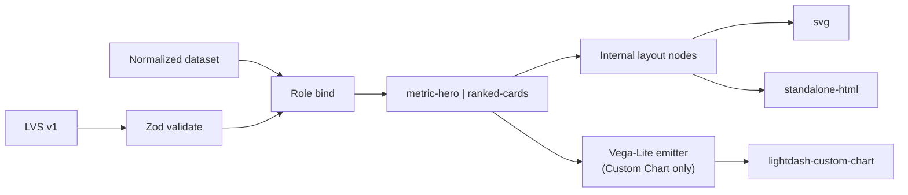
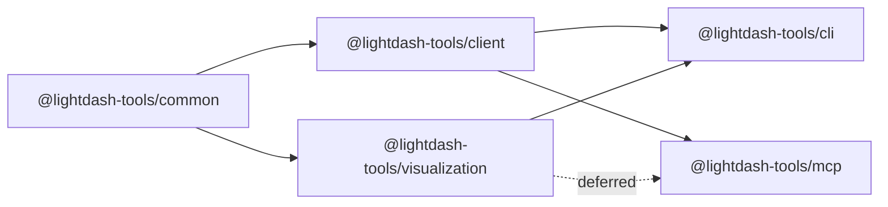
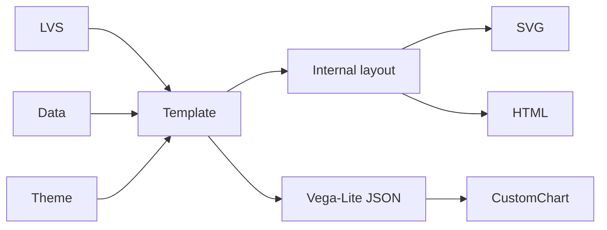
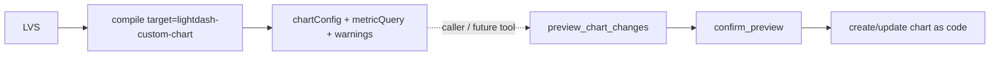
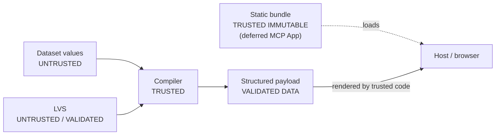

# RFC: Lightdash Tools Visualization Platform (MVP)

## Declarative LVS → SVG / standalone HTML / Lightdash Custom Chart

- **Status:** Accepted (MVP scope)
- **Date:** 2026-08-11
- **Repository:** `yu-iskw/lightdash-tools`
- **Primary new package:** `@lightdash-tools/visualization`
- **Affected packages (MVP):** `@lightdash-tools/common` (types only if needed), `@lightdash-tools/cli`
- **Explicitly out of MVP:** `@lightdash-tools/mcp` tools/Apps, `content-developer` compile helpers
- **Decision type:** Architecture / package boundary / visualization compile contract
- **Amends:** [ADR-0002](adr/0002-monorepo-packages-client-common-cli-mcp.md) via [ADR-0026](adr/0026-add-visualization-package-for-lvs-multi-target-compilers.md)
- **Respects:** [ADR-0014](adr/0014-mcp-content-developer-profile-mutation-boundary.md), [ADR-0020](adr/0020-mcp-data-analyst-profile-ad-hoc-metric-query-boundary.md)

---

## 1. Executive summary

Ship a **narrow, implementable MVP**: a pure package `@lightdash-tools/visualization` that validates a versioned **Lightdash Visualization Specification (LVS v1)** and compiles **two templates** (`metric-hero`, `ranked-cards`) to three targets:

| Target | Output |
| --- | --- |
| `svg` | Deterministic static SVG |
| `standalone-html` | Self-contained HTML (data embed opt-in) |
| `lightdash-custom-chart` | `{ chartConfig, metricQuery }` + capability warnings |

CLI commands: `viz validate`, `viz compile`, `viz render`. There is **no** `viz preview` (avoids collision with ADR-0014 preview tokens).

**Not in this MVP:** MCP Apps, MCP visualization tools, `compile_custom_chart`, multi-theme, Data Apps, OpenTelemetry, public Scene Graph language, Vega-Lite escape hatch on the governed compile path, recommender beyond trivial rules.



An LLM may author LVS; the compiler is deterministic and never requires the model to emit SVG coordinates, HTML, or SQL.

---

## 2. Motivation

`lightdash-tools` already covers semantic discovery, bounded metric queries (ADR-0020), and preview-gated content mutation (ADR-0014). Missing is a **target-independent** way to express visualization intent over governed semantic fields and compile it safely.

AntV Infographic inspires declarative templates and SVG-centric output; this RFC adopts those **ideas**, not `@antv/infographic`. Lightdash Custom Charts require Vega-Lite. SVG/HTML need a small layout model owned by this repo. The durable value is semantic-field-aware validation and multi-target compilation—not a generic drawing library.

Vega-Lite alone is too low-level for compositions (KPI + ranked list + narrative). LVS sits above it for templates; Custom Chart emission still uses Vega-Lite as the Lightdash wire format.

---

## 3. Goals and non-goals (MVP)

### 3.1 Goals

The MVP SHALL:

1. add `@lightdash-tools/visualization` as a pure domain package (no HTTP, no MCP);
2. define LVS v1 with Zod schemas and TypeScript types;
3. ship exactly two templates: `metric-hero`, `ranked-cards`;
4. compile to `svg`, `standalone-html`, and `lightdash-custom-chart`;
5. use an **internal** layout model (not a public IR);
6. negotiate capabilities and emit machine-readable warnings (never silent over-claim);
7. expose CLI: `viz validate`, `viz compile`, `viz render`;
8. default HTML **without** embedded row data (`--embed-data` opt-in);
9. ban `visual.type: vegaLite` on the governed compile path;
10. be testable offline with fixtures (no live Lightdash required for unit/golden tests).

### 3.2 Non-goals (MVP)

The MVP SHALL NOT:

- add MCP Apps (`ui://`), `visualize_metric_query`, `recommend_visualization`, or `compile_custom_chart`;
- ship 8–10 templates, multi-theme, or a public Scene Graph language;
- embed a Vega/Vega-Lite **runtime** in SVG or HTML targets;
- accept arbitrary JavaScript/HTML callbacks in LVS;
- generate SQL or bypass project/auth guardrails;
- mutate Lightdash content (compilation is pure; upsert remains ADR-0014);
- publish Data Apps or reverse-engineer private endpoints;
- add OpenTelemetry spans;
- name any CLI command `preview`.

---

## 4. ADR conflicts resolved

| ADR | Conflict in prior RFC draft | Resolution |
| --- | --- | --- |
| **ADR-0002** | New package not listed | **Amend** via ADR-0026: add `@lightdash-tools/visualization`. Depends on `common` only. MUST NOT depend on `client` or `mcp`. |
| **ADR-0014** | `viz preview` / MCP App mutation language collided with preview tokens | CLI uses `viz render`, never `preview`. Custom Chart **persistence** stays preview → confirm → apply. Compiler emits upsert **fragments** only; callers supply `name`/`slug`/`spaceSlug`/`version`. |
| **ADR-0020** | Interactive HTML “rerun query” implied a second query path | MVP HTML has **local** tooltip/selection only. No credentialed rerun. Future MCP App follow-ups (deferred) must reuse `run_metric_query` bounds—not invent a parallel DSL. |

Package boundary:

```text
visualization  →  common     (OK)
cli            →  visualization + client  (OK)
mcp            →  visualization           (future only; not MVP)
visualization  →  client | mcp            (FORBIDDEN)
```

---

## 5. Architecture and dependency direction

### 5.1 Components

Pure package: Zod validate → template registry → capability negotiate → internal layout (svg/html) and/or Vega-Lite emitter (Custom Chart). Sole MVP adapter: CLI `viz *`.

### 5.2 Dependency direction



`visualization` owns schema, templates, layout, compilers, themes (one), formatting, and security helpers. It does not call Lightdash APIs, hold credentials, or know MCP profiles.

### 5.3 Compile pipeline

```mermaid
flowchart TB
    Spec[LVS] --> V[Zod + version check]
    Data[Dataset] --> P[Profile + cardinality]
    V --> B[Role + option schema bind]
    P --> B
    B --> T[Resolve template]
    T --> C[Capability negotiate]
    C --> L[Build layout nodes]
    C --> VL[Emit Vega-Lite if Custom Chart]
    L --> R[Render svg | html]
    VL --> Out[CompileResult]
    R --> Out
```

---

## 6. Package layout (MVP)

```text
packages/visualization/
├── fixtures/{metric-hero,ranked-cards}/   # spec, dataset, expected.svg, expected.custom-chart.json
└── src/
    ├── index.ts
    ├── spec/          # types, Zod schema, version, validate
    ├── data/          # dataset, normalize, profile
    ├── templates/     # registry, contracts, metric-hero, ranked-cards, options/*
    ├── layout/        # internal nodes (not public IR)
    ├── compile/       # compile, bind, capability, warnings
    ├── targets/       # svg/, html/, vega-lite/ (Custom Chart only)
    ├── theme/lightdash.ts
    ├── format/
    └── security/      # escape, vega-policy
```

No `recommend/` product, no `apps/`, no MCP mounts. Trivial suggest helper optional (§9.1).

---

## 7. LVS v1 (implementable)

### 7.1 Principles

- Higher than Vega-Lite; lower than natural language.
- JSON/YAML serializable; Zod-validated.
- Semantic-field-aware (roles, not coordinates).
- No executable callbacks.
- `visual.type` for MVP governed path: **`template` only**.

### 7.2 Top-level type

```ts
export interface VisualizationSpecV1 {
  version: '1';
  metadata?: VisualizationMetadata;
  intent?: VisualizationIntent;
  data: VisualizationDataBinding;
  visual: TemplateVisualization; // governed path: templates only
  emphasis?: VisualizationEmphasis;
  interaction?: VisualizationInteraction;
  theme?: ThemeReference;
  accessibility?: AccessibilitySpec;
}
```

### 7.3 Example (`ranked-cards`)

```yaml
version: "1"
metadata:
  title: Revenue by region
intent:
  type: rank
  message: APAC leads on revenue
data:
  source: { type: metricQuery, explore: orders }
  query:
    dimensions: [orders_region]
    metrics: [orders_total_revenue, orders_revenue_yoy]
    filters: { dimensions: {}, metrics: {} }
    sorts: [{ fieldId: orders_total_revenue, descending: true }]
    limit: 20
  roles:
    category: orders_region
    value: orders_total_revenue
    secondaryValue: orders_revenue_yoy
visual:
  type: template
  template: ranked-cards
  options: { maxItems: 10, showRank: true }
emphasis: { mode: max, field: orders_total_revenue }
interaction:
  tooltip: true
  selection: { type: single, field: orders_region }
theme: { name: lightdash }
accessibility:
  title: Revenue by region
  description: Regions ranked by total revenue with YoY growth
```

### 7.4 Intent (MVP enum)

Only intents used by the two templates:

```ts
export type VisualizationIntentType =
  | 'overview'             // metric-hero
  | 'rank'                 // ranked-cards
  | 'executive-summary';   // optional narrative hint; either template may accept
```

Dropped until templates exist: `geo`, `relationship`, `process`, `trend`, `composition`, etc.

Narrative (`intent.message`) is guidance only. Compilers MUST NOT alter numeric values to satisfy narrative.

### 7.5 Data binding and query

```ts
export interface MetricQueryDataSource {
  type: 'metricQuery';
  explore: string;
}

/** Align with run_metric_query filter shape (ADR-0020). */
export interface VisualizationFilters {
  dimensions?: Record<string, unknown>;
  metrics?: Record<string, unknown>;
}

export interface VisualizationMetricQuery {
  dimensions: string[];
  metrics: string[];
  filters?: VisualizationFilters;
  sorts?: Array<{
    fieldId: string;
    descending: boolean;
    nullsFirst?: boolean;
  }>;
  limit?: number;
}

export interface VisualizationDataBinding {
  source: MetricQueryDataSource;
  query: VisualizationMetricQuery;
  roles: Partial<Record<FieldRole, string>>;
}
```

`filters` is **not** `unknown`. Shape matches `run_metric_query`: `{ dimensions?, metrics? }`. No SQL DSL. No `tableCalculations` in LVS query (same exclusion as ADR-0020).

### 7.6 Field roles (MVP)

```ts
export type FieldRole =
  | 'category'
  | 'value'
  | 'secondaryValue'
  | 'label'
  | 'description';
```

Geo/time/series roles deferred with their templates.

### 7.7 Visual definition

```ts
export interface TemplateVisualization {
  type: 'template';
  template: 'metric-hero' | 'ranked-cards';
  options?: unknown; // narrowed by per-template Zod at bind time
}

/**
 * Present in the type union for forward compatibility, but
 * REJECTED by validate/compile on the governed path for MVP.
 */
export interface VegaLiteVisualization {
  type: 'vegaLite';
  spec: Record<string, unknown>;
}

export type VisualizationDefinition =
  | TemplateVisualization
  | VegaLiteVisualization;
```

**D14:** Governed `compileVisualization` / CLI `viz compile|render` MUST reject `type: vegaLite` with `VEGA_LITE_ESCAPE_BANNED`. Templates may still emit Vega-Lite **internally** for the Custom Chart target.

### 7.8 Template options

Per-template Zod schemas—not `Record<string, unknown>` at validation time:

```ts
// metric-hero options
z.object({
  showDelta: z.boolean().optional(),
  compact: z.boolean().optional(),
}).strict();

// ranked-cards options
z.object({
  maxItems: z.number().int().min(1).max(50).optional(),
  showRank: z.boolean().optional(),
  showSecondary: z.boolean().optional(),
}).strict();
```

Unknown keys fail validation in strict mode.

### 7.9 Interaction (declarative)

```ts
export interface VisualizationInteraction {
  tooltip?: boolean;
  selection?: {
    type: 'single' | 'multiple';
    field: string;
  };
  /** MVP: ignored for svg; local-only for html; warned for custom-chart */
  actions?: never; // no rerunQuery / openContent in MVP schema
}
```

No function sources, no `onClick` YAML strings. Rerun/drill actions are deferred with MCP Apps.

### 7.10 Theme reference

```ts
export interface ThemeReference {
  name: 'lightdash'; // only MVP theme
  appearance?: 'light' | 'dark' | 'system';
}
```

---

## 8. Dataset contract

Renderers MUST NOT consume raw Lightdash API envelopes.

```ts
export interface VisualizationDataset {
  columns: VisualizationColumn[];
  rows: VisualizationRow[];
  provenance?: DatasetProvenance;
  truncated?: boolean;
  warnings?: string[];
}

export interface VisualizationColumn {
  fieldId: string;
  label: string;
  semanticType: 'dimension' | 'metric' | 'unknown';
  dataType: 'string' | 'number' | 'boolean' | 'date' | 'timestamp' | 'unknown';
  format?: FieldFormat;
}

export type VisualizationRow = Record<string, string | number | boolean | null>;

export interface DatasetProvenance {
  projectUuid?: string;
  explore?: string;
  queriedAt?: string; // ISO
  queryFingerprint?: string;
  // MUST NOT include credentials, tokens, or warehouse connection strings
}
```

Cardinality guidance (enforced as warnings or hard errors in strict mode):

| Template | Rows |
| --- | --- |
| `metric-hero` | exactly 1 (warn/truncate if more) |
| `ranked-cards` | ≤ 20 recommended; `options.maxItems` caps display |

---

## 9. Templates (exactly two)

```ts
export interface VisualizationTemplate {
  id: 'metric-hero' | 'ranked-cards';
  version: string;
  title: string;
  description: string;
  intents: VisualizationIntentType[];
  requirements: TemplateRequirements;
  supportedTargets: Array<'svg' | 'standalone-html' | 'lightdash-custom-chart'>;
  optionsSchema: z.ZodTypeAny;
  compileLayout(ctx: TemplateCompileContext): LayoutNode;
  /** Custom Chart path */
  compileVegaLite?(ctx: TemplateCompileContext): Record<string, unknown>;
}
```

| Template | Intent | Required roles | Purpose |
| --- | --- | --- | --- |
| `metric-hero` | `overview` (+ optional `executive-summary`) | `value` (quantitative); optional `secondaryValue` | Single headline KPI ± delta |
| `ranked-cards` | `rank` (+ optional `executive-summary`) | `category` + `value`; optional `secondaryValue` | Ranked categorical comparison |

Both templates MUST support all three MVP targets. Production bar: null handling, long labels, accessibility text, and golden fixtures.

### 9.1 Trivial recommendation (optional helper)

No scored recommender package. Optional pure helper:

```ts
export function suggestTemplateId(profile: DatasetProfile): 'metric-hero' | 'ranked-cards' | undefined {
  if (profile.rowCount === 1 && profile.quantitativeCount >= 1) return 'metric-hero';
  if (profile.categoricalCount >= 1 && profile.quantitativeCount >= 1) return 'ranked-cards';
  return undefined;
}
```

Not exposed as MCP tool; CLI may call it internally later—not required for MVP acceptance.

---

## 10. Internal layout model

Templates MUST NOT touch the DOM. They produce **internal layout nodes** consumed by SVG/HTML renderers.

```ts
export type LayoutNode =
  | LayoutGroup
  | LayoutStack
  | LayoutText
  | LayoutBox
  | LayoutBar
  | LayoutSeparator
  | LayoutList;
```

This is **not** a public Scene Graph language. Do not export a stable “draw anything” API. Do not embed Vega-Lite chart nodes in layout for MVP SVG/HTML (no Vega runtime). Custom Chart uses a separate Vega-Lite emitter on the template.



---

## 11. Capability negotiation

```ts
export type VisualizationCapability =
  | 'tooltip'
  | 'selection'
  | 'multiSelection'
  | 'filter'
  | 'rerunQuery'
  | 'drillDown'
  | 'underlyingData'
  | 'responsiveLayout';
```

### MVP matrix (binding)

| Capability | `svg` | `standalone-html` | `lightdash-custom-chart` |
| --- | :---: | :---: | :---: |
| tooltip | No | Yes (local) | Partial (platform) |
| selection | No | Yes (local only) | No |
| multiSelection | No | No | No |
| filter | No | Local highlight only | No |
| rerunQuery | No | No | No |
| drillDown | No | No | No |
| underlyingData | No | No | No |
| responsiveLayout | Static | Yes | Container-dependent |

Unsupported **required** capabilities → error in `strict: true`; otherwise warning codes in `CompileResult.warnings`. Compilers MUST NOT claim Custom Chart supports selection/rerun/drill/underlyingData.

---

## 12. Custom Chart target + golden contract

### 12.1 OpenAPI shape

Pinned OpenAPI `CustomVisConfig`:

```ts
chartConfig: {
  type: 'custom';
  config: {
    spec: /* Vega-Lite object */;
  };
}
```

### 12.2 Compile output (MVP)

```ts
export interface CustomChartCompileOutput {
  chartConfig: {
    type: 'custom';
    config: { spec: Record<string, unknown> };
  };
  /**
   * Partial metricQuery aligned from LVS data.query.
   * Not a full ChartAsCode upsert body.
   */
  metricQuery: {
    dimensions: string[];
    metrics: string[];
    filters: VisualizationFilters;
    sorts: Array<{ fieldId: string; descending: boolean; nullsFirst?: boolean }>;
    limit?: number;
    tableCalculations: []; // always empty for LVS MVP
  };
  tableName: string; // from data.source.explore
}
```

Full upsert still requires caller/seed fields: `name`, `slug`, `spaceSlug`, `version`, and any baseline clone fields required by content-developer. Compilation does **not** call `preview_chart_changes`.



### 12.3 Vega policy

```text
allowExternalDataUrls = false
allowExternalImageUrls = false
```

Reject specs with remote `url` data or external image/font references (`EXTERNAL_RESOURCE_BLOCKED`). Values are inlined from `VisualizationDataset` into the Vega-Lite `data.values` (or equivalent) for Custom Chart.

### 12.4 Golden fixture

Package MUST include at least one golden `expected.custom-chart.json` per template asserting:

- `chartConfig.type === 'custom'`;
- `chartConfig.config.spec` is an object (Vega-Lite);
- `metricQuery.dimensions/metrics` match LVS;
- `metricQuery.tableCalculations` is `[]`;
- `tableName` equals explore;
- capability warnings array present (may be empty).

---

## 13. SVG and standalone HTML

### 13.1 SVG

- Deterministic node ordering and attribute serialization.
- Escape all text/attributes from dataset and narrative.
- No external resources; no `<foreignObject>` in MVP.
- No Vega runtime.
- Suitable for golden snapshot tests.

### 13.2 Standalone HTML

- One self-contained file: HTML + inline CSS + minimal inline JS for local tooltip/selection.
- **Embed-data default OFF.** Without `--embed-data`, HTML references an external dataset path or expects data injection by the caller; CLI still can render from `--dataset` into the file only when `--embed-data` is set.
- When rows are embedded, CLI MUST print a warning that the artifact contains source result data.
- No third-party CDN. No credentials. No network calls from the page.
- No Vega runtime.

---

## 14. CLI

Namespace: `lightdash-tools viz …`

| Command | Role |
| --- | --- |
| `viz validate <spec>` | Zod + role checks (dataset optional for schema-only) |
| `viz compile <spec> --dataset … --target lightdash-custom-chart -o …` | Emit Custom Chart fragment JSON |
| `viz render <spec> --dataset … --format svg\|html [-o …] [--embed-data]` | Write SVG/HTML |

**Forbidden name:** `viz preview` (ADR-0014 collision). Embed-data default off. Connected client-fetch commands are out of MVP.

---

## 15. Security

### 15.1 Threats (MVP-relevant)

1. XSS via dataset/narrative strings in SVG/HTML.
2. Hostile Vega-Lite external URLs in Custom Chart output.
3. Accidental credential/PII embedding in HTML artifacts.
4. Oversized datasets exhausting memory.

### 15.2 Controls

- Treat all field values and narrative as untrusted text; escape for SVG/HTML.
- No arbitrary JS in LVS; no `eval` of model output.
- Vega policy: deny external URLs (see §12.3).
- Embed-data default off; warn when on.
- Cap rows per template; reject pathological limits in strict mode.
- Never place PATs, OAuth tokens, or warehouse credentials in datasets, layouts, or artifacts.

### 15.3 Trust boundary (fixed)

Compiler emits a **structured payload**. The static UI **bundle** (future MCP App) is a separate immutable trusted artifact—not produced by mixing untrusted data into executable code.



Incorrect (rejected by this RFC): `Compiler → Bundle` that regenerates executable HTML per query.

---

## 16. Testing

| Layer | Requirement |
| --- | --- |
| Unit | Zod accept/reject; role bind errors; capability warnings; escape helpers |
| Golden | Per-template SVG snapshots; Custom Chart JSON contract |
| HTML | Fixture: XSS strings do not execute; embed-data off by default |
| Package | No network in unit tests; `visualization` has zero dependency on `client`/`mcp` |
| CLI | Smoke: validate / compile / render on fixtures |

Visual regression tooling choice is non-blocking for MVP (SVG text golden is enough). Live Lightdash acceptance of Custom Chart config is a **follow-up** integration test, not a Phase 0 gate.

---

## 17. Phased roadmap

### Phase 0 — this MVP (done when acceptance criteria pass)

```text
@lightdash-tools/visualization
  LVS v1 Zod
  metric-hero + ranked-cards
  internal layout
  svg + standalone-html + lightdash-custom-chart
  CLI validate / compile / render
  one theme: lightdash
  golden fixtures
```

### Phase 1 — template expansion (deferred)

Additional templates (kpi-grid, trend-story, …), richer layout nodes, optional themes, non-trivial recommender.

### Phase 2 — MCP App (deferred)

Static `ui://lightdash-tools/visualization/v1`, `visualize_metric_query`, host bridge follow-ups reusing ADR-0020 bounds, App arg allowlist.

### Phase 3 — content-developer helper (deferred)

`compile_custom_chart` tool wrapping Phase 0 fragment + existing preview gate; never a mutation bypass.

### Phase 4 — Data Apps (deferred)

Only after a stable supported public automation contract exists.

---

## 18. Acceptance criteria (MVP only)

### Package

- [ ] `@lightdash-tools/visualization` exists; depends on `common` only (no `client`/`mcp`).
- [ ] ADR-0002 amended (ADR-0026) listing the package.
- [ ] LVS v1 Zod + types documented in package.
- [ ] Exactly two templates: `metric-hero`, `ranked-cards`.
- [ ] `visual.type: vegaLite` rejected on governed compile path.
- [ ] Filters typed as `{ dimensions?, metrics? }`.
- [ ] Per-template options Zod schemas.

### Targets

- [ ] `svg` deterministic + escaped.
- [ ] `standalone-html` self-contained; embed-data default off; `--embed-data` works.
- [ ] `lightdash-custom-chart` emits `{ chartConfig: { type: 'custom', config: { spec } }, metricQuery, tableName }` + warnings.
- [ ] Golden Custom Chart fixture per template.
- [ ] Capability matrix matches §11 (SVG no interactions; HTML local tooltip/selection; Custom Chart tooltip partial only).

### CLI

- [ ] `viz validate`, `viz compile`, `viz render` work on fixtures.
- [ ] No `viz preview` command.

### Security

- [ ] XSS fixture values do not execute in SVG/HTML.
- [ ] External Vega URLs denied.
- [ ] No credentials in artifacts.

### Explicitly not required for MVP

- MCP App / MCP tools / `compile_custom_chart`
- 8+ templates, multi-theme, OpenTelemetry, Data Apps
- Live Lightdash upsert round-trip

---

## 19. Decision log

### Carried forward

| ID | Decision | Status |
| --- | --- | --- |
| **D1** | Shared `@lightdash-tools/visualization` package; not MCP-owned | **Accepted** (MVP) |
| **D2** | LVS higher-level than Vega-Lite | **Accepted** |
| **D3** | Layout/Scene remains **internal** (not public IR) | **Accepted** |
| **D4** | Interactions declarative only | **Accepted** |
| **D5** | MCP App static bundle + dynamic payload | **Deferred** (was “accepted for MVP”; removed from MVP) |
| **D6** | No credentials / direct Lightdash calls from browser UI | **Hard requirement** (applies to HTML now; Apps later) |
| **D7** | Data Apps deferred | **Accepted** |
| **D8** | Custom Chart persistence reuses ADR-0014 preview gate | **Hard requirement** |

### New / closed from adversarial review (option 4 MVP)

| ID | Decision | Status |
| --- | --- | --- |
| **D9** | MVP templates = exactly `metric-hero` + `ranked-cards` | **Accepted** |
| **D10** | Targets = `svg` \| `standalone-html` \| `lightdash-custom-chart` only | **Accepted** |
| **D11** | CLI: `validate` / `compile` / `render`; **no** `preview` | **Accepted** |
| **D12** | Embed-data default **off** (`--embed-data` opt-in) | **Accepted** |
| **D13** | Custom Chart wire = OpenAPI `CustomVisConfig` + aligned partial `metricQuery` | **Accepted** |
| **D14** | `type: vegaLite` escape hatch **banned** on governed compile path for MVP | **Accepted** |
| **D15** | SVG/HTML use layout primitives; **no** Vega runtime in those targets | **Accepted** |
| **D16** | Intent enum MVP-minimal (`overview` \| `rank` \| `executive-summary`) | **Accepted** |
| **D17** | Filters typed like `run_metric_query`; options per-template Zod | **Accepted** |
| **D18** | No MCP Apps/tools, no recommender product, one `lightdash` theme, no OTel in MVP | **Accepted** |
| **D19** | Trust boundary: Compiler → structured payload; Bundle immutable & separate | **Accepted** |

---

## 20. Adversarial review summary (what changed)

Prior draft (~1800 lines) mixed a full multi-year vision with MVP language, creating false acceptance criteria (8–10 templates, MCP App, `viz preview`, multi-theme, OTel).

**Option 4 (chosen):** implement a **compiler-core MVP** now; defer conversational surfaces.

| Issue | Change |
| --- | --- |
| Scope explosion | Cut to 2 templates, 3 targets, CLI-only adapters |
| ADR-0002 silence | Require ADR-0026 amendment |
| `viz preview` vs ADR-0014 | Renamed to `viz render` |
| Vega in HTML/SVG | Primitives only; Vega-Lite JSON solely for Custom Chart |
| Escape hatch vs governance | Ban `vegaLite` on governed path for MVP |
| `filters: unknown` / `options: Record` | Typed filters; per-template Zod |
| Capability over-claim | Binding matrix with explicit Nos |
| Embed-data default | Off |
| Trust diagram | Compiler outputs payload; bundle not derived from untrusted compile |
| Intent kitchen-sink | Only intents for shipped templates |
| MCP App / tools / Data Apps / OTel | Moved to Future phases |
| Acceptance criteria | Match MVP only |

Open questions **closed**: Q1 (SVG primitives / VL for Custom Chart), Q3 (CustomVisConfig + metricQuery), embed-data default, capability matrix, intent enum, filters, options schemas. Follow-up App arg allowlist deferred with MCP Apps.

---

## 21. Future work (not MVP acceptance)

MCP App `ui://` + `visualize_metric_query`; `recommend_visualization` / `compile_custom_chart`; more templates; optional public layout IR; themes beyond `lightdash`; Data Apps after supported public contracts; OTel spans without row payloads; connected CLI via `@lightdash-tools/client`.

---

## 22. References

- Custom Charts: https://docs.lightdash.com/references/chart-types/custom-charts
- OpenAPI `CustomVisConfig`: `packages/common/src/types/generated/openapi-types.ts`
- ADR-0002 (amended by ADR-0026), ADR-0014, ADR-0020
- Filter shape: `packages/mcp/src/tools/query/run-metric-query.ts`
- Inspiration (ideas only): https://github.com/antvis/Infographic
