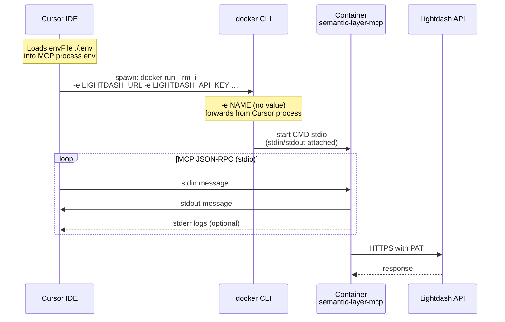
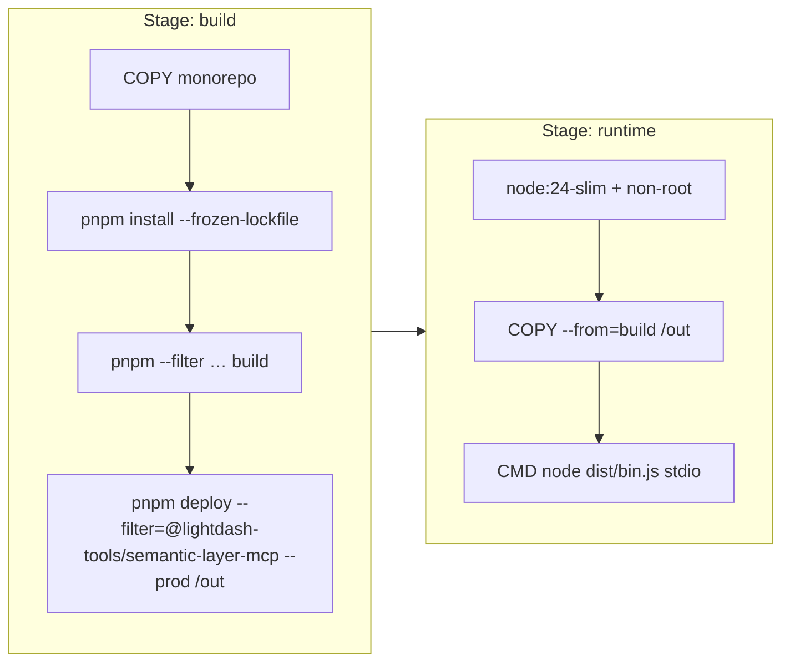
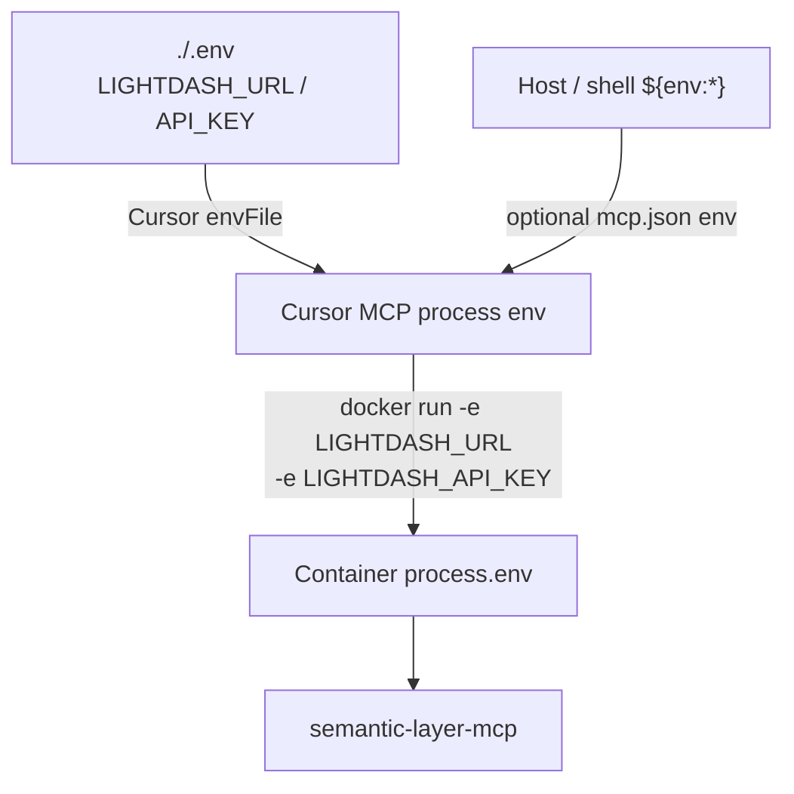

# Semantic-layer MCP Docker (stdio) Implementation Plan

> **For agentic workers:** REQUIRED SUB-SKILL: Use superpowers:subagent-driven-development (recommended) or superpowers:executing-plans to implement this plan task-by-task. Steps use checkbox (`- [ ]`) syntax for tracking.

**Goal:** Add a minimal Dockerfile for `@lightdash-tools/semantic-layer-mcp` that runs **stdio + PAT**, and wire Cursor via `.cursor/mcp.json` using Docker + optional `./.env` through Cursor’s official `envFile`.

**Architecture:** Cursor launches `docker run --rm -i …` as a stdio subprocess. Env comes from Cursor (`envFile` / `env`), then Docker forwards named vars into the container with `-e NAME` (value from the docker CLI process). Image is built from the monorepo root with `pnpm deploy --filter=…`. No HTTP/OAuth in this plan.

**Tech Stack:** Node 24 (`.node-version`), pnpm 11.5.3, Docker BuildKit, Cursor `mcp.json` stdio, MCP stdio transport.

## Global Constraints

- **Transport:** MCP **stdio** only (Cursor manages subprocess). Do not default CMD to `serve-http`.
- **Auth:** PAT via `LIGHTDASH_URL` + `LIGHTDASH_API_KEY` (server never loads `.env` itself).
- **Secrets:** Never `COPY` `.env` into the image. Prefer Cursor `envFile` + Docker `-e` forwarding.
- **Build context:** Repo root (`.`); Dockerfile path `packages/semantic-layer-mcp/Dockerfile`.
- **YAGNI:** No Compose, no GHCR publish, no multi-arch matrix, no HTTP target in this PR.
- **Keep `.cursor/mcp.json` out of commits if it contains local-only paths/secrets;** document a commit-safe example in the package README.

---

## Official references (verified)

| Topic                               | Source                                                                                              | Takeaway used in this plan                                                                                                        |
| ----------------------------------- | --------------------------------------------------------------------------------------------------- | --------------------------------------------------------------------------------------------------------------------------------- |
| Cursor stdio + `docker` + `envFile` | [cursor.com/docs/mcp](https://cursor.com/docs/mcp.md)                                               | `command` may be `docker`; STDIO supports `envFile` (e.g. `${workspaceFolder}/.env`); remote HTTP does **not** support `envFile`. |
| Cursor interpolation                | same                                                                                                | `${workspaceFolder}`, `${env:NAME}` in `command` / `args` / `env`.                                                                |
| MCP stdio                           | [MCP transports (stdio)](https://modelcontextprotocol.io/specification/2025-11-25/basic/transports) | Client spawns server; JSON-RPC on stdin/stdout; logs on stderr only.                                                              |
| Docker `-e` / `--rm` / `-i`         | [docker container run](https://docs.docker.com/reference/cli/docker/container/run/)                 | `-e VAR` with no value copies host env into container; `--rm` for short-lived; `-i` keeps stdin open (required for stdio).        |
| pnpm monorepo image                 | [pnpm.io/docker](https://pnpm.io/docker) Example 2                                                  | Multi-stage + `pnpm deploy --filter=<pkg> --prod` into a slim runtime stage.                                                      |
| Node image / prod                   | Node.js Docker / learn docs                                                                         | Prefer slim base, multi-stage, non-root user; pin Node major to project (24).                                                     |
| Repo secrets policy                 | `docs/secrets-and-credentials.md`                                                                   | Tools read `process.env` only; plaintext `.env` discouraged; dotenvx if file-based.                                               |

---

## File map

| File                                        | Responsibility                                                 |
| ------------------------------------------- | -------------------------------------------------------------- |
| `packages/semantic-layer-mcp/Dockerfile`    | Multi-stage build → deploy → runtime; `CMD` stdio.             |
| `packages/semantic-layer-mcp/.dockerignore` | Used via `docker build --ignorefile …` (context is repo root). |
| `packages/semantic-layer-mcp/README.md`     | Build + Cursor Docker + `.env` / `envFile` notes.              |
| `.cursor/mcp.json`                          | Local Cursor wiring (docker stdio + `envFile`).                |
| `.changes/unreleased/…`                     | Changie fragment.                                              |

---

## Diagrams

### Runtime (Cursor ↔ Docker ↔ MCP)



### Image build (pnpm deploy)



### Env path (simple)



---

## Target `mcp.json` (local)

```json
{
  "mcpServers": {
    "lightdash-semantic-layer-mcp-local": {
      "type": "stdio",
      "command": "docker",
      "args": [
        "run",
        "--rm",
        "-i",
        "-e",
        "LIGHTDASH_URL",
        "-e",
        "LIGHTDASH_API_KEY",
        "-e",
        "LIGHTDASH_TOOLS_PINNED_PROJECT",
        "-e",
        "LIGHTDASH_TOOLS_ALLOWED_PROJECTS",
        "lightdash-semantic-layer-mcp:local"
      ],
      "envFile": "${workspaceFolder}/.env"
    }
  }
}
```

**Why this shape (not over-engineered):**

- Matches Cursor’s documented STDIO fields (`command: docker`, `envFile`).
- Matches Docker’s documented “`-e NAME` with no value → copy from host”.
- Avoids putting secrets in JSON and avoids baking `.env` into the image.
- Optional pin/allowlist vars are forwarded only if present in `.env` / env (empty is fine).

**Build once before Cursor can start the server:**

```bash
docker build \
  -f packages/semantic-layer-mcp/Dockerfile \
  --ignorefile packages/semantic-layer-mcp/.dockerignore \
  -t lightdash-semantic-layer-mcp:local \
  .
```

---

## Target Dockerfile sketch (keep thin)

Aligned with [pnpm Docker Example 2](https://pnpm.io/docker) (`deploy --filter`), Node 24 slim:

```dockerfile
# syntax=docker/dockerfile:1
FROM node:24-slim AS base
ENV PNPM_HOME="/pnpm"
ENV PATH="$PNPM_HOME:$PATH"
RUN corepack enable

FROM base AS build
COPY . /src
WORKDIR /src
RUN --mount=type=cache,id=pnpm,target=/pnpm/store \
  pnpm install --frozen-lockfile
RUN pnpm --filter @lightdash-tools/semantic-layer-mcp... build
RUN pnpm --filter @lightdash-tools/semantic-layer-mcp deploy --prod /out

FROM node:24-slim AS runtime
ENV NODE_ENV=production
WORKDIR /app
RUN useradd --system --uid 1001 --create-home mcp
COPY --from=build --chown=mcp:mcp /out /app
USER mcp
# Stdio only — no EXPOSE
CMD ["node", "dist/bin.js", "stdio"]
```

Adjust `useradd` / `PATH` for `PNPM_HOME` if Corepack layout differs; prefer the smallest change that builds.

### `.dockerignore` (ignorefile)

Exclude secrets and junk from build context:

```text
**/.env
**/.env.*
!**/.env.example
**/node_modules
**/.git
**/coverage
**/.trunk
**/.cursor
**/dist
**/*.md
!packages/semantic-layer-mcp/README.md
!packages/semantic-layer-mcp/src/resources/playbook.md
```

(Tune so `playbook.md` still copies during package build inside the image.)

---

### Task 1: Dockerfile + ignorefile

**Files:**

- Create: `packages/semantic-layer-mcp/Dockerfile`
- Create: `packages/semantic-layer-mcp/.dockerignore`

- [ ] Write Dockerfile per sketch (stdio `CMD`, non-root, no `EXPOSE`, no `.env` copy).
- [ ] Write `.dockerignore` excluding `.env` / `node_modules` / `.git` / coverage.
- [ ] Build image from repo root with `--ignorefile` and tag `lightdash-semantic-layer-mcp:local`.
- [ ] Smoke: `docker run --rm -i -e LIGHTDASH_URL -e LIGHTDASH_API_KEY lightdash-semantic-layer-mcp:local` with dummy env; confirm process stays up on stdio (or exits cleanly with MCP initialize if piped). Prefer: echo nothing / Ctrl+C after stderr “running on stdio”.
- [ ] Confirm image layers do not contain `.env` (`docker history` / inspect — no secret files).

### Task 2: Cursor mcp.json + README

**Files:**

- Update: `.cursor/mcp.json` (local)
- Update: `packages/semantic-layer-mcp/README.md`
- Create: `.changes/unreleased/semantic-layer-mcp-docker.md` (or similar)

- [ ] Point `.cursor/mcp.json` at Docker stdio + `envFile: ${workspaceFolder}/.env` + `-e` forwards (shape above).
- [ ] Document build command, required `.env` keys, and that HTTP/Cloud Run is out of scope for this image.
- [ ] Note: rebuild image after code changes; Cursor does not rebuild automatically.
- [ ] Add changie fragment.
- [ ] Manual check: Cursor MCP logs show server start; tools/list or prompts appear (prompts exist today even if tools are empty).

### Task 3: Light verification

- [ ] `pnpm --filter @lightdash-tools/semantic-layer-mcp test` still passes (unchanged TS).
- [ ] Do **not** add Compose/GHCR/CI publish in this change set.

---

## Out of scope (explicit)

- `serve-http` / OAuth / Cloud Run image variant
- Mounting the whole repo into the container for live reload
- Committing plaintext secrets
- Replacing host-node workflow permanently (node `dist/` remains valid for non-Docker)

---

## Risk notes

| Risk                                       | Mitigation                                                                                                   |
| ------------------------------------------ | ------------------------------------------------------------------------------------------------------------ |
| `pnpm deploy` fails on workspace deps      | Use `--filter @lightdash-tools/semantic-layer-mcp...` build then `deploy --prod`; match pnpm docs Example 2. |
| Cursor envFile vars not reaching container | Must list `-e VAR` in `args`; Docker only forwards listed names.                                             |
| Stdio broken without `-i`                  | Always include `-i` (stdin).                                                                                 |
| Slow cold start                            | Expected for `docker run` each Cursor session; acceptable for v1.                                            |

---

## Done when

1. Image builds from clean context without secrets.
2. Cursor starts the server via Docker stdio using `./.env` through official `envFile`.
3. README documents the two-command loop: `docker build …` then use Cursor.
