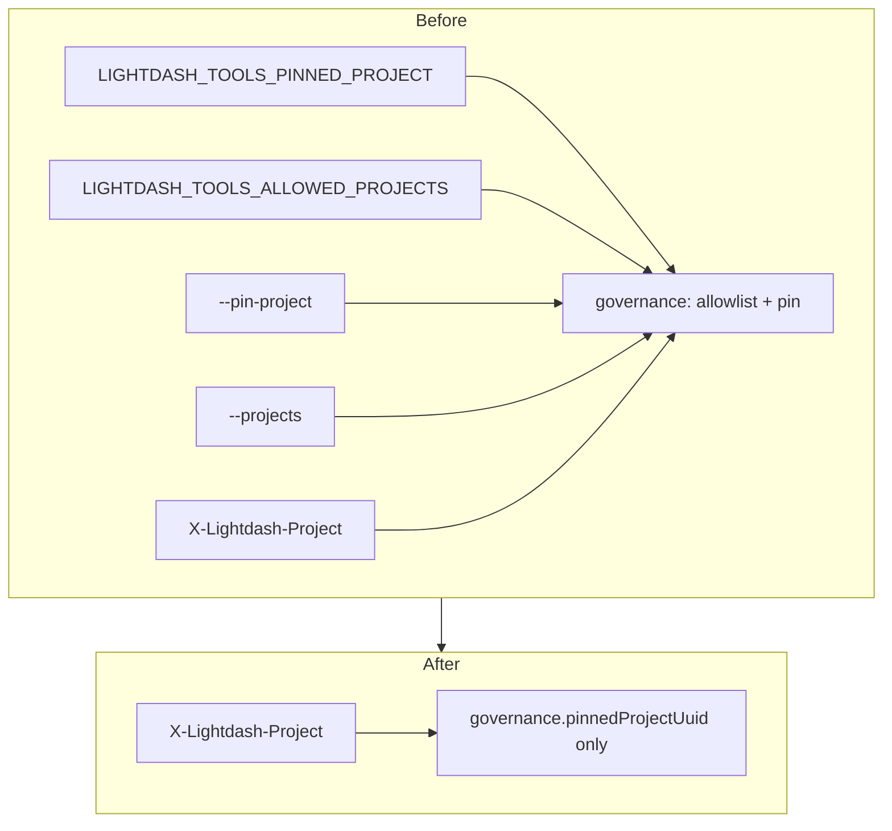
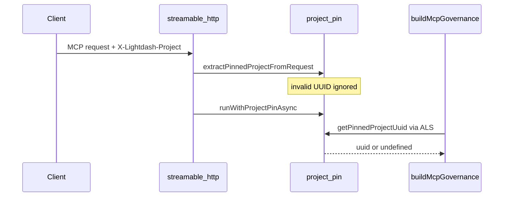

# Drop unused pin/allowlist env from semantic-layer-mcp

> **For agentic workers:** REQUIRED SUB-SKILL: Use superpowers:subagent-driven-development (recommended) or superpowers:executing-plans to implement this plan task-by-task. Steps use checkbox (`- [ ]`) syntax for tracking.

**Goal:** Remove unused `LIGHTDASH_TOOLS_PINNED_PROJECT` and `LIGHTDASH_TOOLS_ALLOWED_PROJECTS` (and matching CLI flags) from `@lightdash-tools/semantic-layer-mcp`. Keep HTTP-only `X-Lightdash-Project` pin per official Lightdash MCP.

**Architecture:** Official pin is a **request header**, not an env var. Delete env/CLI pin + allowlist. Keep ALS + header extract on Streamable HTTP. Stdio has no process pin.

**Tech Stack:** Existing TypeScript package; no new dependencies.

## Global Constraints

- Align with [Lightdash MCP pin docs](https://docs.lightdash.com/references/integrations/lightdash-mcp#pin-a-project-with-the-x-lightdash-project-header): header pin; invalid UUID ignored; list/set project tools hidden when those tools exist (comment only until tools land).
- Do **not** remove `getAllowedProjectUuidsFromEnv` / `LIGHTDASH_TOOLS_ALLOWED_PROJECTS` from `@lightdash-tools/common` or monolith `packages/mcp`.
- YAGNI: no new governance layers; delete `cli-options.ts` when unused.
- Do not edit this plan file during implementation.

---

## Official references (verified)

| Topic             | Source                                                                                                                                              | Takeaway                                                                                                                                             |
| ----------------- | --------------------------------------------------------------------------------------------------------------------------------------------------- | ---------------------------------------------------------------------------------------------------------------------------------------------------- |
| Project pin       | [Lightdash MCP — Pin a project](https://docs.lightdash.com/references/integrations/lightdash-mcp#pin-a-project-with-the-x-lightdash-project-header) | `X-Lightdash-Project` on each request; valid UUID only; invalid ignored; hides `list_projects` / `set_project` when present; permissions still apply |
| Env prefix        | [ADR-0035](../../adr/0035-environment-variables-prefix-lightdash-tools.md)                                                                          | Remove unused `LIGHTDASH_TOOLS_*` rather than keep dead stdio adaptations                                                                            |
| Cursor Docker env | [Cursor MCP docs](https://cursor.com/docs/mcp.md)                                                                                                   | STDIO `envFile` + `-e NAME`; forward only vars the process needs                                                                                     |

Official Lightdash docs do **not** define `LIGHTDASH_TOOLS_PINNED_PROJECT` — that was an unused local stdio adaptation.

---

## Diagrams

### Before → after

### HTTP pin (kept)

---

## File map

| File                                                  | Action                                                          |
| ----------------------------------------------------- | --------------------------------------------------------------- |
| `packages/semantic-layer-mcp/src/project-pin.ts`      | Drop env/CLI static pin; keep parse / extract / ALS / getPinned |
| `packages/semantic-layer-mcp/src/project-pin.test.ts` | Header + ALS tests only                                         |
| `packages/semantic-layer-mcp/src/config.ts`           | Only `getClient()`                                              |
| `packages/semantic-layer-mcp/src/config.test.ts`      | Delete                                                          |
| `packages/semantic-layer-mcp/src/governance.ts`       | `{ pinnedProjectUuid }` only                                    |
| `packages/semantic-layer-mcp/src/request-context.ts`  | Drop `allowedProjectUuids`                                      |
| `packages/semantic-layer-mcp/src/bin.ts`              | No project CLI options                                          |
| `packages/semantic-layer-mcp/src/cli-options.ts`      | **Delete**                                                      |
| `packages/semantic-layer-mcp/src/tools/index.ts`      | Comment: header pin only                                        |
| `packages/semantic-layer-mcp/README.md`               | Docs: HTTP pin; Docker env = URL + API key only                 |
| `.cursor/mcp.json`                                    | `-e LIGHTDASH_URL`, `-e LIGHTDASH_API_KEY` only                 |
| `packages/common/src/env.ts`                          | Remove `ENV_LIGHTDASH_TOOLS_PINNED_PROJECT` if unused           |
| `AGENTS.md` / `CLAUDE.md`                             | Drop SL-mcp env/CLI pin claims                                  |
| `.changes/unreleased/…`                               | Changie fragment                                                |

---

### Task 1: Slim project-pin + governance

- [ ] Rewrite `project-pin.ts` without env/CLI static override.
- [ ] Update `project-pin.test.ts` (no env/CLI cases; no `cli-options` tests).
- [ ] Slim `governance.ts` + `request-context.ts`.
- [ ] `pnpm exec vitest run packages/semantic-layer-mcp --coverage=false`.

### Task 2: Slim CLI + config

- [ ] Simplify `bin.ts`; delete `cli-options.ts`.
- [ ] Slim `config.ts` to `getClient()`; delete `config.test.ts`.
- [ ] Confirm no remaining imports of deleted symbols in the package.

### Task 3: Docs + Cursor + common cleanup

- [ ] README + `.cursor/mcp.json`: remove the two env vars and CLI flags; document HTTP header pin with link to official docs.
- [ ] AGENTS.md / CLAUDE.md updates.
- [ ] Remove `ENV_LIGHTDASH_TOOLS_PINNED_PROJECT` from common if unused.
- [ ] Changie fragment.
- [ ] `pnpm --filter @lightdash-tools/common build && pnpm --filter @lightdash-tools/semantic-layer-mcp test` (and eslint on touched files).

---

## Out of scope

- Implementing / enforcing list/set project tools
- Changing monolith `packages/mcp` allowlist
- Docker/HTTP redesign beyond mcp.json env list

## Done when

1. No `LIGHTDASH_TOOLS_PINNED_PROJECT`, `LIGHTDASH_TOOLS_ALLOWED_PROJECTS`, `--pin-project`, or `--projects` under `packages/semantic-layer-mcp`.
2. HTTP `X-Lightdash-Project` still sets `governance.pinnedProjectUuid`.
3. Stdio Docker Cursor config only forwards `LIGHTDASH_URL` + `LIGHTDASH_API_KEY`.
4. Package tests pass.
