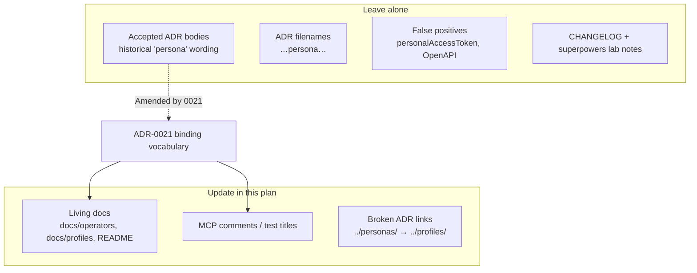
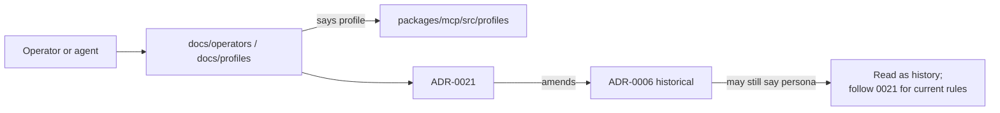
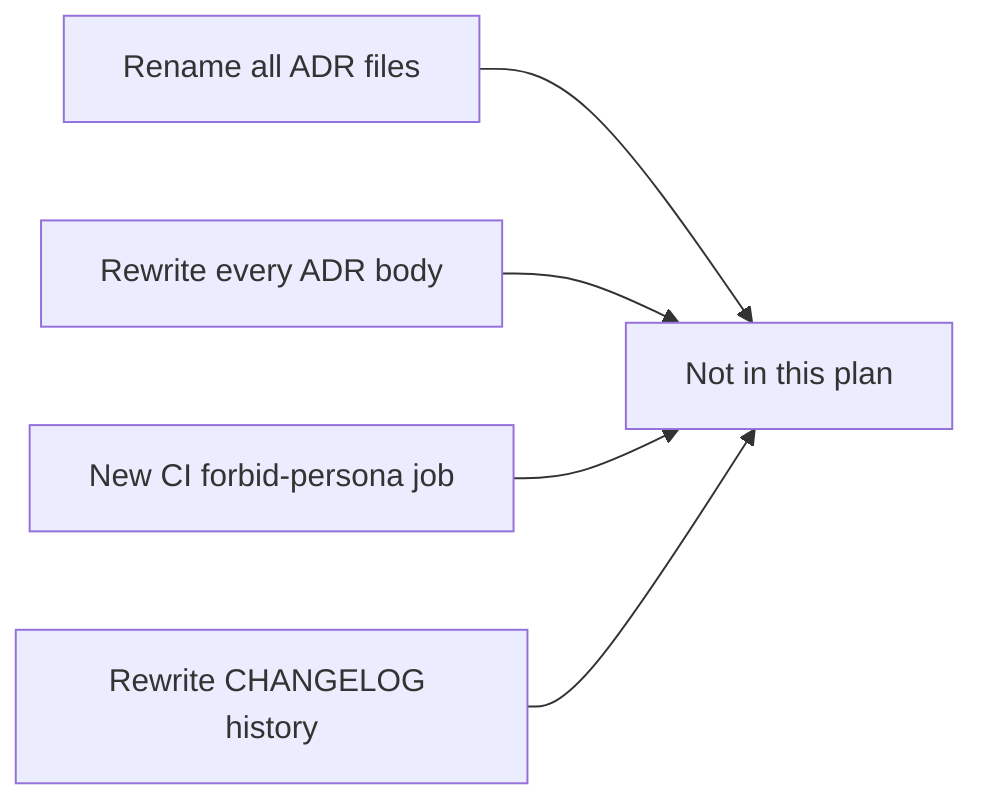

# Persona → profile vocabulary catch-up Implementation Plan

> **For agentic workers:** REQUIRED SUB-SKILL: Use superpowers:subagent-driven-development (recommended) or superpowers:executing-plans to implement this plan task-by-task. Steps use checkbox (`- [ ]`) syntax for tracking.

**Goal:** Make living docs and operator-facing text use **profile** for MCP packaging vocabulary, without rewriting accepted ADR history or inventing new automation.

**Architecture:** ADR-0021 is already the binding rename. Update living docs (`docs/operators`, `docs/profiles`, READMEs), fix broken `../personas/` links, and rename leftover “persona” wording in MCP comments/tests. Leave accepted ADR **bodies** historically intact ([AWS ADR process](https://docs.aws.amazon.com/prescriptive-guidance/latest/architectural-decision-records/adr-process.html): accepted ADRs are immutable; new decisions supersede via a new ADR).

**Tech Stack:** Markdown under `docs/`; MCP TypeScript comments/tests; verification via `rg` (no new CI job).

## Global Constraints

- Product term is **profile** (ADR-0021). MCP protocol terms stay Host / Client / Server / Tools / Prompts / Resources ([MCP architecture 2025-11-25](https://modelcontextprotocol.io/specification/2025-11-25/architecture)) — MCP does **not** define “persona” or “profile”.
- Do **not** rename ADR filenames (`0006-mcp-personas-…` etc.) — stable IDs/links; TOC may add a one-line pointer to ADR-0021.
- Do **not** rewrite accepted ADR Decision/Context sections for vocabulary purity (immutability). Allowed: fix **broken relative links** `../personas/` → `../profiles/`; ensure Status shows `Amended by` ADR-0021 where that ADR already amends them.
- Do **not** touch: `personalAccessToken` / OpenAPI / `impersonation` / `CHANGELOG.md` historical entries / `docs/superpowers/**` lab notes (optional later).
- Do **not** add a new CI linter in this plan (YAGNI); end with one `rg` verification command.
- Prefer small search-replace + link fixes; no new abstractions.

---

## Official references (checked)

| Source                                                                                                                      | What it says                                                                      | How this plan uses it                                                                             |
| --------------------------------------------------------------------------------------------------------------------------- | --------------------------------------------------------------------------------- | ------------------------------------------------------------------------------------------------- |
| [MCP Architecture (2025-11-25)](https://modelcontextprotocol.io/specification/2025-11-25/architecture)                      | Host / Client / Server; Tools, Prompts, Resources; capability negotiation         | “Profile” is **our** packaging (one path + `serverInfo.name` + tool subset), not an MCP primitive |
| [ADR-0021](../../adr/0021-mcp-profile-packaging-catalog-tool-membership-ssot.md)                                            | Rename persona→profile; catalog membership SSOT; older ADRs historically accurate | Binding vocabulary for living docs                                                                |
| [AWS ADR process](https://docs.aws.amazon.com/prescriptive-guidance/latest/architectural-decision-records/adr-process.html) | Accepted ADRs immutable; supersede with a new ADR                                 | Do not mass-edit ADR bodies; ADR-0021 already amends 0006/0013                                    |
| [Nygard ADRs](https://cognitect.com/blog/2011/11/15/documenting-architecture-decisions) (cited in `docs/adr/README.md`)     | Context / Decision / Status / Consequences                                        | Keep that shape; Status/links only for hygiene                                                    |

---

## Diagrams

### Vocabulary layers (what we change vs leave)



### Operator / agent reading path after catch-up



### Out of scope (over-engineering we skip)



---

## File map

| Path                                                         | Responsibility                                                                                   |
| ------------------------------------------------------------ | ------------------------------------------------------------------------------------------------ |
| `docs/operators/*.md`                                        | Operator how-to: say **profile**, catalog membership (not `toolIds` allowlists)                  |
| `docs/profiles/**/*.md`                                      | Profile inventories / client-compat: “MCP profile”, not “persona”                                |
| `README.md`, `packages/mcp/README.md`                        | User-facing packaging wording                                                                    |
| `packages/mcp/CONTRIBUTING.md`                               | Contributor wording; ADR links by filename OK                                                    |
| `docs/adr/README.md`                                         | TOC: note that living vocabulary is **profile** (ADR-0021)                                       |
| `docs/adr/0012,0014,0018,0020` (and any with `../personas/`) | **Link-only** fixes to `../profiles/…`                                                           |
| `packages/mcp/src/**/*.ts` comments + `*.test.ts` titles     | Cosmetic rename persona→profile where it means packaging                                         |
| `CLAUDE.md`                                                  | One current learning already exists (2026-08-04); do not rewrite entire Recent Learnings history |

---

### Task 1: Living operator + profile docs

**Files:**

- Modify: `docs/operators/cloud-run.md`
- Modify: `docs/operators/mcp-oauth.md`
- Modify: `docs/operators/mcp-oauth-threat-model.md`
- Modify: `docs/operators/cursor-claude.md`
- Modify: `docs/profiles/ai-agent-ops/inventory.md`
- Modify: `docs/profiles/ai-agent-ops/loop.md`
- Modify: `docs/profiles/content-developer/inventory.md`
- Modify: `docs/profiles/content-governance/inventory.md`
- Modify: `docs/profiles/content-governance/client-compatibility.md`
- Modify: `docs/profiles/content-reader/inventory.md`
- Modify: `docs/profiles/data-analyst/inventory.md`
- Modify: `docs/profiles/organization-audit/inventory.md`

**Interfaces:**

- Consumes: ADR-0021 vocabulary (profile = mount + tools from catalog)
- Produces: Living docs that never instruct “persona `toolIds`” or `docs/personas/`

- [ ] **Step 1: Replace packaging vocabulary in operators**

Use meaning-preserving edits (not blind replace of `personal`):

| Avoid writing                      | Prefer                                           |
| ---------------------------------- | ------------------------------------------------ |
| persona / personas (MCP packaging) | profile / profiles                               |
| persona `toolIds`                  | catalog `profiles` + `listMcpToolNamesByProfile` |
| persona MCP paths                  | profile MCP paths (same URL strings)             |
| shipped persona                    | shipped profile                                  |

Example (`docs/profiles/content-governance/client-compatibility.md`):

```markdown
Soft-delete tools (`delete_chart`, `delete_dashboard`) and dashboard promote (`promote_dashboard`) on the `content-governance` profile require **MCP form elicitation**.
```

Example threat-model row: replace “Persona `toolIds` fix the MCP catalog” with “Catalog `profiles` + `listMcpToolNamesByProfile` fix the MCP catalog ([ADR-0021](../adr/0021-mcp-profile-packaging-catalog-tool-membership-ssot.md))”.

- [ ] **Step 2: Spot-check inventories**

Run:

```bash
rg -n -i '\bpersonas?\b' docs/operators docs/profiles
```

Expected: **no matches** (or only an intentional historical quote — prefer zero).

- [ ] **Step 3: Commit**

```bash
git add docs/operators docs/profiles
git commit -m "$(cat <<'EOF'
docs: use profile vocabulary in operators and inventories

EOF
)"
```

---

### Task 2: Root / package READMEs + CONTRIBUTING

**Files:**

- Modify: `README.md`
- Modify: `packages/mcp/README.md` (if any remaining “persona” packaging wording)
- Modify: `packages/mcp/CONTRIBUTING.md` (prose only; keep ADR filename links)

**Interfaces:**

- Consumes: Task 1 wording
- Produces: First-touch README language matches ADR-0021

- [ ] **Step 1: Edit root README packaging lines**

Current pattern to fix:

```markdown
TypeScript client, CLI, and persona-scoped MCP servers for Lightdash
```

Replace with:

```markdown
TypeScript client, CLI, and profile-scoped MCP servers for Lightdash
```

And capability bullet: “persona tool surface” → “profile tool surface (catalog membership)”.

Keep “personal access token” unchanged.

- [ ] **Step 2: Verify**

```bash
rg -n -i '\bpersonas?\b' README.md packages/mcp/README.md packages/mcp/CONTRIBUTING.md
```

Expected: no packaging hits; PAT wording may remain.

- [ ] **Step 3: Commit**

```bash
git add README.md packages/mcp/README.md packages/mcp/CONTRIBUTING.md
git commit -m "$(cat <<'EOF'
docs: align README/CONTRIBUTING with profile packaging term

EOF
)"
```

---

### Task 3: ADR hygiene (links + TOC only)

**Files:**

- Modify: `docs/adr/README.md` (TOC clarification only)
- Modify (links only):
  - `docs/adr/0012-mcp-content-reader-persona-saved-content-execution-boundary.md`
  - `docs/adr/0014-mcp-content-developer-persona-mutation-boundary.md`
  - `docs/adr/0018-mcp-ai-agent-ops-persona-thin-api-boundary.md`
  - `docs/adr/0020-mcp-data-analyst-persona-ad-hoc-metric-query-boundary.md`
  - any other ADR with `../personas/` from:

```bash
rg -n '\.\./personas/' docs/adr
```

**Interfaces:**

- Consumes: `docs/profiles/` paths from the profile SSOT move
- Produces: Clickable inventory links; TOC readers pointed at ADR-0021 for current vocabulary

- [ ] **Step 1: Fix broken inventory links**

Replace every `../personas/` with `../profiles/` inside ADR markdown. Do **not** rewrite Decision bullets that say “persona” historically.

- [ ] **Step 2: Soften ADR index for readers**

In `docs/adr/README.md`, keep filenames/links, and add once under Keep criteria or above the TOC:

```markdown
Vocabulary: living product term is **profile** ([ADR-0021](0021-mcp-profile-packaging-catalog-tool-membership-ssot.md)). Older ADR titles may still say “persona”; treat those bodies as historical and follow ADR-0021 for current packaging rules.
```

- [ ] **Step 3: Deduplicate Status on ADR-0006 if still duplicated**

`0006` currently lists “Amended by 21” twice — keep a single line.

- [ ] **Step 4: Verify links**

```bash
rg -n '\.\./personas/|docs/personas/' docs/adr
test ! -d docs/personas
```

Expected: no `../personas/` hits; `docs/personas` directory absent.

- [ ] **Step 5: Commit**

```bash
git add docs/adr
git commit -m "$(cat <<'EOF'
docs(adr): fix profile inventory links; clarify vocabulary vs history

EOF
)"
```

---

### Task 4: MCP comment / test-title cleanup

**Files (representative; expand via rg):**

- Modify: `packages/mcp/src/config/normalize-url.test.ts`
- Modify: `packages/mcp/src/config/load-mcp-config.test.ts`
- Modify: `packages/mcp/src/http.integration.test.ts`
- Modify: `packages/mcp/src/stdio.process.test.ts`
- Modify: `packages/mcp/src/tools/project/projects.test.ts`
- Modify: `packages/mcp/src/tools/project/developer-content-preview.ts`
- Modify: `packages/mcp/src/tools/ai-agents/agents.ts`
- Modify: `packages/mcp/src/tools/ai-agents/threads.ts`
- Modify: `packages/mcp/src/tools/ai-agents/evaluations.ts`
- Modify: any other under `packages/mcp/src` from the rg in Step 1

**Interfaces:**

- Consumes: none
- Produces: Grep noise reduced; behavior unchanged

- [ ] **Step 1: List remaining product “persona” hits**

```bash
rg -n -i '\bpersonas?\b' packages/mcp/src --glob '!**/openapi-types.ts'
```

Ignore local test variables named `toolIds`. Change comments / `it('… persona …')` titles to **profile**.

Example:

```typescript
it('strips the semantic-layer profile path', () => {
```

```typescript
 * Project AI agent inventory tools (ai-agent-ops profile).
```

- [ ] **Step 2: Run a narrow test slice**

```bash
pnpm exec vitest run packages/mcp/src/config/normalize-url.test.ts packages/mcp/src/config/load-mcp-config.test.ts packages/mcp/src/tools/project/projects.test.ts
```

Expected: PASS (title-only / comment-only changes).

- [ ] **Step 3: Commit**

```bash
git add packages/mcp/src
git commit -m "$(cat <<'EOF'
chore(mcp): rename leftover persona wording in comments and tests

EOF
)"
```

---

### Task 5: Final verification (no new CI)

**Files:** none (read-only check)

- [ ] **Step 1: Living-doc gate**

```bash
rg -n -i '\bpersonas?\b' docs/operators docs/profiles README.md packages/mcp/README.md
```

Expected: **empty**.

- [ ] **Step 2: False-positive sanity**

```bash
rg -n 'personalAccessToken|personal-access-token|impersonation' packages/client packages/common/src/types --glob '!**/openapi-types.ts' | head
```

Expected: still present (untouched).

- [ ] **Step 3: ADR history still findable**

```bash
rg -n -i '\bpersonas?\b' docs/adr/0006-mcp-personas-shared-registry-fixed-paths.md | head
```

Expected: historical wording remains; Status still points at ADR-0021.

- [ ] **Step 4: Optional Prettier on touched Markdown**

```bash
pnpm exec prettier --write docs/operators docs/profiles docs/adr/README.md README.md
```

- [ ] **Step 5: Push to PR branch**

```bash
git push origin HEAD
```

Target PR: https://github.com/yu-iskw/lightdash-tools/pull/175 (keep draft until CI green).

---

## Self-review

1. **Spec coverage:** Living docs catch-up ✓; remaining persona inventory addressed ✓; no BC requirement for operators without ADR rewrite ✓; official MCP + ADR immutability respected ✓; simplicity (no CI job, no ADR renames) ✓.
2. **Placeholders:** None.
3. **Consistency:** Mount ids and URLs unchanged; only vocabulary and broken links.

---

## Why this is simpler than “rewrite all docs/adr”

Rewriting every accepted ADR body to say “profile” would fight [AWS ADR immutability](https://docs.aws.amazon.com/prescriptive-guidance/latest/architectural-decision-records/adr-process.html) and ADR-0021’s own consequence (“older ADRs … remain historically accurate”). Living docs + link fixes + comment cleanup give operators the right term **now** without a second architecture decision or filename churn.
