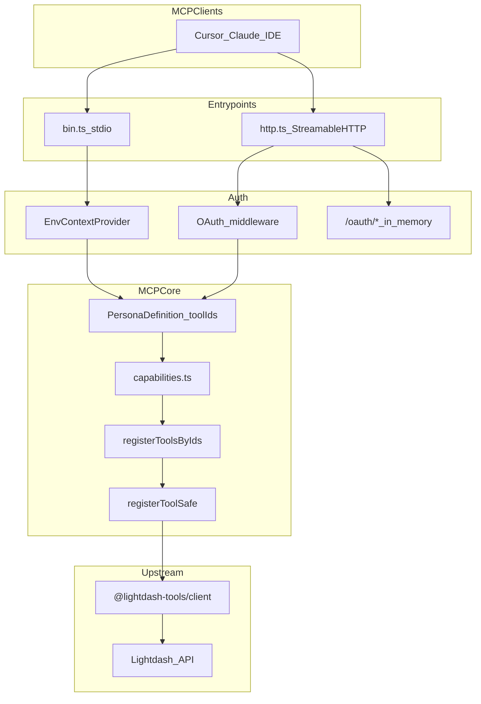
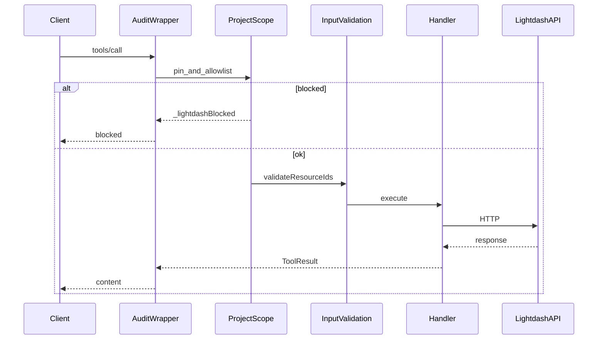
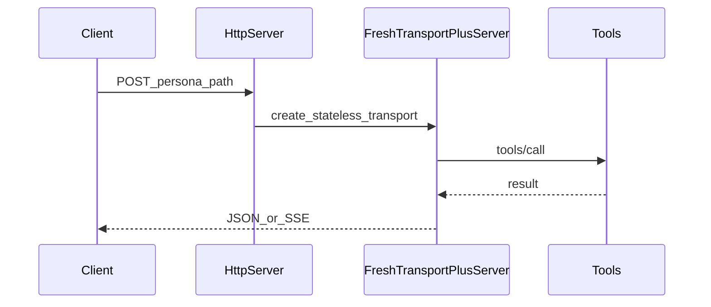
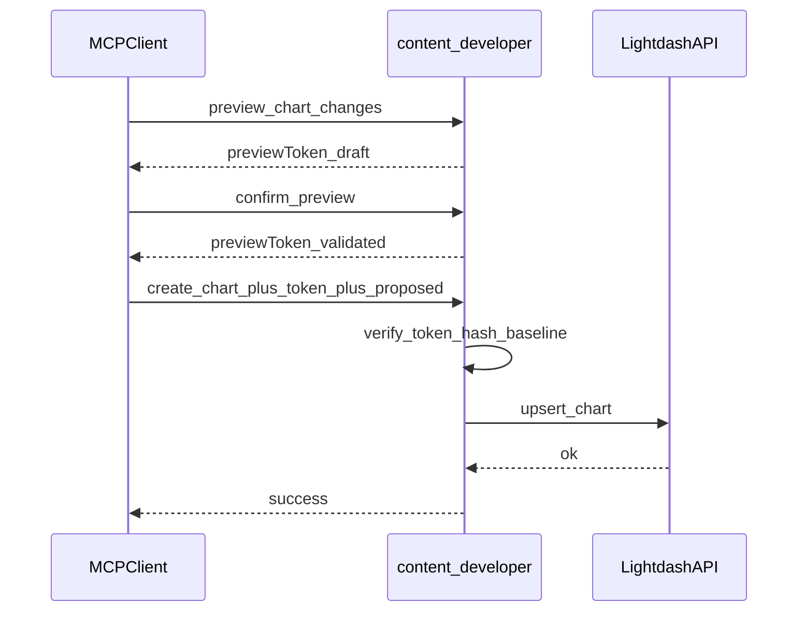
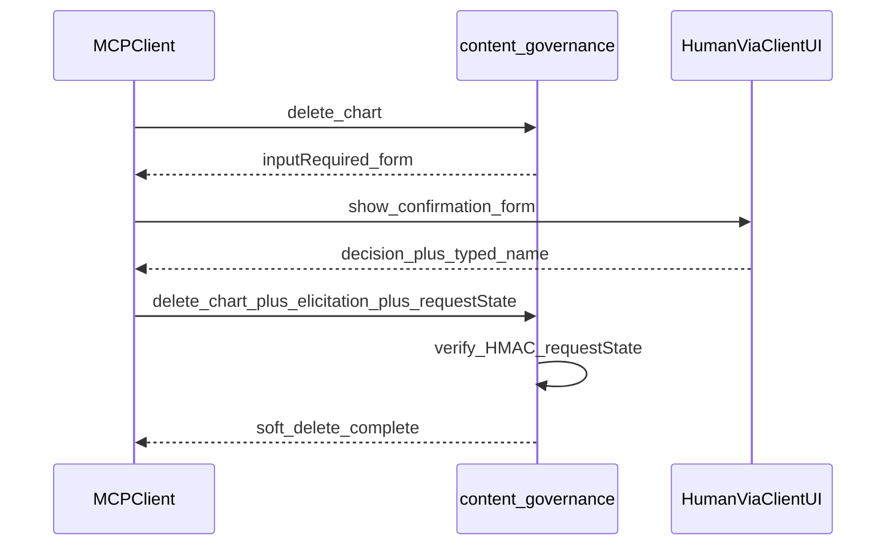

# Contributing to `@lightdash-tools/mcp`

Developer guide for this package. For monorepo setup, PR workflow, and quality gates see the root [CONTRIBUTING.md](../../CONTRIBUTING.md) and [AGENTS.md](../../AGENTS.md).

End-user install and configuration live in [README.md](./README.md).

## Package layout

| Edit…                                                   | Path                                                                                                                    |
| :------------------------------------------------------ | :---------------------------------------------------------------------------------------------------------------------- |
| Shared tools / registry                                 | `src/tools/` (`registry.ts`, domain modules)                                                                            |
| Persona (tools allowlist, prompts, playbook, HTTP path) | `src/personas/<id>/`                                                                                                    |
| Destructive confirmation (form elicitation / MRTR)      | `src/destructive/`                                                                                                      |
| HTTP transport (sessionless)                            | `src/transports/`                                                                                                       |
| HTTP auth / OAuth broker (in-memory pending)            | `src/auth/`                                                                                                             |
| Runtime client + guardrail env                          | `src/config/runtime.ts`                                                                                                 |
| HTTP env / loader                                       | `src/config/env.ts`, `src/config/load-mcp-config.ts`                                                                    |
| OAuth broker (in-memory pending)                        | `src/auth/oauth-broker/` ([ADR-0019](../../docs/adr/0019-mcp-stateless-protocol-core-without-redis-ephemeral-store.md)) |
| Audit logging helpers                                   | `src/audit/`                                                                                                            |
| Entrypoints                                             | `src/bin.ts`, `src/index.ts` (stdio), `src/http.ts`                                                                     |

Prompts and resources are **persona-owned** (e.g. `src/personas/semantic-layer/v1/`). There is no package-level `src/prompts/` or `src/resources/`.

## Architecture overview

One package ships multiple **personas**. Shared tools live under `src/tools/`; each persona selects an explicit `toolIds` allowlist, prompts, playbooks, and a fixed HTTP path ([ADR-0006](../../docs/adr/0006-mcp-personas-shared-registry-fixed-paths.md)). Registration goes through `registerToolsByIds` → `registerToolSafe` → `@lightdash-tools/client`.



SDK: `@modelcontextprotocol/server` + `@modelcontextprotocol/node` v2. Protocol: [MCP 2026-07-28 transports](https://modelcontextprotocol.io/specification/2026-07-28/basic/transports) (stdio + Streamable HTTP; POST-only MCP endpoints; no protocol sessions).

## Request lifecycle

`registerToolSafe` layers (outer → inner), documented in `src/tools/shared.ts` ([ADR-0008](../../docs/adr/0008-mcp-request-scope-and-hardening.md)):



Capability surface is the persona `toolIds` list — not CLI `SAFETY_MODE` / dry-run.

## Sequence diagrams

### Stateless HTTP request

Each POST creates a fresh transport + server ([ADR-0019](../../docs/adr/0019-mcp-stateless-protocol-core-without-redis-ephemeral-store.md); [MCP statelessness](https://modelcontextprotocol.io/specification/2026-07-28/basic/index#statelessness)):



OAuth broker pending/codes/DCR remain **process-local** — sticky-route `/oauth/*` or a single replica for multi-instance. Persona MCP paths can round-robin. Operator details: [docs/operators/mcp-oauth.md](../../docs/operators/mcp-oauth.md).

### content-developer preview gate

HMAC-signed `previewToken` (subject/project/`contentHash`); no server ledger ([`src/policy/preview-ledger.ts`](./src/policy/preview-ledger.ts)):



### content-governance elicitation

Form elicitation via MRTR [`InputRequiredResult`](https://modelcontextprotocol.io/specification/2026-07-28/basic/patterns/mrtr) + HMAC `requestState` ([`src/destructive/`](./src/destructive/)):



## Extension points

| Change                      | Where                                                            |
| :-------------------------- | :--------------------------------------------------------------- |
| New shared tool             | `packages/common/src/operations/` + `src/tools/` + `registry.ts` |
| New persona                 | `src/personas/<id>/v1/` + ADR                                    |
| Auth / OAuth                | `src/auth/`                                                      |
| Preview / destructive gates | `src/policy/`, `src/destructive/`                                |

## Testing

From the monorepo root:

```bash
pnpm exec vitest run packages/mcp/src
# or package script (runs the same via filter):
pnpm --filter @lightdash-tools/mcp test
```

Integration tests hit a real Lightdash API when credentials are set:

```bash
LIGHTDASH_URL=https://app.lightdash.cloud LIGHTDASH_API_KEY=your_api_key pnpm --filter @lightdash-tools/mcp test
```

For OAuth HTTP live checks: `LIGHTDASH_TOOLS_TEST_OAUTH_ACCESS_TOKEN` (+ `LIGHTDASH_URL`).

Before commit: `pnpm verify` (or `pnpm verify:quick`) from the repo root — see [AGENTS.md](../../AGENTS.md).

## Related ADRs

- [ADR-0006](../../docs/adr/0006-mcp-personas-shared-registry-fixed-paths.md) — Personas, shared registry, fixed HTTP paths
- [ADR-0007](../../docs/adr/0007-mcp-http-transport-auth-modes-sdk-v2.md) — HTTP transport + OAuth broker (SDK v2)
- [ADR-0008](../../docs/adr/0008-mcp-request-scope-and-hardening.md) — Project pin, input validation, audit
- [ADR-0012](../../docs/adr/0012-mcp-content-reader-persona-saved-content-execution-boundary.md) — Content-reader boundary
- [ADR-0014](../../docs/adr/0014-mcp-content-developer-persona-mutation-boundary.md) — Content-developer preview gate
- [ADR-0015](../../docs/adr/0015-mcp-content-governance-persona-elicitation-required-soft-delete-boundary.md) — Soft-delete elicitation
- [ADR-0018](../../docs/adr/0018-mcp-ai-agent-ops-persona-thin-api-boundary.md) — AI-agent-ops thin API surface
- [ADR-0019](../../docs/adr/0019-mcp-stateless-protocol-core-without-redis-ephemeral-store.md) — Stateless HTTP; HMAC handles; no Redis
